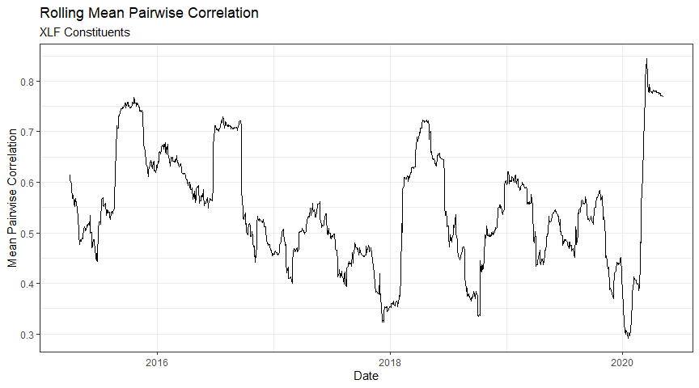

Rolling Correlation of ETF Constituents
================

How might we calculate rolling correlations between constituents of an
ETF, given a dataframe of prices?

For problems like this, the `tidyverse` really shines. There are a
number of ways to solve this problem … read on for our solution, and let
us know if you’d approach it differently\!

First, we load some packages and some data that we extracted earlier.
`xlfprices.RData` contains a dataframe, `prices_xlf`, of constituents of
the XLF ETF and their daily prices. You can get this data from our
[GitHub
repository](https://github.com/Robot-Wealth/r-quant-recipes/tree/master/data).

The dataset isn’t entirely accurate, as it contains prices of today’s
constituents and doesn’t account for historical changes. But that won’t
matter for our purposes.

``` r
library(tidyverse)
```

    ## -- Attaching packages --------------------------------------------------------------------------------------------------- tidyverse 1.3.0 --

    ## v ggplot2 3.3.0     v purrr   0.3.4
    ## v tibble  3.0.1     v dplyr   0.8.5
    ## v tidyr   1.1.0     v stringr 1.4.0
    ## v readr   1.3.1     v forcats 0.5.0

    ## -- Conflicts ------------------------------------------------------------------------------------------------------ tidyverse_conflicts() --
    ## x dplyr::filter() masks stats::filter()
    ## x dplyr::lag()    masks stats::lag()

``` r
library(lubridate)
```

    ## 
    ## Attaching package: 'lubridate'

    ## The following objects are masked from 'package:dplyr':
    ## 
    ##     intersect, setdiff, union

    ## The following objects are masked from 'package:base':
    ## 
    ##     date, intersect, setdiff, union

``` r
library(glue)
```

    ## 
    ## Attaching package: 'glue'

    ## The following object is masked from 'package:dplyr':
    ## 
    ##     collapse

``` r
library(here)
```

    ## here() starts at C:/Users/Kris/Documents/r-quant-recipes

``` r
theme_set(theme_bw())

load(here::here("data", "xlfprices.RData"))

prices_xlf %>%
  head(10)
```

    ## # A tibble: 10 x 10
    ##    ticker date        open  high   low close   volume dividends closeunadj inSPX
    ##    <chr>  <date>     <dbl> <dbl> <dbl> <dbl>    <dbl>     <dbl>      <dbl> <lgl>
    ##  1 AFL    2019-11-29  54.8  55.1  54.8  54.8  1270649         0       54.8 TRUE 
    ##  2 AIG    2019-11-29  52.8  53.2  52.6  52.7  2865501         0       52.7 TRUE 
    ##  3 AIZ    2019-11-29 133.  134.  133.  133.    202854         0      133.  TRUE 
    ##  4 AJG    2019-11-29  93.3  93.6  93.0  93.3   392489         0       93.3 TRUE 
    ##  5 ALL    2019-11-29 112.  112.  111.  111.    817942         0      111.  TRUE 
    ##  6 AMP    2019-11-29 164.  165.  163.  164.    404660         0      164.  TRUE 
    ##  7 AON    2019-11-29 203.  204.  202.  204.    415940         0      204.  TRUE 
    ##  8 AXP    2019-11-29 120.  121.  120.  120.   1961463         0      120.  TRUE 
    ##  9 BAC    2019-11-29  33.4  33.5  33.2  33.3 19503395         0       33.3 TRUE 
    ## 10 BEN    2019-11-29  27.8  27.9  27.4  27.5  1485635         0       27.5 TRUE

We’d like to be able to calculate *rolling average pairwise
correlations* between all the stocks in as tidy a way possible.

That requires that we calculate the rolling pairwise correlation between
all the stock combinations in the index and then take the mean of all
those.

A good way to tacke such problems is to chunk them down into bite-sized
pieces, and then solve each piece in turn. We split the problem into the
following steps:

  - calculate returns for each ticker
  - create a long dataframe of all the pairwise ticker combinations for
    each day by doing a full join of the data on itself, keyed by date
  - remove instances where we had the same stock twice (corresponding to
    the diagonal of the correlation matrix)
  - remove instances where we have the complimentary pair of the same
    stocks, eg we only want one of APPL-GOOG and GOOG-APPL (this is
    equivalent to removing the upper or lower triangle of the
    correlation matrix)
  - use `slider::slide2_dbl` to do the rolling correlation calculation
  - group by date and take the mean

### Calculating returns

The first step is straightforward - we simply calculate close-to-close
returns and return a long dataframe of dates, tickers and returns:

``` r
# calculate returns to each stock
df <- prices_xlf %>%
  group_by(ticker) %>%
  arrange(date, .by_group = TRUE) %>%
  mutate(return = close / dplyr::lag(close) - 1) %>%
  select(date, ticker, return)

# function for prettier web display
pretty_table <- function(df) {
  require(kableExtra)
  
  df %>%
    kable() %>%
    kable_styling(full_width = TRUE, position = 'center') %>%
    scroll_box(height = '300px')
}

df %>%
  head(50) %>%
  pretty_table()
```

    ## Loading required package: kableExtra

    ## 
    ## Attaching package: 'kableExtra'

    ## The following object is masked from 'package:dplyr':
    ## 
    ##     group_rows

<div style="border: 1px solid #ddd; padding: 0px; overflow-y: scroll; height:300px; ">

<table class="table" style="margin-left: auto; margin-right: auto;">

<thead>

<tr>

<th style="text-align:left;position: sticky; top:0; background-color: #FFFFFF;">

date

</th>

<th style="text-align:left;position: sticky; top:0; background-color: #FFFFFF;">

ticker

</th>

<th style="text-align:right;position: sticky; top:0; background-color: #FFFFFF;">

return

</th>

</tr>

</thead>

<tbody>

<tr>

<td style="text-align:left;">

2015-01-02

</td>

<td style="text-align:left;">

AFL

</td>

<td style="text-align:right;">

NA

</td>

</tr>

<tr>

<td style="text-align:left;">

2015-01-05

</td>

<td style="text-align:left;">

AFL

</td>

<td style="text-align:right;">

\-0.0261952

</td>

</tr>

<tr>

<td style="text-align:left;">

2015-01-06

</td>

<td style="text-align:left;">

AFL

</td>

<td style="text-align:right;">

\-0.0089106

</td>

</tr>

<tr>

<td style="text-align:left;">

2015-01-07

</td>

<td style="text-align:left;">

AFL

</td>

<td style="text-align:right;">

0.0062765

</td>

</tr>

<tr>

<td style="text-align:left;">

2015-01-08

</td>

<td style="text-align:left;">

AFL

</td>

<td style="text-align:right;">

0.0097775

</td>

</tr>

<tr>

<td style="text-align:left;">

2015-01-09

</td>

<td style="text-align:left;">

AFL

</td>

<td style="text-align:right;">

\-0.0212020

</td>

</tr>

<tr>

<td style="text-align:left;">

2015-01-12

</td>

<td style="text-align:left;">

AFL

</td>

<td style="text-align:right;">

\-0.0057991

</td>

</tr>

<tr>

<td style="text-align:left;">

2015-01-13

</td>

<td style="text-align:left;">

AFL

</td>

<td style="text-align:right;">

\-0.0049751

</td>

</tr>

<tr>

<td style="text-align:left;">

2015-01-14

</td>

<td style="text-align:left;">

AFL

</td>

<td style="text-align:right;">

\-0.0077586

</td>

</tr>

<tr>

<td style="text-align:left;">

2015-01-15

</td>

<td style="text-align:left;">

AFL

</td>

<td style="text-align:right;">

\-0.0033015

</td>

</tr>

<tr>

<td style="text-align:left;">

2015-01-16

</td>

<td style="text-align:left;">

AFL

</td>

<td style="text-align:right;">

0.0142957

</td>

</tr>

<tr>

<td style="text-align:left;">

2015-01-20

</td>

<td style="text-align:left;">

AFL

</td>

<td style="text-align:right;">

\-0.0029220

</td>

</tr>

<tr>

<td style="text-align:left;">

2015-01-21

</td>

<td style="text-align:left;">

AFL

</td>

<td style="text-align:right;">

0.0015515

</td>

</tr>

<tr>

<td style="text-align:left;">

2015-01-22

</td>

<td style="text-align:left;">

AFL

</td>

<td style="text-align:right;">

0.0180723

</td>

</tr>

<tr>

<td style="text-align:left;">

2015-01-23

</td>

<td style="text-align:left;">

AFL

</td>

<td style="text-align:right;">

\-0.0071006

</td>

</tr>

<tr>

<td style="text-align:left;">

2015-01-26

</td>

<td style="text-align:left;">

AFL

</td>

<td style="text-align:right;">

0.0049379

</td>

</tr>

<tr>

<td style="text-align:left;">

2015-01-27

</td>

<td style="text-align:left;">

AFL

</td>

<td style="text-align:right;">

\-0.0086411

</td>

</tr>

<tr>

<td style="text-align:left;">

2015-01-28

</td>

<td style="text-align:left;">

AFL

</td>

<td style="text-align:right;">

\-0.0196548

</td>

</tr>

<tr>

<td style="text-align:left;">

2015-01-29

</td>

<td style="text-align:left;">

AFL

</td>

<td style="text-align:right;">

0.0050558

</td>

</tr>

<tr>

<td style="text-align:left;">

2015-01-30

</td>

<td style="text-align:left;">

AFL

</td>

<td style="text-align:right;">

\-0.0098873

</td>

</tr>

<tr>

<td style="text-align:left;">

2015-02-02

</td>

<td style="text-align:left;">

AFL

</td>

<td style="text-align:right;">

0.0190960

</td>

</tr>

<tr>

<td style="text-align:left;">

2015-02-03

</td>

<td style="text-align:left;">

AFL

</td>

<td style="text-align:right;">

0.0158157

</td>

</tr>

<tr>

<td style="text-align:left;">

2015-02-04

</td>

<td style="text-align:left;">

AFL

</td>

<td style="text-align:right;">

0.0269081

</td>

</tr>

<tr>

<td style="text-align:left;">

2015-02-05

</td>

<td style="text-align:left;">

AFL

</td>

<td style="text-align:right;">

0.0049440

</td>

</tr>

<tr>

<td style="text-align:left;">

2015-02-06

</td>

<td style="text-align:left;">

AFL

</td>

<td style="text-align:right;">

0.0049196

</td>

</tr>

<tr>

<td style="text-align:left;">

2015-02-09

</td>

<td style="text-align:left;">

AFL

</td>

<td style="text-align:right;">

\-0.0022846

</td>

</tr>

<tr>

<td style="text-align:left;">

2015-02-10

</td>

<td style="text-align:left;">

AFL

</td>

<td style="text-align:right;">

0.0050703

</td>

</tr>

<tr>

<td style="text-align:left;">

2015-02-11

</td>

<td style="text-align:left;">

AFL

</td>

<td style="text-align:right;">

0.0061839

</td>

</tr>

<tr>

<td style="text-align:left;">

2015-02-12

</td>

<td style="text-align:left;">

AFL

</td>

<td style="text-align:right;">

\-0.0004852

</td>

</tr>

<tr>

<td style="text-align:left;">

2015-02-13

</td>

<td style="text-align:left;">

AFL

</td>

<td style="text-align:right;">

0.0053398

</td>

</tr>

<tr>

<td style="text-align:left;">

2015-02-17

</td>

<td style="text-align:left;">

AFL

</td>

<td style="text-align:right;">

0.0035410

</td>

</tr>

<tr>

<td style="text-align:left;">

2015-02-18

</td>

<td style="text-align:left;">

AFL

</td>

<td style="text-align:right;">

\-0.0096231

</td>

</tr>

<tr>

<td style="text-align:left;">

2015-02-19

</td>

<td style="text-align:left;">

AFL

</td>

<td style="text-align:right;">

0.0004858

</td>

</tr>

<tr>

<td style="text-align:left;">

2015-02-20

</td>

<td style="text-align:left;">

AFL

</td>

<td style="text-align:right;">

0.0056653

</td>

</tr>

<tr>

<td style="text-align:left;">

2015-02-23

</td>

<td style="text-align:left;">

AFL

</td>

<td style="text-align:right;">

\-0.0112667

</td>

</tr>

<tr>

<td style="text-align:left;">

2015-02-24

</td>

<td style="text-align:left;">

AFL

</td>

<td style="text-align:right;">

0.0102556

</td>

</tr>

<tr>

<td style="text-align:left;">

2015-02-25

</td>

<td style="text-align:left;">

AFL

</td>

<td style="text-align:right;">

\-0.0017725

</td>

</tr>

<tr>

<td style="text-align:left;">

2015-02-26

</td>

<td style="text-align:left;">

AFL

</td>

<td style="text-align:right;">

0.0037127

</td>

</tr>

<tr>

<td style="text-align:left;">

2015-02-27

</td>

<td style="text-align:left;">

AFL

</td>

<td style="text-align:right;">

0.0011258

</td>

</tr>

<tr>

<td style="text-align:left;">

2015-03-02

</td>

<td style="text-align:left;">

AFL

</td>

<td style="text-align:right;">

0.0051406

</td>

</tr>

<tr>

<td style="text-align:left;">

2015-03-03

</td>

<td style="text-align:left;">

AFL

</td>

<td style="text-align:right;">

\-0.0046348

</td>

</tr>

<tr>

<td style="text-align:left;">

2015-03-04

</td>

<td style="text-align:left;">

AFL

</td>

<td style="text-align:right;">

0.0011240

</td>

</tr>

<tr>

<td style="text-align:left;">

2015-03-05

</td>

<td style="text-align:left;">

AFL

</td>

<td style="text-align:right;">

0.0072173

</td>

</tr>

<tr>

<td style="text-align:left;">

2015-03-06

</td>

<td style="text-align:left;">

AFL

</td>

<td style="text-align:right;">

\-0.0101911

</td>

</tr>

<tr>

<td style="text-align:left;">

2015-03-09

</td>

<td style="text-align:left;">

AFL

</td>

<td style="text-align:right;">

0.0022523

</td>

</tr>

<tr>

<td style="text-align:left;">

2015-03-10

</td>

<td style="text-align:left;">

AFL

</td>

<td style="text-align:right;">

\-0.0200642

</td>

</tr>

<tr>

<td style="text-align:left;">

2015-03-11

</td>

<td style="text-align:left;">

AFL

</td>

<td style="text-align:right;">

0.0072072

</td>

</tr>

<tr>

<td style="text-align:left;">

2015-03-12

</td>

<td style="text-align:left;">

AFL

</td>

<td style="text-align:right;">

0.0188649

</td>

</tr>

<tr>

<td style="text-align:left;">

2015-03-13

</td>

<td style="text-align:left;">

AFL

</td>

<td style="text-align:right;">

\-0.0083001

</td>

</tr>

<tr>

<td style="text-align:left;">

2015-03-16

</td>

<td style="text-align:left;">

AFL

</td>

<td style="text-align:right;">

0.0133591

</td>

</tr>

</tbody>

</table>

</div>

Next, we create a long dataframe of all the combinations for each day by
doing a full join of the data on itself, by date.

``` r
# combinations by date
pairwise_combos <- df %>%
  full_join(df, by = "date")  

pairwise_combos %>%
  na.omit() %>%
  head(20) %>%
  pretty_table()
```

<div style="border: 1px solid #ddd; padding: 0px; overflow-y: scroll; height:300px; ">

<table class="table" style="margin-left: auto; margin-right: auto;">

<thead>

<tr>

<th style="text-align:left;position: sticky; top:0; background-color: #FFFFFF;">

date

</th>

<th style="text-align:left;position: sticky; top:0; background-color: #FFFFFF;">

ticker.x

</th>

<th style="text-align:right;position: sticky; top:0; background-color: #FFFFFF;">

return.x

</th>

<th style="text-align:left;position: sticky; top:0; background-color: #FFFFFF;">

ticker.y

</th>

<th style="text-align:right;position: sticky; top:0; background-color: #FFFFFF;">

return.y

</th>

</tr>

</thead>

<tbody>

<tr>

<td style="text-align:left;">

2015-01-05

</td>

<td style="text-align:left;">

AFL

</td>

<td style="text-align:right;">

\-0.0261952

</td>

<td style="text-align:left;">

AFL

</td>

<td style="text-align:right;">

\-0.0261952

</td>

</tr>

<tr>

<td style="text-align:left;">

2015-01-05

</td>

<td style="text-align:left;">

AFL

</td>

<td style="text-align:right;">

\-0.0261952

</td>

<td style="text-align:left;">

AIG

</td>

<td style="text-align:right;">

\-0.0197826

</td>

</tr>

<tr>

<td style="text-align:left;">

2015-01-05

</td>

<td style="text-align:left;">

AFL

</td>

<td style="text-align:right;">

\-0.0261952

</td>

<td style="text-align:left;">

AIZ

</td>

<td style="text-align:right;">

\-0.0224288

</td>

</tr>

<tr>

<td style="text-align:left;">

2015-01-05

</td>

<td style="text-align:left;">

AFL

</td>

<td style="text-align:right;">

\-0.0261952

</td>

<td style="text-align:left;">

AJG

</td>

<td style="text-align:right;">

\-0.0059600

</td>

</tr>

<tr>

<td style="text-align:left;">

2015-01-05

</td>

<td style="text-align:left;">

AFL

</td>

<td style="text-align:right;">

\-0.0261952

</td>

<td style="text-align:left;">

ALL

</td>

<td style="text-align:right;">

\-0.0198232

</td>

</tr>

<tr>

<td style="text-align:left;">

2015-01-05

</td>

<td style="text-align:left;">

AFL

</td>

<td style="text-align:right;">

\-0.0261952

</td>

<td style="text-align:left;">

AMP

</td>

<td style="text-align:right;">

\-0.0320993

</td>

</tr>

<tr>

<td style="text-align:left;">

2015-01-05

</td>

<td style="text-align:left;">

AFL

</td>

<td style="text-align:right;">

\-0.0261952

</td>

<td style="text-align:left;">

AON

</td>

<td style="text-align:right;">

\-0.0096470

</td>

</tr>

<tr>

<td style="text-align:left;">

2015-01-05

</td>

<td style="text-align:left;">

AFL

</td>

<td style="text-align:right;">

\-0.0261952

</td>

<td style="text-align:left;">

AXP

</td>

<td style="text-align:right;">

\-0.0264459

</td>

</tr>

<tr>

<td style="text-align:left;">

2015-01-05

</td>

<td style="text-align:left;">

AFL

</td>

<td style="text-align:right;">

\-0.0261952

</td>

<td style="text-align:left;">

BAC

</td>

<td style="text-align:right;">

\-0.0290503

</td>

</tr>

<tr>

<td style="text-align:left;">

2015-01-05

</td>

<td style="text-align:left;">

AFL

</td>

<td style="text-align:right;">

\-0.0261952

</td>

<td style="text-align:left;">

BEN

</td>

<td style="text-align:right;">

\-0.0331591

</td>

</tr>

<tr>

<td style="text-align:left;">

2015-01-05

</td>

<td style="text-align:left;">

AFL

</td>

<td style="text-align:right;">

\-0.0261952

</td>

<td style="text-align:left;">

BK

</td>

<td style="text-align:right;">

\-0.0257044

</td>

</tr>

<tr>

<td style="text-align:left;">

2015-01-05

</td>

<td style="text-align:left;">

AFL

</td>

<td style="text-align:right;">

\-0.0261952

</td>

<td style="text-align:left;">

BLK

</td>

<td style="text-align:right;">

\-0.0258739

</td>

</tr>

<tr>

<td style="text-align:left;">

2015-01-05

</td>

<td style="text-align:left;">

AFL

</td>

<td style="text-align:right;">

\-0.0261952

</td>

<td style="text-align:left;">

C

</td>

<td style="text-align:right;">

\-0.0315149

</td>

</tr>

<tr>

<td style="text-align:left;">

2015-01-05

</td>

<td style="text-align:left;">

AFL

</td>

<td style="text-align:right;">

\-0.0261952

</td>

<td style="text-align:left;">

CB

</td>

<td style="text-align:right;">

\-0.0163404

</td>

</tr>

<tr>

<td style="text-align:left;">

2015-01-05

</td>

<td style="text-align:left;">

AFL

</td>

<td style="text-align:right;">

\-0.0261952

</td>

<td style="text-align:left;">

CB

</td>

<td style="text-align:right;">

0.0000000

</td>

</tr>

<tr>

<td style="text-align:left;">

2015-01-05

</td>

<td style="text-align:left;">

AFL

</td>

<td style="text-align:right;">

\-0.0261952

</td>

<td style="text-align:left;">

CBOE

</td>

<td style="text-align:right;">

0.0318813

</td>

</tr>

<tr>

<td style="text-align:left;">

2015-01-05

</td>

<td style="text-align:left;">

AFL

</td>

<td style="text-align:right;">

\-0.0261952

</td>

<td style="text-align:left;">

CFG

</td>

<td style="text-align:right;">

\-0.0234249

</td>

</tr>

<tr>

<td style="text-align:left;">

2015-01-05

</td>

<td style="text-align:left;">

AFL

</td>

<td style="text-align:right;">

\-0.0261952

</td>

<td style="text-align:left;">

CINF

</td>

<td style="text-align:right;">

\-0.0143383

</td>

</tr>

<tr>

<td style="text-align:left;">

2015-01-05

</td>

<td style="text-align:left;">

AFL

</td>

<td style="text-align:right;">

\-0.0261952

</td>

<td style="text-align:left;">

CMA

</td>

<td style="text-align:right;">

\-0.0356448

</td>

</tr>

<tr>

<td style="text-align:left;">

2015-01-05

</td>

<td style="text-align:left;">

AFL

</td>

<td style="text-align:right;">

\-0.0261952

</td>

<td style="text-align:left;">

CME

</td>

<td style="text-align:right;">

0.0056728

</td>

</tr>

</tbody>

</table>

</div>

So far so good.

Now we’ve got some wrangling to do. We want to remove instances where we
have the same stock for `ticker.x` and `ticker.y`, which corresponds to
the diagonal on the correlation matrix.

We also want to remove instances where we have the same stock, but with
the `ticker.x` and `ticker.y` designations reversed. For instance, we
only want one of APPL-GOOG and GOOG-APPL (this is equivalent to removing
the upper or lower triangle of the correlation matrix).

Note that we need to `ungroup` our dataframe (we grouped it earlier) -
if we don’t ungroup our variables, the grouping variable will be added
back and thwart attempts to filter distinct cases.

``` r
pairwise_combos <- pairwise_combos %>%
  ungroup() %>%  # important!! 
# drop diagonal 
  filter(ticker.x != ticker.y) %>% 
# remove duplicate pairs (eg A-AAL, AAL-A)
  mutate(tickers = ifelse(ticker.x < ticker.y, glue("{ticker.x}, {ticker.y}"), glue("{ticker.y}, {ticker.x}"))) %>%
  distinct(date, tickers, .keep_all = TRUE) 

pairwise_combos %>%
  na.omit() %>%
  head(30) %>%
  pretty_table()
```

<div style="border: 1px solid #ddd; padding: 0px; overflow-y: scroll; height:300px; ">

<table class="table" style="margin-left: auto; margin-right: auto;">

<thead>

<tr>

<th style="text-align:left;position: sticky; top:0; background-color: #FFFFFF;">

date

</th>

<th style="text-align:left;position: sticky; top:0; background-color: #FFFFFF;">

ticker.x

</th>

<th style="text-align:right;position: sticky; top:0; background-color: #FFFFFF;">

return.x

</th>

<th style="text-align:left;position: sticky; top:0; background-color: #FFFFFF;">

ticker.y

</th>

<th style="text-align:right;position: sticky; top:0; background-color: #FFFFFF;">

return.y

</th>

<th style="text-align:left;position: sticky; top:0; background-color: #FFFFFF;">

tickers

</th>

</tr>

</thead>

<tbody>

<tr>

<td style="text-align:left;">

2015-01-05

</td>

<td style="text-align:left;">

AFL

</td>

<td style="text-align:right;">

\-0.0261952

</td>

<td style="text-align:left;">

AIG

</td>

<td style="text-align:right;">

\-0.0197826

</td>

<td style="text-align:left;">

AFL, AIG

</td>

</tr>

<tr>

<td style="text-align:left;">

2015-01-05

</td>

<td style="text-align:left;">

AFL

</td>

<td style="text-align:right;">

\-0.0261952

</td>

<td style="text-align:left;">

AIZ

</td>

<td style="text-align:right;">

\-0.0224288

</td>

<td style="text-align:left;">

AFL, AIZ

</td>

</tr>

<tr>

<td style="text-align:left;">

2015-01-05

</td>

<td style="text-align:left;">

AFL

</td>

<td style="text-align:right;">

\-0.0261952

</td>

<td style="text-align:left;">

AJG

</td>

<td style="text-align:right;">

\-0.0059600

</td>

<td style="text-align:left;">

AFL, AJG

</td>

</tr>

<tr>

<td style="text-align:left;">

2015-01-05

</td>

<td style="text-align:left;">

AFL

</td>

<td style="text-align:right;">

\-0.0261952

</td>

<td style="text-align:left;">

ALL

</td>

<td style="text-align:right;">

\-0.0198232

</td>

<td style="text-align:left;">

AFL, ALL

</td>

</tr>

<tr>

<td style="text-align:left;">

2015-01-05

</td>

<td style="text-align:left;">

AFL

</td>

<td style="text-align:right;">

\-0.0261952

</td>

<td style="text-align:left;">

AMP

</td>

<td style="text-align:right;">

\-0.0320993

</td>

<td style="text-align:left;">

AFL, AMP

</td>

</tr>

<tr>

<td style="text-align:left;">

2015-01-05

</td>

<td style="text-align:left;">

AFL

</td>

<td style="text-align:right;">

\-0.0261952

</td>

<td style="text-align:left;">

AON

</td>

<td style="text-align:right;">

\-0.0096470

</td>

<td style="text-align:left;">

AFL, AON

</td>

</tr>

<tr>

<td style="text-align:left;">

2015-01-05

</td>

<td style="text-align:left;">

AFL

</td>

<td style="text-align:right;">

\-0.0261952

</td>

<td style="text-align:left;">

AXP

</td>

<td style="text-align:right;">

\-0.0264459

</td>

<td style="text-align:left;">

AFL, AXP

</td>

</tr>

<tr>

<td style="text-align:left;">

2015-01-05

</td>

<td style="text-align:left;">

AFL

</td>

<td style="text-align:right;">

\-0.0261952

</td>

<td style="text-align:left;">

BAC

</td>

<td style="text-align:right;">

\-0.0290503

</td>

<td style="text-align:left;">

AFL, BAC

</td>

</tr>

<tr>

<td style="text-align:left;">

2015-01-05

</td>

<td style="text-align:left;">

AFL

</td>

<td style="text-align:right;">

\-0.0261952

</td>

<td style="text-align:left;">

BEN

</td>

<td style="text-align:right;">

\-0.0331591

</td>

<td style="text-align:left;">

AFL, BEN

</td>

</tr>

<tr>

<td style="text-align:left;">

2015-01-05

</td>

<td style="text-align:left;">

AFL

</td>

<td style="text-align:right;">

\-0.0261952

</td>

<td style="text-align:left;">

BK

</td>

<td style="text-align:right;">

\-0.0257044

</td>

<td style="text-align:left;">

AFL, BK

</td>

</tr>

<tr>

<td style="text-align:left;">

2015-01-05

</td>

<td style="text-align:left;">

AFL

</td>

<td style="text-align:right;">

\-0.0261952

</td>

<td style="text-align:left;">

BLK

</td>

<td style="text-align:right;">

\-0.0258739

</td>

<td style="text-align:left;">

AFL, BLK

</td>

</tr>

<tr>

<td style="text-align:left;">

2015-01-05

</td>

<td style="text-align:left;">

AFL

</td>

<td style="text-align:right;">

\-0.0261952

</td>

<td style="text-align:left;">

C

</td>

<td style="text-align:right;">

\-0.0315149

</td>

<td style="text-align:left;">

AFL, C

</td>

</tr>

<tr>

<td style="text-align:left;">

2015-01-05

</td>

<td style="text-align:left;">

AFL

</td>

<td style="text-align:right;">

\-0.0261952

</td>

<td style="text-align:left;">

CB

</td>

<td style="text-align:right;">

\-0.0163404

</td>

<td style="text-align:left;">

AFL, CB

</td>

</tr>

<tr>

<td style="text-align:left;">

2015-01-05

</td>

<td style="text-align:left;">

AFL

</td>

<td style="text-align:right;">

\-0.0261952

</td>

<td style="text-align:left;">

CBOE

</td>

<td style="text-align:right;">

0.0318813

</td>

<td style="text-align:left;">

AFL, CBOE

</td>

</tr>

<tr>

<td style="text-align:left;">

2015-01-05

</td>

<td style="text-align:left;">

AFL

</td>

<td style="text-align:right;">

\-0.0261952

</td>

<td style="text-align:left;">

CFG

</td>

<td style="text-align:right;">

\-0.0234249

</td>

<td style="text-align:left;">

AFL, CFG

</td>

</tr>

<tr>

<td style="text-align:left;">

2015-01-05

</td>

<td style="text-align:left;">

AFL

</td>

<td style="text-align:right;">

\-0.0261952

</td>

<td style="text-align:left;">

CINF

</td>

<td style="text-align:right;">

\-0.0143383

</td>

<td style="text-align:left;">

AFL, CINF

</td>

</tr>

<tr>

<td style="text-align:left;">

2015-01-05

</td>

<td style="text-align:left;">

AFL

</td>

<td style="text-align:right;">

\-0.0261952

</td>

<td style="text-align:left;">

CMA

</td>

<td style="text-align:right;">

\-0.0356448

</td>

<td style="text-align:left;">

AFL, CMA

</td>

</tr>

<tr>

<td style="text-align:left;">

2015-01-05

</td>

<td style="text-align:left;">

AFL

</td>

<td style="text-align:right;">

\-0.0261952

</td>

<td style="text-align:left;">

CME

</td>

<td style="text-align:right;">

0.0056728

</td>

<td style="text-align:left;">

AFL, CME

</td>

</tr>

<tr>

<td style="text-align:left;">

2015-01-05

</td>

<td style="text-align:left;">

AFL

</td>

<td style="text-align:right;">

\-0.0261952

</td>

<td style="text-align:left;">

COF

</td>

<td style="text-align:right;">

\-0.0230331

</td>

<td style="text-align:left;">

AFL, COF

</td>

</tr>

<tr>

<td style="text-align:left;">

2015-01-05

</td>

<td style="text-align:left;">

AFL

</td>

<td style="text-align:right;">

\-0.0261952

</td>

<td style="text-align:left;">

DFS

</td>

<td style="text-align:right;">

\-0.0223378

</td>

<td style="text-align:left;">

AFL, DFS

</td>

</tr>

<tr>

<td style="text-align:left;">

2015-01-05

</td>

<td style="text-align:left;">

AFL

</td>

<td style="text-align:right;">

\-0.0261952

</td>

<td style="text-align:left;">

ETFC

</td>

<td style="text-align:right;">

\-0.0324865

</td>

<td style="text-align:left;">

AFL, ETFC

</td>

</tr>

<tr>

<td style="text-align:left;">

2015-01-05

</td>

<td style="text-align:left;">

AFL

</td>

<td style="text-align:right;">

\-0.0261952

</td>

<td style="text-align:left;">

FITB

</td>

<td style="text-align:right;">

\-0.0301831

</td>

<td style="text-align:left;">

AFL, FITB

</td>

</tr>

<tr>

<td style="text-align:left;">

2015-01-05

</td>

<td style="text-align:left;">

AFL

</td>

<td style="text-align:right;">

\-0.0261952

</td>

<td style="text-align:left;">

FRC

</td>

<td style="text-align:right;">

\-0.0299424

</td>

<td style="text-align:left;">

AFL, FRC

</td>

</tr>

<tr>

<td style="text-align:left;">

2015-01-05

</td>

<td style="text-align:left;">

AFL

</td>

<td style="text-align:right;">

\-0.0261952

</td>

<td style="text-align:left;">

GL

</td>

<td style="text-align:right;">

\-0.0179099

</td>

<td style="text-align:left;">

AFL, GL

</td>

</tr>

<tr>

<td style="text-align:left;">

2015-01-05

</td>

<td style="text-align:left;">

AFL

</td>

<td style="text-align:right;">

\-0.0261952

</td>

<td style="text-align:left;">

GS

</td>

<td style="text-align:right;">

\-0.0312227

</td>

<td style="text-align:left;">

AFL, GS

</td>

</tr>

<tr>

<td style="text-align:left;">

2015-01-05

</td>

<td style="text-align:left;">

AFL

</td>

<td style="text-align:right;">

\-0.0261952

</td>

<td style="text-align:left;">

HBAN

</td>

<td style="text-align:right;">

\-0.0295238

</td>

<td style="text-align:left;">

AFL, HBAN

</td>

</tr>

<tr>

<td style="text-align:left;">

2015-01-05

</td>

<td style="text-align:left;">

AFL

</td>

<td style="text-align:right;">

\-0.0261952

</td>

<td style="text-align:left;">

HIG

</td>

<td style="text-align:right;">

\-0.0210577

</td>

<td style="text-align:left;">

AFL, HIG

</td>

</tr>

<tr>

<td style="text-align:left;">

2015-01-05

</td>

<td style="text-align:left;">

AFL

</td>

<td style="text-align:right;">

\-0.0261952

</td>

<td style="text-align:left;">

ICE

</td>

<td style="text-align:right;">

0.0054677

</td>

<td style="text-align:left;">

AFL, ICE

</td>

</tr>

<tr>

<td style="text-align:left;">

2015-01-05

</td>

<td style="text-align:left;">

AFL

</td>

<td style="text-align:right;">

\-0.0261952

</td>

<td style="text-align:left;">

IVZ

</td>

<td style="text-align:right;">

\-0.0291262

</td>

<td style="text-align:left;">

AFL, IVZ

</td>

</tr>

<tr>

<td style="text-align:left;">

2015-01-05

</td>

<td style="text-align:left;">

AFL

</td>

<td style="text-align:right;">

\-0.0261952

</td>

<td style="text-align:left;">

JPM

</td>

<td style="text-align:right;">

\-0.0310450

</td>

<td style="text-align:left;">

AFL, JPM

</td>

</tr>

</tbody>

</table>

</div>

Next, we’ll use the brilliantly useful `slider` package and the function
`slide2_dbl` to do the rolling correlation calculation (`slider`
implements a number of rolling window calculation funtions - we’ll
explore it more in another post):

``` r
period <- 60

pairwise_corrs <- pairwise_combos %>%
  group_by(tickers) %>%
  arrange(date, .by_group = TRUE) %>%
  mutate(rollingcor = slider::slide2_dbl(
    .x = return.x, 
    .y = return.y, 
    .f = ~cor(.x, .y), 
    .before = period, 
    .complete = TRUE)
    ) %>%
  select(date, tickers, rollingcor)

pairwise_corrs %>%
  na.omit() %>%
  head(30) %>%
  pretty_table()
```

<div style="border: 1px solid #ddd; padding: 0px; overflow-y: scroll; height:300px; ">

<table class="table" style="margin-left: auto; margin-right: auto;">

<thead>

<tr>

<th style="text-align:left;position: sticky; top:0; background-color: #FFFFFF;">

date

</th>

<th style="text-align:left;position: sticky; top:0; background-color: #FFFFFF;">

tickers

</th>

<th style="text-align:right;position: sticky; top:0; background-color: #FFFFFF;">

rollingcor

</th>

</tr>

</thead>

<tbody>

<tr>

<td style="text-align:left;">

2015-04-01

</td>

<td style="text-align:left;">

AFL, AIG

</td>

<td style="text-align:right;">

0.7818676

</td>

</tr>

<tr>

<td style="text-align:left;">

2015-04-02

</td>

<td style="text-align:left;">

AFL, AIG

</td>

<td style="text-align:right;">

0.7718580

</td>

</tr>

<tr>

<td style="text-align:left;">

2015-04-06

</td>

<td style="text-align:left;">

AFL, AIG

</td>

<td style="text-align:right;">

0.7678625

</td>

</tr>

<tr>

<td style="text-align:left;">

2015-04-07

</td>

<td style="text-align:left;">

AFL, AIG

</td>

<td style="text-align:right;">

0.7680022

</td>

</tr>

<tr>

<td style="text-align:left;">

2015-04-08

</td>

<td style="text-align:left;">

AFL, AIG

</td>

<td style="text-align:right;">

0.7813979

</td>

</tr>

<tr>

<td style="text-align:left;">

2015-04-09

</td>

<td style="text-align:left;">

AFL, AIG

</td>

<td style="text-align:right;">

0.7711979

</td>

</tr>

<tr>

<td style="text-align:left;">

2015-04-10

</td>

<td style="text-align:left;">

AFL, AIG

</td>

<td style="text-align:right;">

0.7678292

</td>

</tr>

<tr>

<td style="text-align:left;">

2015-04-13

</td>

<td style="text-align:left;">

AFL, AIG

</td>

<td style="text-align:right;">

0.7469418

</td>

</tr>

<tr>

<td style="text-align:left;">

2015-04-14

</td>

<td style="text-align:left;">

AFL, AIG

</td>

<td style="text-align:right;">

0.7423953

</td>

</tr>

<tr>

<td style="text-align:left;">

2015-04-15

</td>

<td style="text-align:left;">

AFL, AIG

</td>

<td style="text-align:right;">

0.7422602

</td>

</tr>

<tr>

<td style="text-align:left;">

2015-04-16

</td>

<td style="text-align:left;">

AFL, AIG

</td>

<td style="text-align:right;">

0.7375739

</td>

</tr>

<tr>

<td style="text-align:left;">

2015-04-17

</td>

<td style="text-align:left;">

AFL, AIG

</td>

<td style="text-align:right;">

0.7422152

</td>

</tr>

<tr>

<td style="text-align:left;">

2015-04-20

</td>

<td style="text-align:left;">

AFL, AIG

</td>

<td style="text-align:right;">

0.7391824

</td>

</tr>

<tr>

<td style="text-align:left;">

2015-04-21

</td>

<td style="text-align:left;">

AFL, AIG

</td>

<td style="text-align:right;">

0.7285547

</td>

</tr>

<tr>

<td style="text-align:left;">

2015-04-22

</td>

<td style="text-align:left;">

AFL, AIG

</td>

<td style="text-align:right;">

0.7220685

</td>

</tr>

<tr>

<td style="text-align:left;">

2015-04-23

</td>

<td style="text-align:left;">

AFL, AIG

</td>

<td style="text-align:right;">

0.7302781

</td>

</tr>

<tr>

<td style="text-align:left;">

2015-04-24

</td>

<td style="text-align:left;">

AFL, AIG

</td>

<td style="text-align:right;">

0.7220693

</td>

</tr>

<tr>

<td style="text-align:left;">

2015-04-27

</td>

<td style="text-align:left;">

AFL, AIG

</td>

<td style="text-align:right;">

0.6898930

</td>

</tr>

<tr>

<td style="text-align:left;">

2015-04-28

</td>

<td style="text-align:left;">

AFL, AIG

</td>

<td style="text-align:right;">

0.6830527

</td>

</tr>

<tr>

<td style="text-align:left;">

2015-04-29

</td>

<td style="text-align:left;">

AFL, AIG

</td>

<td style="text-align:right;">

0.6761612

</td>

</tr>

<tr>

<td style="text-align:left;">

2015-04-30

</td>

<td style="text-align:left;">

AFL, AIG

</td>

<td style="text-align:right;">

0.6472679

</td>

</tr>

<tr>

<td style="text-align:left;">

2015-05-01

</td>

<td style="text-align:left;">

AFL, AIG

</td>

<td style="text-align:right;">

0.5972614

</td>

</tr>

<tr>

<td style="text-align:left;">

2015-05-04

</td>

<td style="text-align:left;">

AFL, AIG

</td>

<td style="text-align:right;">

0.6544743

</td>

</tr>

<tr>

<td style="text-align:left;">

2015-05-05

</td>

<td style="text-align:left;">

AFL, AIG

</td>

<td style="text-align:right;">

0.6505913

</td>

</tr>

<tr>

<td style="text-align:left;">

2015-05-06

</td>

<td style="text-align:left;">

AFL, AIG

</td>

<td style="text-align:right;">

0.6460236

</td>

</tr>

<tr>

<td style="text-align:left;">

2015-05-07

</td>

<td style="text-align:left;">

AFL, AIG

</td>

<td style="text-align:right;">

0.6449847

</td>

</tr>

<tr>

<td style="text-align:left;">

2015-05-08

</td>

<td style="text-align:left;">

AFL, AIG

</td>

<td style="text-align:right;">

0.6497471

</td>

</tr>

<tr>

<td style="text-align:left;">

2015-05-11

</td>

<td style="text-align:left;">

AFL, AIG

</td>

<td style="text-align:right;">

0.6656422

</td>

</tr>

<tr>

<td style="text-align:left;">

2015-05-12

</td>

<td style="text-align:left;">

AFL, AIG

</td>

<td style="text-align:right;">

0.6721218

</td>

</tr>

<tr>

<td style="text-align:left;">

2015-05-13

</td>

<td style="text-align:left;">

AFL, AIG

</td>

<td style="text-align:right;">

0.6832579

</td>

</tr>

</tbody>

</table>

</div>

The syntax of `slide2_dbl` might look odd if it’s the first time you’ve
seen it, but it leverages the tidyverse’s functional programming tools
to repeatedly apply a function (given by `.f = ~cor(...)`) over windows
of our data specified by `before` (number of prior periods to use in the
window) and `complete` (whether to evaluate `.f` on complete windows
only).

The `~` notation might look odd too. In this case, it’s used as
shorthand for an anonymous function: `function(.x, .y) {cor(.x, .y)}`

So our pipeline of operations above is exactly the same as this one:

``` r
pairwise_corrs <- pairwise_combos %>%
  group_by(tickers) %>%
  arrange(date, .by_group = TRUE) %>%
  mutate(rollingcor = slider::slide2_dbl(
    .x = return.x, 
    .y = return.y, 
    .f = function(.x, .y) { cor(.x, .y) },  # long-hand anonymous function
    .before = period, 
    .complete = TRUE)
    ) %>%
  select(date, tickers, rollingcor)
```

Now, the other confusing things about this transformation are the
seemingly inconsistent arguemnts in `slider2_dbl`:

  - we designate a `.x` and a `.y` argument
  - but we also define a function with these arguments

Actually, the `.x` and `.y` names are conventions used throughout the
tidyverse to designate variables that are subject to non-standard
evaluation (more on what that means in another post - it’s not critical
right now). In our `slide2_dbl` function, `.x` is passed as the first
argument to `.f` and `.y` is passed as the second.

That means that we could equally write our transformation like this, and
it would be equivalent:

``` r
pairwise_corrs <- pairwise_combos %>%
  group_by(tickers) %>%
  arrange(date, .by_group = TRUE) %>%
  mutate(rollingcor = slider::slide2_dbl(
    .x = return.x, 
    .y = return.y, 
    .f = function(arg1, arg2) { cor(arg1, arg2) },  # the name of the args doesn't matter
    .before = period, 
    .complete = TRUE)
    ) %>%
  select(date, tickers, rollingcor)
```

Finally, to get the mean rolling correlation of the ETF constituents, we
simply group by date and take the mean of the group:

``` r
mean_pw_cors <- pairwise_corrs %>%
  group_by(date) %>%
  summarise(mean_pw_corr = mean(rollingcor, na.rm = TRUE))

mean_pw_cors %>%
  na.omit() %>%
  ggplot(aes(x = date, y = mean_pw_corr)) +
    geom_line() +
    labs(
      x = "Date",
      y = "Mean Pairwise Correlation",
      title = "Rolling Mean Pairwise Correlation",
      subtitle = "XLF Constituents"
    )
```



## Conclusion

In this post we broke down our problem of calculating the rolling mean
correlation of the constituents of an ETF into various chunks, and
solved them one at a time to get the desired output.

The tidy data manipulation snippets we used here will be useful for
doing similar transformations, such as rolling beta calculations, as
well as single-variable rolling calculations such as volatility.

One problem that we glossed over here is that our largest dataframe -
the one containing the pairwise combinations of returns - consisted of
just under 3 million rows. That means we can easily do this entire piece
of analysis in memory. Things get slightly more difficult if we want to
calculate the mean rolling correlation of the constituents of a larger
ETF or index.

In another post, we’ll solve this problem for the S\&P 500 index. We’ll
also consider how the index has changed over time.
