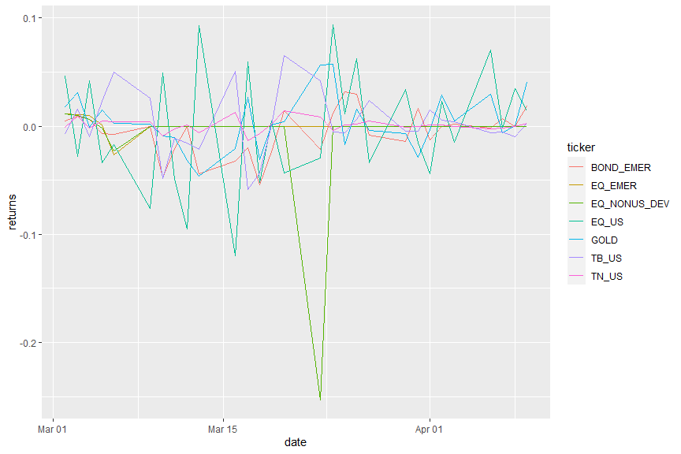
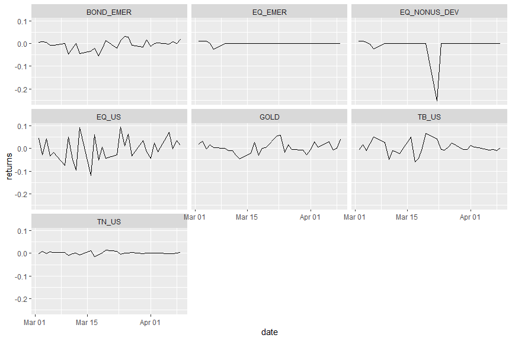

Tidy Data and its Shape
================

Holding data in a tidy format works wonders for one’s productivity.
Let’s explore the `tidyr` package, which is all about creating tidy
data.

In particular, let’s develop an understanding of the
`tidyr::pivot_longer` and `tidyr::pivot_wider` functions for switching
between different formats of tidy data.

## What’s tidy data?

Tidy data is data where:

  - Every column is variable.
  - Every row is an observation.
  - Every cell is a single value.

## Why do we care?

It turns out there are huge benefits to thinking about the “shape” of
your data and the best way to structure and manipulate it for your
problem.

Tidy data is a standard way of shaping data that facilitates analysis.
In particular, tidy data works very well with the tidyverse tools. Which
means less time spent transforming and cleaning data and more time spent
solving problems. In short, structuring data to facilitate analysis is
an enormous productivity hack.

Thinking in these terms has had a MASSIVE impact on the effectiveness
and speed of our research. We’re going to cover this in some detail in
the Armageddon bootcamp, along with some specific patterns for doing
trading analysis.

## Wide vs Long Data

Let’s take a look at some long-format data. This code loads a long
dataframe of daily returns for various indexes and prints the
observations from the beginning of March 2020:

``` r
if (!require("pacman")) install.packages("pacman")
```

    ## Loading required package: pacman

``` r
pacman::p_load(tidyverse, here, knitr, kableExtra)
load(here::here('data', 'indexreturns.RData'))

dailyindex_df <- dailyindex_df %>%
  filter(date >= '2020-03-01') 

dailyindex_df %>%
  kable() %>%
  kable_styling(full_width = FALSE, position = 'center') %>%
  scroll_box(width = '800px', height = '300px')
```

<div style="border: 1px solid #ddd; padding: 0px; overflow-y: scroll; height:300px; overflow-x: scroll; width:800px; ">

<table class="table" style="width: auto !important; margin-left: auto; margin-right: auto;">

<thead>

<tr>

<th style="text-align:left;position: sticky; top:0; background-color: #FFFFFF;">

date

</th>

<th style="text-align:left;position: sticky; top:0; background-color: #FFFFFF;">

ticker

</th>

<th style="text-align:right;position: sticky; top:0; background-color: #FFFFFF;">

returns

</th>

</tr>

</thead>

<tbody>

<tr>

<td style="text-align:left;">

2020-03-02

</td>

<td style="text-align:left;">

EQ\_US

</td>

<td style="text-align:right;">

0.0460048

</td>

</tr>

<tr>

<td style="text-align:left;">

2020-03-02

</td>

<td style="text-align:left;">

EQ\_NONUS\_DEV

</td>

<td style="text-align:right;">

0.0111621

</td>

</tr>

<tr>

<td style="text-align:left;">

2020-03-02

</td>

<td style="text-align:left;">

EQ\_EMER

</td>

<td style="text-align:right;">

0.0114468

</td>

</tr>

<tr>

<td style="text-align:left;">

2020-03-02

</td>

<td style="text-align:left;">

TN\_US

</td>

<td style="text-align:right;">

\-0.0008475

</td>

</tr>

<tr>

<td style="text-align:left;">

2020-03-02

</td>

<td style="text-align:left;">

TB\_US

</td>

<td style="text-align:right;">

\-0.0073579

</td>

</tr>

<tr>

<td style="text-align:left;">

2020-03-02

</td>

<td style="text-align:left;">

BOND\_EMER

</td>

<td style="text-align:right;">

0.0051502

</td>

</tr>

<tr>

<td style="text-align:left;">

2020-03-02

</td>

<td style="text-align:left;">

GOLD

</td>

<td style="text-align:right;">

0.0179376

</td>

</tr>

<tr>

<td style="text-align:left;">

2020-03-03

</td>

<td style="text-align:left;">

EQ\_US

</td>

<td style="text-align:right;">

\-0.0280740

</td>

</tr>

<tr>

<td style="text-align:left;">

2020-03-03

</td>

<td style="text-align:left;">

EQ\_NONUS\_DEV

</td>

<td style="text-align:right;">

0.0097820

</td>

</tr>

<tr>

<td style="text-align:left;">

2020-03-03

</td>

<td style="text-align:left;">

EQ\_EMER

</td>

<td style="text-align:right;">

0.0106093

</td>

</tr>

<tr>

<td style="text-align:left;">

2020-03-03

</td>

<td style="text-align:left;">

TN\_US

</td>

<td style="text-align:right;">

0.0093299

</td>

</tr>

<tr>

<td style="text-align:left;">

2020-03-03

</td>

<td style="text-align:left;">

TB\_US

</td>

<td style="text-align:right;">

0.0154987

</td>

</tr>

<tr>

<td style="text-align:left;">

2020-03-03

</td>

<td style="text-align:left;">

BOND\_EMER

</td>

<td style="text-align:right;">

0.0093937

</td>

</tr>

<tr>

<td style="text-align:left;">

2020-03-03

</td>

<td style="text-align:left;">

GOLD

</td>

<td style="text-align:right;">

0.0311450

</td>

</tr>

<tr>

<td style="text-align:left;">

2020-03-04

</td>

<td style="text-align:left;">

EQ\_US

</td>

<td style="text-align:right;">

0.0422302

</td>

</tr>

<tr>

<td style="text-align:left;">

2020-03-04

</td>

<td style="text-align:left;">

EQ\_NONUS\_DEV

</td>

<td style="text-align:right;">

0.0062777

</td>

</tr>

<tr>

<td style="text-align:left;">

2020-03-04

</td>

<td style="text-align:left;">

EQ\_EMER

</td>

<td style="text-align:right;">

0.0097196

</td>

</tr>

<tr>

<td style="text-align:left;">

2020-03-04

</td>

<td style="text-align:left;">

TN\_US

</td>

<td style="text-align:right;">

\-0.0016807

</td>

</tr>

<tr>

<td style="text-align:left;">

2020-03-04

</td>

<td style="text-align:left;">

TB\_US

</td>

<td style="text-align:right;">

\-0.0099536

</td>

</tr>

<tr>

<td style="text-align:left;">

2020-03-04

</td>

<td style="text-align:left;">

BOND\_EMER

</td>

<td style="text-align:right;">

0.0059222

</td>

</tr>

<tr>

<td style="text-align:left;">

2020-03-04

</td>

<td style="text-align:left;">

GOLD

</td>

<td style="text-align:right;">

\-0.0008743

</td>

</tr>

<tr>

<td style="text-align:left;">

2020-03-05

</td>

<td style="text-align:left;">

EQ\_US

</td>

<td style="text-align:right;">

\-0.0336854

</td>

</tr>

<tr>

<td style="text-align:left;">

2020-03-05

</td>

<td style="text-align:left;">

EQ\_NONUS\_DEV

</td>

<td style="text-align:right;">

\-0.0014521

</td>

</tr>

<tr>

<td style="text-align:left;">

2020-03-05

</td>

<td style="text-align:left;">

EQ\_EMER

</td>

<td style="text-align:right;">

0.0014743

</td>

</tr>

<tr>

<td style="text-align:left;">

2020-03-05

</td>

<td style="text-align:left;">

TN\_US

</td>

<td style="text-align:right;">

0.0050505

</td>

</tr>

<tr>

<td style="text-align:left;">

2020-03-05

</td>

<td style="text-align:left;">

TB\_US

</td>

<td style="text-align:right;">

0.0227882

</td>

</tr>

<tr>

<td style="text-align:left;">

2020-03-05

</td>

<td style="text-align:left;">

BOND\_EMER

</td>

<td style="text-align:right;">

\-0.0067283

</td>

</tr>

<tr>

<td style="text-align:left;">

2020-03-05

</td>

<td style="text-align:left;">

GOLD

</td>

<td style="text-align:right;">

0.0151949

</td>

</tr>

<tr>

<td style="text-align:left;">

2020-03-06

</td>

<td style="text-align:left;">

EQ\_US

</td>

<td style="text-align:right;">

\-0.0170369

</td>

</tr>

<tr>

<td style="text-align:left;">

2020-03-06

</td>

<td style="text-align:left;">

EQ\_NONUS\_DEV

</td>

<td style="text-align:right;">

\-0.0232132

</td>

</tr>

<tr>

<td style="text-align:left;">

2020-03-06

</td>

<td style="text-align:left;">

EQ\_EMER

</td>

<td style="text-align:right;">

\-0.0262282

</td>

</tr>

<tr>

<td style="text-align:left;">

2020-03-06

</td>

<td style="text-align:left;">

TN\_US

</td>

<td style="text-align:right;">

0.0041876

</td>

</tr>

<tr>

<td style="text-align:left;">

2020-03-06

</td>

<td style="text-align:left;">

TB\_US

</td>

<td style="text-align:right;">

0.0498034

</td>

</tr>

<tr>

<td style="text-align:left;">

2020-03-06

</td>

<td style="text-align:left;">

BOND\_EMER

</td>

<td style="text-align:right;">

\-0.0076207

</td>

</tr>

<tr>

<td style="text-align:left;">

2020-03-06

</td>

<td style="text-align:left;">

GOLD

</td>

<td style="text-align:right;">

0.0026644

</td>

</tr>

<tr>

<td style="text-align:left;">

2020-03-09

</td>

<td style="text-align:left;">

EQ\_US

</td>

<td style="text-align:right;">

\-0.0761665

</td>

</tr>

<tr>

<td style="text-align:left;">

2020-03-09

</td>

<td style="text-align:left;">

EQ\_NONUS\_DEV

</td>

<td style="text-align:right;">

0.0000000

</td>

</tr>

<tr>

<td style="text-align:left;">

2020-03-09

</td>

<td style="text-align:left;">

EQ\_EMER

</td>

<td style="text-align:right;">

0.0000000

</td>

</tr>

<tr>

<td style="text-align:left;">

2020-03-09

</td>

<td style="text-align:left;">

TN\_US

</td>

<td style="text-align:right;">

0.0041701

</td>

</tr>

<tr>

<td style="text-align:left;">

2020-03-09

</td>

<td style="text-align:left;">

TB\_US

</td>

<td style="text-align:right;">

0.0262172

</td>

</tr>

<tr>

<td style="text-align:left;">

2020-03-09

</td>

<td style="text-align:left;">

BOND\_EMER

</td>

<td style="text-align:right;">

0.0000000

</td>

</tr>

<tr>

<td style="text-align:left;">

2020-03-09

</td>

<td style="text-align:left;">

GOLD

</td>

<td style="text-align:right;">

0.0018757

</td>

</tr>

<tr>

<td style="text-align:left;">

2020-03-10

</td>

<td style="text-align:left;">

EQ\_US

</td>

<td style="text-align:right;">

0.0494037

</td>

</tr>

<tr>

<td style="text-align:left;">

2020-03-10

</td>

<td style="text-align:left;">

EQ\_NONUS\_DEV

</td>

<td style="text-align:right;">

0.0000000

</td>

</tr>

<tr>

<td style="text-align:left;">

2020-03-10

</td>

<td style="text-align:left;">

EQ\_EMER

</td>

<td style="text-align:right;">

0.0000000

</td>

</tr>

<tr>

<td style="text-align:left;">

2020-03-10

</td>

<td style="text-align:left;">

TN\_US

</td>

<td style="text-align:right;">

\-0.0091362

</td>

</tr>

<tr>

<td style="text-align:left;">

2020-03-10

</td>

<td style="text-align:left;">

TB\_US

</td>

<td style="text-align:right;">

\-0.0486618

</td>

</tr>

<tr>

<td style="text-align:left;">

2020-03-10

</td>

<td style="text-align:left;">

BOND\_EMER

</td>

<td style="text-align:right;">

\-0.0477816

</td>

</tr>

<tr>

<td style="text-align:left;">

2020-03-10

</td>

<td style="text-align:left;">

GOLD

</td>

<td style="text-align:right;">

\-0.0091271

</td>

</tr>

<tr>

<td style="text-align:left;">

2020-03-11

</td>

<td style="text-align:left;">

EQ\_US

</td>

<td style="text-align:right;">

\-0.0487713

</td>

</tr>

<tr>

<td style="text-align:left;">

2020-03-11

</td>

<td style="text-align:left;">

EQ\_NONUS\_DEV

</td>

<td style="text-align:right;">

0.0000000

</td>

</tr>

<tr>

<td style="text-align:left;">

2020-03-11

</td>

<td style="text-align:left;">

EQ\_EMER

</td>

<td style="text-align:right;">

0.0000000

</td>

</tr>

<tr>

<td style="text-align:left;">

2020-03-11

</td>

<td style="text-align:left;">

TN\_US

</td>

<td style="text-align:right;">

\-0.0025147

</td>

</tr>

<tr>

<td style="text-align:left;">

2020-03-11

</td>

<td style="text-align:left;">

TB\_US

</td>

<td style="text-align:right;">

\-0.0108696

</td>

</tr>

<tr>

<td style="text-align:left;">

2020-03-11

</td>

<td style="text-align:left;">

BOND\_EMER

</td>

<td style="text-align:right;">

\-0.0206093

</td>

</tr>

<tr>

<td style="text-align:left;">

2020-03-11

</td>

<td style="text-align:left;">

GOLD

</td>

<td style="text-align:right;">

\-0.0107857

</td>

</tr>

<tr>

<td style="text-align:left;">

2020-03-12

</td>

<td style="text-align:left;">

EQ\_US

</td>

<td style="text-align:right;">

\-0.0949084

</td>

</tr>

<tr>

<td style="text-align:left;">

2020-03-12

</td>

<td style="text-align:left;">

EQ\_NONUS\_DEV

</td>

<td style="text-align:right;">

0.0000000

</td>

</tr>

<tr>

<td style="text-align:left;">

2020-03-12

</td>

<td style="text-align:left;">

EQ\_EMER

</td>

<td style="text-align:right;">

0.0000000

</td>

</tr>

<tr>

<td style="text-align:left;">

2020-03-12

</td>

<td style="text-align:left;">

TN\_US

</td>

<td style="text-align:right;">

0.0008403

</td>

</tr>

<tr>

<td style="text-align:left;">

2020-03-12

</td>

<td style="text-align:left;">

TB\_US

</td>

<td style="text-align:right;">

\-0.0155139

</td>

</tr>

<tr>

<td style="text-align:left;">

2020-03-12

</td>

<td style="text-align:left;">

BOND\_EMER

</td>

<td style="text-align:right;">

0.0000000

</td>

</tr>

<tr>

<td style="text-align:left;">

2020-03-12

</td>

<td style="text-align:left;">

GOLD

</td>

<td style="text-align:right;">

\-0.0317549

</td>

</tr>

<tr>

<td style="text-align:left;">

2020-03-13

</td>

<td style="text-align:left;">

EQ\_US

</td>

<td style="text-align:right;">

0.0931900

</td>

</tr>

<tr>

<td style="text-align:left;">

2020-03-13

</td>

<td style="text-align:left;">

EQ\_NONUS\_DEV

</td>

<td style="text-align:right;">

0.0000000

</td>

</tr>

<tr>

<td style="text-align:left;">

2020-03-13

</td>

<td style="text-align:left;">

EQ\_EMER

</td>

<td style="text-align:right;">

0.0000000

</td>

</tr>

<tr>

<td style="text-align:left;">

2020-03-13

</td>

<td style="text-align:left;">

TN\_US

</td>

<td style="text-align:right;">

\-0.0058774

</td>

</tr>

<tr>

<td style="text-align:left;">

2020-03-13

</td>

<td style="text-align:left;">

TB\_US

</td>

<td style="text-align:right;">

\-0.0216678

</td>

</tr>

<tr>

<td style="text-align:left;">

2020-03-13

</td>

<td style="text-align:left;">

BOND\_EMER

</td>

<td style="text-align:right;">

\-0.0439158

</td>

</tr>

<tr>

<td style="text-align:left;">

2020-03-13

</td>

<td style="text-align:left;">

GOLD

</td>

<td style="text-align:right;">

\-0.0462765

</td>

</tr>

<tr>

<td style="text-align:left;">

2020-03-16

</td>

<td style="text-align:left;">

EQ\_US

</td>

<td style="text-align:right;">

\-0.1197921

</td>

</tr>

<tr>

<td style="text-align:left;">

2020-03-16

</td>

<td style="text-align:left;">

EQ\_NONUS\_DEV

</td>

<td style="text-align:right;">

0.0000000

</td>

</tr>

<tr>

<td style="text-align:left;">

2020-03-16

</td>

<td style="text-align:left;">

EQ\_EMER

</td>

<td style="text-align:right;">

0.0000000

</td>

</tr>

<tr>

<td style="text-align:left;">

2020-03-16

</td>

<td style="text-align:left;">

TN\_US

</td>

<td style="text-align:right;">

0.0126689

</td>

</tr>

<tr>

<td style="text-align:left;">

2020-03-16

</td>

<td style="text-align:left;">

TB\_US

</td>

<td style="text-align:right;">

0.0510067

</td>

</tr>

<tr>

<td style="text-align:left;">

2020-03-16

</td>

<td style="text-align:left;">

BOND\_EMER

</td>

<td style="text-align:right;">

\-0.0325359

</td>

</tr>

<tr>

<td style="text-align:left;">

2020-03-16

</td>

<td style="text-align:left;">

GOLD

</td>

<td style="text-align:right;">

\-0.0203396

</td>

</tr>

<tr>

<td style="text-align:left;">

2020-03-17

</td>

<td style="text-align:left;">

EQ\_US

</td>

<td style="text-align:right;">

0.0597801

</td>

</tr>

<tr>

<td style="text-align:left;">

2020-03-17

</td>

<td style="text-align:left;">

EQ\_NONUS\_DEV

</td>

<td style="text-align:right;">

0.0000000

</td>

</tr>

<tr>

<td style="text-align:left;">

2020-03-17

</td>

<td style="text-align:left;">

EQ\_EMER

</td>

<td style="text-align:right;">

0.0000000

</td>

</tr>

<tr>

<td style="text-align:left;">

2020-03-17

</td>

<td style="text-align:left;">

TN\_US

</td>

<td style="text-align:right;">

\-0.0133445

</td>

</tr>

<tr>

<td style="text-align:left;">

2020-03-17

</td>

<td style="text-align:left;">

TB\_US

</td>

<td style="text-align:right;">

\-0.0587484

</td>

</tr>

<tr>

<td style="text-align:left;">

2020-03-17

</td>

<td style="text-align:left;">

BOND\_EMER

</td>

<td style="text-align:right;">

\-0.0197824

</td>

</tr>

<tr>

<td style="text-align:left;">

2020-03-17

</td>

<td style="text-align:left;">

GOLD

</td>

<td style="text-align:right;">

0.0265681

</td>

</tr>

<tr>

<td style="text-align:left;">

2020-03-18

</td>

<td style="text-align:left;">

EQ\_US

</td>

<td style="text-align:right;">

\-0.0517360

</td>

</tr>

<tr>

<td style="text-align:left;">

2020-03-18

</td>

<td style="text-align:left;">

EQ\_NONUS\_DEV

</td>

<td style="text-align:right;">

0.0000000

</td>

</tr>

<tr>

<td style="text-align:left;">

2020-03-18

</td>

<td style="text-align:left;">

EQ\_EMER

</td>

<td style="text-align:right;">

0.0000000

</td>

</tr>

<tr>

<td style="text-align:left;">

2020-03-18

</td>

<td style="text-align:left;">

TN\_US

</td>

<td style="text-align:right;">

\-0.0067625

</td>

</tr>

<tr>

<td style="text-align:left;">

2020-03-18

</td>

<td style="text-align:left;">

TB\_US

</td>

<td style="text-align:right;">

\-0.0434193

</td>

</tr>

<tr>

<td style="text-align:left;">

2020-03-18

</td>

<td style="text-align:left;">

BOND\_EMER

</td>

<td style="text-align:right;">

\-0.0544904

</td>

</tr>

<tr>

<td style="text-align:left;">

2020-03-18

</td>

<td style="text-align:left;">

GOLD

</td>

<td style="text-align:right;">

\-0.0311081

</td>

</tr>

<tr>

<td style="text-align:left;">

2020-03-19

</td>

<td style="text-align:left;">

EQ\_US

</td>

<td style="text-align:right;">

0.0047010

</td>

</tr>

<tr>

<td style="text-align:left;">

2020-03-19

</td>

<td style="text-align:left;">

EQ\_NONUS\_DEV

</td>

<td style="text-align:right;">

0.0000000

</td>

</tr>

<tr>

<td style="text-align:left;">

2020-03-19

</td>

<td style="text-align:left;">

EQ\_EMER

</td>

<td style="text-align:right;">

0.0000000

</td>

</tr>

<tr>

<td style="text-align:left;">

2020-03-19

</td>

<td style="text-align:left;">

TN\_US

</td>

<td style="text-align:right;">

0.0017021

</td>

</tr>

<tr>

<td style="text-align:left;">

2020-03-19

</td>

<td style="text-align:left;">

TB\_US

</td>

<td style="text-align:right;">

0.0007092

</td>

</tr>

<tr>

<td style="text-align:left;">

2020-03-19

</td>

<td style="text-align:left;">

BOND\_EMER

</td>

<td style="text-align:right;">

\-0.0234792

</td>

</tr>

<tr>

<td style="text-align:left;">

2020-03-19

</td>

<td style="text-align:left;">

GOLD

</td>

<td style="text-align:right;">

0.0011498

</td>

</tr>

<tr>

<td style="text-align:left;">

2020-03-20

</td>

<td style="text-align:left;">

EQ\_US

</td>

<td style="text-align:right;">

\-0.0431907

</td>

</tr>

<tr>

<td style="text-align:left;">

2020-03-20

</td>

<td style="text-align:left;">

EQ\_NONUS\_DEV

</td>

<td style="text-align:right;">

0.0000000

</td>

</tr>

<tr>

<td style="text-align:left;">

2020-03-20

</td>

<td style="text-align:left;">

EQ\_EMER

</td>

<td style="text-align:right;">

0.0000000

</td>

</tr>

<tr>

<td style="text-align:left;">

2020-03-20

</td>

<td style="text-align:left;">

TN\_US

</td>

<td style="text-align:right;">

0.0144435

</td>

</tr>

<tr>

<td style="text-align:left;">

2020-03-20

</td>

<td style="text-align:left;">

TB\_US

</td>

<td style="text-align:right;">

0.0652020

</td>

</tr>

<tr>

<td style="text-align:left;">

2020-03-20

</td>

<td style="text-align:left;">

BOND\_EMER

</td>

<td style="text-align:right;">

0.0142077

</td>

</tr>

<tr>

<td style="text-align:left;">

2020-03-20

</td>

<td style="text-align:left;">

GOLD

</td>

<td style="text-align:right;">

0.0039756

</td>

</tr>

<tr>

<td style="text-align:left;">

2020-03-23

</td>

<td style="text-align:left;">

EQ\_US

</td>

<td style="text-align:right;">

\-0.0292942

</td>

</tr>

<tr>

<td style="text-align:left;">

2020-03-23

</td>

<td style="text-align:left;">

EQ\_NONUS\_DEV

</td>

<td style="text-align:right;">

\-0.2532532

</td>

</tr>

<tr>

<td style="text-align:left;">

2020-03-23

</td>

<td style="text-align:left;">

EQ\_EMER

</td>

<td style="text-align:right;">

0.0000000

</td>

</tr>

<tr>

<td style="text-align:left;">

2020-03-23

</td>

<td style="text-align:left;">

TN\_US

</td>

<td style="text-align:right;">

0.0083752

</td>

</tr>

<tr>

<td style="text-align:left;">

2020-03-23

</td>

<td style="text-align:left;">

TB\_US

</td>

<td style="text-align:right;">

0.0419162

</td>

</tr>

<tr>

<td style="text-align:left;">

2020-03-23

</td>

<td style="text-align:left;">

BOND\_EMER

</td>

<td style="text-align:right;">

\-0.0215517

</td>

</tr>

<tr>

<td style="text-align:left;">

2020-03-23

</td>

<td style="text-align:left;">

GOLD

</td>

<td style="text-align:right;">

0.0568462

</td>

</tr>

<tr>

<td style="text-align:left;">

2020-03-24

</td>

<td style="text-align:left;">

EQ\_US

</td>

<td style="text-align:right;">

0.0939740

</td>

</tr>

<tr>

<td style="text-align:left;">

2020-03-24

</td>

<td style="text-align:left;">

EQ\_NONUS\_DEV

</td>

<td style="text-align:right;">

0.0000000

</td>

</tr>

<tr>

<td style="text-align:left;">

2020-03-24

</td>

<td style="text-align:left;">

EQ\_EMER

</td>

<td style="text-align:right;">

0.0000000

</td>

</tr>

<tr>

<td style="text-align:left;">

2020-03-24

</td>

<td style="text-align:left;">

TN\_US

</td>

<td style="text-align:right;">

\-0.0041528

</td>

</tr>

<tr>

<td style="text-align:left;">

2020-03-24

</td>

<td style="text-align:left;">

TB\_US

</td>

<td style="text-align:right;">

\-0.0051086

</td>

</tr>

<tr>

<td style="text-align:left;">

2020-03-24

</td>

<td style="text-align:left;">

BOND\_EMER

</td>

<td style="text-align:right;">

0.0121145

</td>

</tr>

<tr>

<td style="text-align:left;">

2020-03-24

</td>

<td style="text-align:left;">

GOLD

</td>

<td style="text-align:right;">

0.0575354

</td>

</tr>

<tr>

<td style="text-align:left;">

2020-03-25

</td>

<td style="text-align:left;">

EQ\_US

</td>

<td style="text-align:right;">

0.0115569

</td>

</tr>

<tr>

<td style="text-align:left;">

2020-03-25

</td>

<td style="text-align:left;">

EQ\_NONUS\_DEV

</td>

<td style="text-align:right;">

0.0000000

</td>

</tr>

<tr>

<td style="text-align:left;">

2020-03-25

</td>

<td style="text-align:left;">

EQ\_EMER

</td>

<td style="text-align:right;">

0.0000000

</td>

</tr>

<tr>

<td style="text-align:left;">

2020-03-25

</td>

<td style="text-align:left;">

TN\_US

</td>

<td style="text-align:right;">

0.0008340

</td>

</tr>

<tr>

<td style="text-align:left;">

2020-03-25

</td>

<td style="text-align:left;">

TB\_US

</td>

<td style="text-align:right;">

\-0.0064185

</td>

</tr>

<tr>

<td style="text-align:left;">

2020-03-25

</td>

<td style="text-align:left;">

BOND\_EMER

</td>

<td style="text-align:right;">

0.0315560

</td>

</tr>

<tr>

<td style="text-align:left;">

2020-03-25

</td>

<td style="text-align:left;">

GOLD

</td>

<td style="text-align:right;">

\-0.0174002

</td>

</tr>

<tr>

<td style="text-align:left;">

2020-03-26

</td>

<td style="text-align:left;">

EQ\_US

</td>

<td style="text-align:right;">

0.0624207

</td>

</tr>

<tr>

<td style="text-align:left;">

2020-03-26

</td>

<td style="text-align:left;">

EQ\_NONUS\_DEV

</td>

<td style="text-align:right;">

0.0000000

</td>

</tr>

<tr>

<td style="text-align:left;">

2020-03-26

</td>

<td style="text-align:left;">

EQ\_EMER

</td>

<td style="text-align:right;">

0.0000000

</td>

</tr>

<tr>

<td style="text-align:left;">

2020-03-26

</td>

<td style="text-align:left;">

TN\_US

</td>

<td style="text-align:right;">

0.0016667

</td>

</tr>

<tr>

<td style="text-align:left;">

2020-03-26

</td>

<td style="text-align:left;">

TB\_US

</td>

<td style="text-align:right;">

0.0064599

</td>

</tr>

<tr>

<td style="text-align:left;">

2020-03-26

</td>

<td style="text-align:left;">

BOND\_EMER

</td>

<td style="text-align:right;">

0.0295359

</td>

</tr>

<tr>

<td style="text-align:left;">

2020-03-26

</td>

<td style="text-align:left;">

GOLD

</td>

<td style="text-align:right;">

0.0159455

</td>

</tr>

<tr>

<td style="text-align:left;">

2020-03-27

</td>

<td style="text-align:left;">

EQ\_US

</td>

<td style="text-align:right;">

\-0.0336616

</td>

</tr>

<tr>

<td style="text-align:left;">

2020-03-27

</td>

<td style="text-align:left;">

EQ\_NONUS\_DEV

</td>

<td style="text-align:right;">

0.0000000

</td>

</tr>

<tr>

<td style="text-align:left;">

2020-03-27

</td>

<td style="text-align:left;">

EQ\_EMER

</td>

<td style="text-align:right;">

0.0000000

</td>

</tr>

<tr>

<td style="text-align:left;">

2020-03-27

</td>

<td style="text-align:left;">

TN\_US

</td>

<td style="text-align:right;">

0.0049917

</td>

</tr>

<tr>

<td style="text-align:left;">

2020-03-27

</td>

<td style="text-align:left;">

TB\_US

</td>

<td style="text-align:right;">

0.0237484

</td>

</tr>

<tr>

<td style="text-align:left;">

2020-03-27

</td>

<td style="text-align:left;">

BOND\_EMER

</td>

<td style="text-align:right;">

\-0.0081967

</td>

</tr>

<tr>

<td style="text-align:left;">

2020-03-27

</td>

<td style="text-align:left;">

GOLD

</td>

<td style="text-align:right;">

\-0.0037858

</td>

</tr>

<tr>

<td style="text-align:left;">

2020-03-30

</td>

<td style="text-align:left;">

EQ\_US

</td>

<td style="text-align:right;">

0.0336403

</td>

</tr>

<tr>

<td style="text-align:left;">

2020-03-30

</td>

<td style="text-align:left;">

EQ\_NONUS\_DEV

</td>

<td style="text-align:right;">

0.0000000

</td>

</tr>

<tr>

<td style="text-align:left;">

2020-03-30

</td>

<td style="text-align:left;">

EQ\_EMER

</td>

<td style="text-align:right;">

0.0000000

</td>

</tr>

<tr>

<td style="text-align:left;">

2020-03-30

</td>

<td style="text-align:left;">

TN\_US

</td>

<td style="text-align:right;">

\-0.0008278

</td>

</tr>

<tr>

<td style="text-align:left;">

2020-03-30

</td>

<td style="text-align:left;">

TB\_US

</td>

<td style="text-align:right;">

\-0.0050157

</td>

</tr>

<tr>

<td style="text-align:left;">

2020-03-30

</td>

<td style="text-align:left;">

BOND\_EMER

</td>

<td style="text-align:right;">

\-0.0144628

</td>

</tr>

<tr>

<td style="text-align:left;">

2020-03-30

</td>

<td style="text-align:left;">

GOLD

</td>

<td style="text-align:right;">

\-0.0065711

</td>

</tr>

<tr>

<td style="text-align:left;">

2020-03-31

</td>

<td style="text-align:left;">

EQ\_US

</td>

<td style="text-align:right;">

\-0.0159221

</td>

</tr>

<tr>

<td style="text-align:left;">

2020-03-31

</td>

<td style="text-align:left;">

EQ\_NONUS\_DEV

</td>

<td style="text-align:right;">

0.0000000

</td>

</tr>

<tr>

<td style="text-align:left;">

2020-03-31

</td>

<td style="text-align:left;">

EQ\_EMER

</td>

<td style="text-align:right;">

0.0000000

</td>

</tr>

<tr>

<td style="text-align:left;">

2020-03-31

</td>

<td style="text-align:left;">

TN\_US

</td>

<td style="text-align:right;">

\-0.0001659

</td>

</tr>

<tr>

<td style="text-align:left;">

2020-03-31

</td>

<td style="text-align:left;">

TB\_US

</td>

<td style="text-align:right;">

\-0.0045962

</td>

</tr>

<tr>

<td style="text-align:left;">

2020-03-31

</td>

<td style="text-align:left;">

BOND\_EMER

</td>

<td style="text-align:right;">

0.0165385

</td>

</tr>

<tr>

<td style="text-align:left;">

2020-03-31

</td>

<td style="text-align:left;">

GOLD

</td>

<td style="text-align:right;">

\-0.0283711

</td>

</tr>

<tr>

<td style="text-align:left;">

2020-04-01

</td>

<td style="text-align:left;">

EQ\_US

</td>

<td style="text-align:right;">

\-0.0441380

</td>

</tr>

<tr>

<td style="text-align:left;">

2020-04-01

</td>

<td style="text-align:left;">

EQ\_NONUS\_DEV

</td>

<td style="text-align:right;">

0.0000000

</td>

</tr>

<tr>

<td style="text-align:left;">

2020-04-01

</td>

<td style="text-align:left;">

EQ\_EMER

</td>

<td style="text-align:right;">

0.0000000

</td>

</tr>

<tr>

<td style="text-align:left;">

2020-04-01

</td>

<td style="text-align:left;">

TN\_US

</td>

<td style="text-align:right;">

0.0008299

</td>

</tr>

<tr>

<td style="text-align:left;">

2020-04-01

</td>

<td style="text-align:left;">

TB\_US

</td>

<td style="text-align:right;">

0.0147059

</td>

</tr>

<tr>

<td style="text-align:left;">

2020-04-01

</td>

<td style="text-align:left;">

BOND\_EMER

</td>

<td style="text-align:right;">

\-0.0124352

</td>

</tr>

<tr>

<td style="text-align:left;">

2020-04-01

</td>

<td style="text-align:left;">

GOLD

</td>

<td style="text-align:right;">

\-0.0032808

</td>

</tr>

<tr>

<td style="text-align:left;">

2020-04-02

</td>

<td style="text-align:left;">

EQ\_US

</td>

<td style="text-align:right;">

0.0230223

</td>

</tr>

<tr>

<td style="text-align:left;">

2020-04-02

</td>

<td style="text-align:left;">

EQ\_NONUS\_DEV

</td>

<td style="text-align:right;">

0.0000000

</td>

</tr>

<tr>

<td style="text-align:left;">

2020-04-02

</td>

<td style="text-align:left;">

EQ\_EMER

</td>

<td style="text-align:right;">

0.0000000

</td>

</tr>

<tr>

<td style="text-align:left;">

2020-04-02

</td>

<td style="text-align:left;">

TN\_US

</td>

<td style="text-align:right;">

0.0008292

</td>

</tr>

<tr>

<td style="text-align:left;">

2020-04-02

</td>

<td style="text-align:left;">

TB\_US

</td>

<td style="text-align:right;">

0.0056711

</td>

</tr>

<tr>

<td style="text-align:left;">

2020-04-02

</td>

<td style="text-align:left;">

BOND\_EMER

</td>

<td style="text-align:right;">

0.0000000

</td>

</tr>

<tr>

<td style="text-align:left;">

2020-04-02

</td>

<td style="text-align:left;">

GOLD

</td>

<td style="text-align:right;">

0.0291310

</td>

</tr>

<tr>

<td style="text-align:left;">

2020-04-03

</td>

<td style="text-align:left;">

EQ\_US

</td>

<td style="text-align:right;">

\-0.0150028

</td>

</tr>

<tr>

<td style="text-align:left;">

2020-04-03

</td>

<td style="text-align:left;">

EQ\_NONUS\_DEV

</td>

<td style="text-align:right;">

0.0000000

</td>

</tr>

<tr>

<td style="text-align:left;">

2020-04-03

</td>

<td style="text-align:left;">

EQ\_EMER

</td>

<td style="text-align:right;">

0.0000000

</td>

</tr>

<tr>

<td style="text-align:left;">

2020-04-03

</td>

<td style="text-align:left;">

TN\_US

</td>

<td style="text-align:right;">

0.0000000

</td>

</tr>

<tr>

<td style="text-align:left;">

2020-04-03

</td>

<td style="text-align:left;">

TB\_US

</td>

<td style="text-align:right;">

0.0043860

</td>

</tr>

<tr>

<td style="text-align:left;">

2020-04-03

</td>

<td style="text-align:left;">

BOND\_EMER

</td>

<td style="text-align:right;">

0.0020986

</td>

</tr>

<tr>

<td style="text-align:left;">

2020-04-03

</td>

<td style="text-align:left;">

GOLD

</td>

<td style="text-align:right;">

0.0048777

</td>

</tr>

<tr>

<td style="text-align:left;">

2020-04-06

</td>

<td style="text-align:left;">

EQ\_US

</td>

<td style="text-align:right;">

0.0702816

</td>

</tr>

<tr>

<td style="text-align:left;">

2020-04-06

</td>

<td style="text-align:left;">

EQ\_NONUS\_DEV

</td>

<td style="text-align:right;">

0.0000000

</td>

</tr>

<tr>

<td style="text-align:left;">

2020-04-06

</td>

<td style="text-align:left;">

EQ\_EMER

</td>

<td style="text-align:right;">

0.0000000

</td>

</tr>

<tr>

<td style="text-align:left;">

2020-04-06

</td>

<td style="text-align:left;">

TN\_US

</td>

<td style="text-align:right;">

\-0.0024855

</td>

</tr>

<tr>

<td style="text-align:left;">

2020-04-06

</td>

<td style="text-align:left;">

TB\_US

</td>

<td style="text-align:right;">

\-0.0062383

</td>

</tr>

<tr>

<td style="text-align:left;">

2020-04-06

</td>

<td style="text-align:left;">

BOND\_EMER

</td>

<td style="text-align:right;">

\-0.0020942

</td>

</tr>

<tr>

<td style="text-align:left;">

2020-04-06

</td>

<td style="text-align:left;">

GOLD

</td>

<td style="text-align:right;">

0.0292830

</td>

</tr>

<tr>

<td style="text-align:left;">

2020-04-07

</td>

<td style="text-align:left;">

EQ\_US

</td>

<td style="text-align:right;">

\-0.0015858

</td>

</tr>

<tr>

<td style="text-align:left;">

2020-04-07

</td>

<td style="text-align:left;">

EQ\_NONUS\_DEV

</td>

<td style="text-align:right;">

0.0000000

</td>

</tr>

<tr>

<td style="text-align:left;">

2020-04-07

</td>

<td style="text-align:left;">

EQ\_EMER

</td>

<td style="text-align:right;">

0.0000000

</td>

</tr>

<tr>

<td style="text-align:left;">

2020-04-07

</td>

<td style="text-align:left;">

TN\_US

</td>

<td style="text-align:right;">

\-0.0016611

</td>

</tr>

<tr>

<td style="text-align:left;">

2020-04-07

</td>

<td style="text-align:left;">

TB\_US

</td>

<td style="text-align:right;">

\-0.0056497

</td>

</tr>

<tr>

<td style="text-align:left;">

2020-04-07

</td>

<td style="text-align:left;">

BOND\_EMER

</td>

<td style="text-align:right;">

0.0073452

</td>

</tr>

<tr>

<td style="text-align:left;">

2020-04-07

</td>

<td style="text-align:left;">

GOLD

</td>

<td style="text-align:right;">

\-0.0060302

</td>

</tr>

<tr>

<td style="text-align:left;">

2020-04-08

</td>

<td style="text-align:left;">

EQ\_US

</td>

<td style="text-align:right;">

0.0343311

</td>

</tr>

<tr>

<td style="text-align:left;">

2020-04-08

</td>

<td style="text-align:left;">

EQ\_NONUS\_DEV

</td>

<td style="text-align:right;">

0.0000000

</td>

</tr>

<tr>

<td style="text-align:left;">

2020-04-08

</td>

<td style="text-align:left;">

EQ\_EMER

</td>

<td style="text-align:right;">

0.0000000

</td>

</tr>

<tr>

<td style="text-align:left;">

2020-04-08

</td>

<td style="text-align:left;">

TN\_US

</td>

<td style="text-align:right;">

0.0000000

</td>

</tr>

<tr>

<td style="text-align:left;">

2020-04-08

</td>

<td style="text-align:left;">

TB\_US

</td>

<td style="text-align:right;">

\-0.0094697

</td>

</tr>

<tr>

<td style="text-align:left;">

2020-04-08

</td>

<td style="text-align:left;">

BOND\_EMER

</td>

<td style="text-align:right;">

0.0000000

</td>

</tr>

<tr>

<td style="text-align:left;">

2020-04-08

</td>

<td style="text-align:left;">

GOLD

</td>

<td style="text-align:right;">

0.0003889

</td>

</tr>

<tr>

<td style="text-align:left;">

2020-04-09

</td>

<td style="text-align:left;">

EQ\_US

</td>

<td style="text-align:right;">

0.0146074

</td>

</tr>

<tr>

<td style="text-align:left;">

2020-04-09

</td>

<td style="text-align:left;">

EQ\_NONUS\_DEV

</td>

<td style="text-align:right;">

0.0000000

</td>

</tr>

<tr>

<td style="text-align:left;">

2020-04-09

</td>

<td style="text-align:left;">

EQ\_EMER

</td>

<td style="text-align:right;">

0.0000000

</td>

</tr>

<tr>

<td style="text-align:left;">

2020-04-09

</td>

<td style="text-align:left;">

TN\_US

</td>

<td style="text-align:right;">

0.0024958

</td>

</tr>

<tr>

<td style="text-align:left;">

2020-04-09

</td>

<td style="text-align:left;">

TB\_US

</td>

<td style="text-align:right;">

0.0025494

</td>

</tr>

<tr>

<td style="text-align:left;">

2020-04-09

</td>

<td style="text-align:left;">

BOND\_EMER

</td>

<td style="text-align:right;">

0.0187500

</td>

</tr>

<tr>

<td style="text-align:left;">

2020-04-09

</td>

<td style="text-align:left;">

GOLD

</td>

<td style="text-align:right;">

0.0406624

</td>

</tr>

</tbody>

</table>

</div>

Long data is presented with one or more columns containing a key and
another containing all the values.

In this example, the key, or so-called "unit of analysis: is
date-ticker. That is, each value (in the returns column) is uniquely
associated with a date-ticker joint key.

The joint key date-ticker would be the starting point of any analysis
we’d want to do on this data set.

This is often easier to manage and process, however if you’re used to
looking at spreadhseets it can be harder to understand intuitively
(although I think that this difficulty evaporates fairly quickly once
you start using the tools).

While structuring data as key-value pairs might seem odd if you’re not
used to it, it does actually facilitate your conceptual clarity of the
problem at hand.

For example, in the example above, it is clear that the unique
identifier of each return is the date-ticker joint key.

With that clarity, it becomes much simpler to imagine the steps in an
analysis workflow. You get quite productive and effective at this with a
little practice.

Let’s compare this with the same data in wide format:

``` r
dailyindex_df %>%
  pivot_wider(names_from = ticker, values_from = returns) %>%
  kable() %>%
  kable_styling(position = 'center') %>%
  scroll_box(width = '800px', height = '300px')
```

<div style="border: 1px solid #ddd; padding: 0px; overflow-y: scroll; height:300px; overflow-x: scroll; width:800px; ">

<table class="table" style="margin-left: auto; margin-right: auto;">

<thead>

<tr>

<th style="text-align:left;position: sticky; top:0; background-color: #FFFFFF;">

date

</th>

<th style="text-align:right;position: sticky; top:0; background-color: #FFFFFF;">

EQ\_US

</th>

<th style="text-align:right;position: sticky; top:0; background-color: #FFFFFF;">

EQ\_NONUS\_DEV

</th>

<th style="text-align:right;position: sticky; top:0; background-color: #FFFFFF;">

EQ\_EMER

</th>

<th style="text-align:right;position: sticky; top:0; background-color: #FFFFFF;">

TN\_US

</th>

<th style="text-align:right;position: sticky; top:0; background-color: #FFFFFF;">

TB\_US

</th>

<th style="text-align:right;position: sticky; top:0; background-color: #FFFFFF;">

BOND\_EMER

</th>

<th style="text-align:right;position: sticky; top:0; background-color: #FFFFFF;">

GOLD

</th>

</tr>

</thead>

<tbody>

<tr>

<td style="text-align:left;">

2020-03-02

</td>

<td style="text-align:right;">

0.0460048

</td>

<td style="text-align:right;">

0.0111621

</td>

<td style="text-align:right;">

0.0114468

</td>

<td style="text-align:right;">

\-0.0008475

</td>

<td style="text-align:right;">

\-0.0073579

</td>

<td style="text-align:right;">

0.0051502

</td>

<td style="text-align:right;">

0.0179376

</td>

</tr>

<tr>

<td style="text-align:left;">

2020-03-03

</td>

<td style="text-align:right;">

\-0.0280740

</td>

<td style="text-align:right;">

0.0097820

</td>

<td style="text-align:right;">

0.0106093

</td>

<td style="text-align:right;">

0.0093299

</td>

<td style="text-align:right;">

0.0154987

</td>

<td style="text-align:right;">

0.0093937

</td>

<td style="text-align:right;">

0.0311450

</td>

</tr>

<tr>

<td style="text-align:left;">

2020-03-04

</td>

<td style="text-align:right;">

0.0422302

</td>

<td style="text-align:right;">

0.0062777

</td>

<td style="text-align:right;">

0.0097196

</td>

<td style="text-align:right;">

\-0.0016807

</td>

<td style="text-align:right;">

\-0.0099536

</td>

<td style="text-align:right;">

0.0059222

</td>

<td style="text-align:right;">

\-0.0008743

</td>

</tr>

<tr>

<td style="text-align:left;">

2020-03-05

</td>

<td style="text-align:right;">

\-0.0336854

</td>

<td style="text-align:right;">

\-0.0014521

</td>

<td style="text-align:right;">

0.0014743

</td>

<td style="text-align:right;">

0.0050505

</td>

<td style="text-align:right;">

0.0227882

</td>

<td style="text-align:right;">

\-0.0067283

</td>

<td style="text-align:right;">

0.0151949

</td>

</tr>

<tr>

<td style="text-align:left;">

2020-03-06

</td>

<td style="text-align:right;">

\-0.0170369

</td>

<td style="text-align:right;">

\-0.0232132

</td>

<td style="text-align:right;">

\-0.0262282

</td>

<td style="text-align:right;">

0.0041876

</td>

<td style="text-align:right;">

0.0498034

</td>

<td style="text-align:right;">

\-0.0076207

</td>

<td style="text-align:right;">

0.0026644

</td>

</tr>

<tr>

<td style="text-align:left;">

2020-03-09

</td>

<td style="text-align:right;">

\-0.0761665

</td>

<td style="text-align:right;">

0.0000000

</td>

<td style="text-align:right;">

0.0000000

</td>

<td style="text-align:right;">

0.0041701

</td>

<td style="text-align:right;">

0.0262172

</td>

<td style="text-align:right;">

0.0000000

</td>

<td style="text-align:right;">

0.0018757

</td>

</tr>

<tr>

<td style="text-align:left;">

2020-03-10

</td>

<td style="text-align:right;">

0.0494037

</td>

<td style="text-align:right;">

0.0000000

</td>

<td style="text-align:right;">

0.0000000

</td>

<td style="text-align:right;">

\-0.0091362

</td>

<td style="text-align:right;">

\-0.0486618

</td>

<td style="text-align:right;">

\-0.0477816

</td>

<td style="text-align:right;">

\-0.0091271

</td>

</tr>

<tr>

<td style="text-align:left;">

2020-03-11

</td>

<td style="text-align:right;">

\-0.0487713

</td>

<td style="text-align:right;">

0.0000000

</td>

<td style="text-align:right;">

0.0000000

</td>

<td style="text-align:right;">

\-0.0025147

</td>

<td style="text-align:right;">

\-0.0108696

</td>

<td style="text-align:right;">

\-0.0206093

</td>

<td style="text-align:right;">

\-0.0107857

</td>

</tr>

<tr>

<td style="text-align:left;">

2020-03-12

</td>

<td style="text-align:right;">

\-0.0949084

</td>

<td style="text-align:right;">

0.0000000

</td>

<td style="text-align:right;">

0.0000000

</td>

<td style="text-align:right;">

0.0008403

</td>

<td style="text-align:right;">

\-0.0155139

</td>

<td style="text-align:right;">

0.0000000

</td>

<td style="text-align:right;">

\-0.0317549

</td>

</tr>

<tr>

<td style="text-align:left;">

2020-03-13

</td>

<td style="text-align:right;">

0.0931900

</td>

<td style="text-align:right;">

0.0000000

</td>

<td style="text-align:right;">

0.0000000

</td>

<td style="text-align:right;">

\-0.0058774

</td>

<td style="text-align:right;">

\-0.0216678

</td>

<td style="text-align:right;">

\-0.0439158

</td>

<td style="text-align:right;">

\-0.0462765

</td>

</tr>

<tr>

<td style="text-align:left;">

2020-03-16

</td>

<td style="text-align:right;">

\-0.1197921

</td>

<td style="text-align:right;">

0.0000000

</td>

<td style="text-align:right;">

0.0000000

</td>

<td style="text-align:right;">

0.0126689

</td>

<td style="text-align:right;">

0.0510067

</td>

<td style="text-align:right;">

\-0.0325359

</td>

<td style="text-align:right;">

\-0.0203396

</td>

</tr>

<tr>

<td style="text-align:left;">

2020-03-17

</td>

<td style="text-align:right;">

0.0597801

</td>

<td style="text-align:right;">

0.0000000

</td>

<td style="text-align:right;">

0.0000000

</td>

<td style="text-align:right;">

\-0.0133445

</td>

<td style="text-align:right;">

\-0.0587484

</td>

<td style="text-align:right;">

\-0.0197824

</td>

<td style="text-align:right;">

0.0265681

</td>

</tr>

<tr>

<td style="text-align:left;">

2020-03-18

</td>

<td style="text-align:right;">

\-0.0517360

</td>

<td style="text-align:right;">

0.0000000

</td>

<td style="text-align:right;">

0.0000000

</td>

<td style="text-align:right;">

\-0.0067625

</td>

<td style="text-align:right;">

\-0.0434193

</td>

<td style="text-align:right;">

\-0.0544904

</td>

<td style="text-align:right;">

\-0.0311081

</td>

</tr>

<tr>

<td style="text-align:left;">

2020-03-19

</td>

<td style="text-align:right;">

0.0047010

</td>

<td style="text-align:right;">

0.0000000

</td>

<td style="text-align:right;">

0.0000000

</td>

<td style="text-align:right;">

0.0017021

</td>

<td style="text-align:right;">

0.0007092

</td>

<td style="text-align:right;">

\-0.0234792

</td>

<td style="text-align:right;">

0.0011498

</td>

</tr>

<tr>

<td style="text-align:left;">

2020-03-20

</td>

<td style="text-align:right;">

\-0.0431907

</td>

<td style="text-align:right;">

0.0000000

</td>

<td style="text-align:right;">

0.0000000

</td>

<td style="text-align:right;">

0.0144435

</td>

<td style="text-align:right;">

0.0652020

</td>

<td style="text-align:right;">

0.0142077

</td>

<td style="text-align:right;">

0.0039756

</td>

</tr>

<tr>

<td style="text-align:left;">

2020-03-23

</td>

<td style="text-align:right;">

\-0.0292942

</td>

<td style="text-align:right;">

\-0.2532532

</td>

<td style="text-align:right;">

0.0000000

</td>

<td style="text-align:right;">

0.0083752

</td>

<td style="text-align:right;">

0.0419162

</td>

<td style="text-align:right;">

\-0.0215517

</td>

<td style="text-align:right;">

0.0568462

</td>

</tr>

<tr>

<td style="text-align:left;">

2020-03-24

</td>

<td style="text-align:right;">

0.0939740

</td>

<td style="text-align:right;">

0.0000000

</td>

<td style="text-align:right;">

0.0000000

</td>

<td style="text-align:right;">

\-0.0041528

</td>

<td style="text-align:right;">

\-0.0051086

</td>

<td style="text-align:right;">

0.0121145

</td>

<td style="text-align:right;">

0.0575354

</td>

</tr>

<tr>

<td style="text-align:left;">

2020-03-25

</td>

<td style="text-align:right;">

0.0115569

</td>

<td style="text-align:right;">

0.0000000

</td>

<td style="text-align:right;">

0.0000000

</td>

<td style="text-align:right;">

0.0008340

</td>

<td style="text-align:right;">

\-0.0064185

</td>

<td style="text-align:right;">

0.0315560

</td>

<td style="text-align:right;">

\-0.0174002

</td>

</tr>

<tr>

<td style="text-align:left;">

2020-03-26

</td>

<td style="text-align:right;">

0.0624207

</td>

<td style="text-align:right;">

0.0000000

</td>

<td style="text-align:right;">

0.0000000

</td>

<td style="text-align:right;">

0.0016667

</td>

<td style="text-align:right;">

0.0064599

</td>

<td style="text-align:right;">

0.0295359

</td>

<td style="text-align:right;">

0.0159455

</td>

</tr>

<tr>

<td style="text-align:left;">

2020-03-27

</td>

<td style="text-align:right;">

\-0.0336616

</td>

<td style="text-align:right;">

0.0000000

</td>

<td style="text-align:right;">

0.0000000

</td>

<td style="text-align:right;">

0.0049917

</td>

<td style="text-align:right;">

0.0237484

</td>

<td style="text-align:right;">

\-0.0081967

</td>

<td style="text-align:right;">

\-0.0037858

</td>

</tr>

<tr>

<td style="text-align:left;">

2020-03-30

</td>

<td style="text-align:right;">

0.0336403

</td>

<td style="text-align:right;">

0.0000000

</td>

<td style="text-align:right;">

0.0000000

</td>

<td style="text-align:right;">

\-0.0008278

</td>

<td style="text-align:right;">

\-0.0050157

</td>

<td style="text-align:right;">

\-0.0144628

</td>

<td style="text-align:right;">

\-0.0065711

</td>

</tr>

<tr>

<td style="text-align:left;">

2020-03-31

</td>

<td style="text-align:right;">

\-0.0159221

</td>

<td style="text-align:right;">

0.0000000

</td>

<td style="text-align:right;">

0.0000000

</td>

<td style="text-align:right;">

\-0.0001659

</td>

<td style="text-align:right;">

\-0.0045962

</td>

<td style="text-align:right;">

0.0165385

</td>

<td style="text-align:right;">

\-0.0283711

</td>

</tr>

<tr>

<td style="text-align:left;">

2020-04-01

</td>

<td style="text-align:right;">

\-0.0441380

</td>

<td style="text-align:right;">

0.0000000

</td>

<td style="text-align:right;">

0.0000000

</td>

<td style="text-align:right;">

0.0008299

</td>

<td style="text-align:right;">

0.0147059

</td>

<td style="text-align:right;">

\-0.0124352

</td>

<td style="text-align:right;">

\-0.0032808

</td>

</tr>

<tr>

<td style="text-align:left;">

2020-04-02

</td>

<td style="text-align:right;">

0.0230223

</td>

<td style="text-align:right;">

0.0000000

</td>

<td style="text-align:right;">

0.0000000

</td>

<td style="text-align:right;">

0.0008292

</td>

<td style="text-align:right;">

0.0056711

</td>

<td style="text-align:right;">

0.0000000

</td>

<td style="text-align:right;">

0.0291310

</td>

</tr>

<tr>

<td style="text-align:left;">

2020-04-03

</td>

<td style="text-align:right;">

\-0.0150028

</td>

<td style="text-align:right;">

0.0000000

</td>

<td style="text-align:right;">

0.0000000

</td>

<td style="text-align:right;">

0.0000000

</td>

<td style="text-align:right;">

0.0043860

</td>

<td style="text-align:right;">

0.0020986

</td>

<td style="text-align:right;">

0.0048777

</td>

</tr>

<tr>

<td style="text-align:left;">

2020-04-06

</td>

<td style="text-align:right;">

0.0702816

</td>

<td style="text-align:right;">

0.0000000

</td>

<td style="text-align:right;">

0.0000000

</td>

<td style="text-align:right;">

\-0.0024855

</td>

<td style="text-align:right;">

\-0.0062383

</td>

<td style="text-align:right;">

\-0.0020942

</td>

<td style="text-align:right;">

0.0292830

</td>

</tr>

<tr>

<td style="text-align:left;">

2020-04-07

</td>

<td style="text-align:right;">

\-0.0015858

</td>

<td style="text-align:right;">

0.0000000

</td>

<td style="text-align:right;">

0.0000000

</td>

<td style="text-align:right;">

\-0.0016611

</td>

<td style="text-align:right;">

\-0.0056497

</td>

<td style="text-align:right;">

0.0073452

</td>

<td style="text-align:right;">

\-0.0060302

</td>

</tr>

<tr>

<td style="text-align:left;">

2020-04-08

</td>

<td style="text-align:right;">

0.0343311

</td>

<td style="text-align:right;">

0.0000000

</td>

<td style="text-align:right;">

0.0000000

</td>

<td style="text-align:right;">

0.0000000

</td>

<td style="text-align:right;">

\-0.0094697

</td>

<td style="text-align:right;">

0.0000000

</td>

<td style="text-align:right;">

0.0003889

</td>

</tr>

<tr>

<td style="text-align:left;">

2020-04-09

</td>

<td style="text-align:right;">

0.0146074

</td>

<td style="text-align:right;">

0.0000000

</td>

<td style="text-align:right;">

0.0000000

</td>

<td style="text-align:right;">

0.0024958

</td>

<td style="text-align:right;">

0.0025494

</td>

<td style="text-align:right;">

0.0187500

</td>

<td style="text-align:right;">

0.0406624

</td>

</tr>

</tbody>

</table>

</div>

This might look more familiar. Here we have a row for each date and a
column for the return corresponding to each index. The unique values in
the ticker column are actual columns in this wide format.

Data in this format is probably more amenable human consumption.

## So which is better - wide or long format?

It depends\!

You’ll find that storing your data in long format facilitates
exploration and analysis, particularly if you use the tidyverse tools.
We highly recommend that you do all your tidy analysis in long format
unless you have a good reason not to.

Long format data is also easy to maintain - adding a new variable (a new
ticker, say) is as simple as appending rows to the bottom of the
existing data frame (and maybe sorting it by date, if you wanted to).

One use case that you see all the time is using ggplot to visualise a
variable for more than one member of some organising category, for
example a time series plot of a bunch of different price curves where
the organising category is ticker.

On the other hand, wide format data might be a better choice if you
intend for a human to consume the data.

You will also find certain functions and algorithms that expect data in
this format, for example `stats::cor`.

## The practical reality

A good rule of thumb (and one that we follow) is to keep your data in
long format whenever you’re doing any data manipulation or processing,
and save wide format for displaying it.

Of course, there are exceptions and sometimes you have a reason not to
do your processing in long format, for instance when a function requires
a wide data frame.

That means that in reality you’ll often find yourself wanting to switch
between long and wide format. Fortunately, Fortunately, using the
`tidyr` package, it is very simple to convert from long to wide format
and back again.

### Pivoting from long to wide

We’ve already seen an example of pivoting from long to wide format.
Let’s explore that in a little more detail.

We use `tidyr::pivot_wider` to go from long to wide.

The most important arguments to the function are `id_cols`, `names_from`
and `values_from`, and they each specify a column in our long dataframe.

  - The `id_cols` column specifies the unique identifier of each
    observation in our wide dataframe.
  - The unique values in the `names_from` column become the column names
    in the wide dataframe.  
  - The values in the `values_from` column get populated into the cells
    of the wide dataframe.

In our example:  
\- We want to index our wide dataframe by date, so we specify `id_cols =
date` - We want the tickers to form columns in the wide dataframe, so we
specify `names_from = ticker` - We want to populate our wide dataframe
with returns values, so we specify `values_from = returns`

Here’s what that looks like:

``` r
dailyindex_df %>%
  pivot_wider(id_cols = date, names_from = ticker, values_from = returns) %>%
  kable() %>%
  kable_styling(position = 'center') %>%
  scroll_box(width = '800px', height = '300px')
```

<div style="border: 1px solid #ddd; padding: 0px; overflow-y: scroll; height:300px; overflow-x: scroll; width:800px; ">

<table class="table" style="margin-left: auto; margin-right: auto;">

<thead>

<tr>

<th style="text-align:left;position: sticky; top:0; background-color: #FFFFFF;">

date

</th>

<th style="text-align:right;position: sticky; top:0; background-color: #FFFFFF;">

EQ\_US

</th>

<th style="text-align:right;position: sticky; top:0; background-color: #FFFFFF;">

EQ\_NONUS\_DEV

</th>

<th style="text-align:right;position: sticky; top:0; background-color: #FFFFFF;">

EQ\_EMER

</th>

<th style="text-align:right;position: sticky; top:0; background-color: #FFFFFF;">

TN\_US

</th>

<th style="text-align:right;position: sticky; top:0; background-color: #FFFFFF;">

TB\_US

</th>

<th style="text-align:right;position: sticky; top:0; background-color: #FFFFFF;">

BOND\_EMER

</th>

<th style="text-align:right;position: sticky; top:0; background-color: #FFFFFF;">

GOLD

</th>

</tr>

</thead>

<tbody>

<tr>

<td style="text-align:left;">

2020-03-02

</td>

<td style="text-align:right;">

0.0460048

</td>

<td style="text-align:right;">

0.0111621

</td>

<td style="text-align:right;">

0.0114468

</td>

<td style="text-align:right;">

\-0.0008475

</td>

<td style="text-align:right;">

\-0.0073579

</td>

<td style="text-align:right;">

0.0051502

</td>

<td style="text-align:right;">

0.0179376

</td>

</tr>

<tr>

<td style="text-align:left;">

2020-03-03

</td>

<td style="text-align:right;">

\-0.0280740

</td>

<td style="text-align:right;">

0.0097820

</td>

<td style="text-align:right;">

0.0106093

</td>

<td style="text-align:right;">

0.0093299

</td>

<td style="text-align:right;">

0.0154987

</td>

<td style="text-align:right;">

0.0093937

</td>

<td style="text-align:right;">

0.0311450

</td>

</tr>

<tr>

<td style="text-align:left;">

2020-03-04

</td>

<td style="text-align:right;">

0.0422302

</td>

<td style="text-align:right;">

0.0062777

</td>

<td style="text-align:right;">

0.0097196

</td>

<td style="text-align:right;">

\-0.0016807

</td>

<td style="text-align:right;">

\-0.0099536

</td>

<td style="text-align:right;">

0.0059222

</td>

<td style="text-align:right;">

\-0.0008743

</td>

</tr>

<tr>

<td style="text-align:left;">

2020-03-05

</td>

<td style="text-align:right;">

\-0.0336854

</td>

<td style="text-align:right;">

\-0.0014521

</td>

<td style="text-align:right;">

0.0014743

</td>

<td style="text-align:right;">

0.0050505

</td>

<td style="text-align:right;">

0.0227882

</td>

<td style="text-align:right;">

\-0.0067283

</td>

<td style="text-align:right;">

0.0151949

</td>

</tr>

<tr>

<td style="text-align:left;">

2020-03-06

</td>

<td style="text-align:right;">

\-0.0170369

</td>

<td style="text-align:right;">

\-0.0232132

</td>

<td style="text-align:right;">

\-0.0262282

</td>

<td style="text-align:right;">

0.0041876

</td>

<td style="text-align:right;">

0.0498034

</td>

<td style="text-align:right;">

\-0.0076207

</td>

<td style="text-align:right;">

0.0026644

</td>

</tr>

<tr>

<td style="text-align:left;">

2020-03-09

</td>

<td style="text-align:right;">

\-0.0761665

</td>

<td style="text-align:right;">

0.0000000

</td>

<td style="text-align:right;">

0.0000000

</td>

<td style="text-align:right;">

0.0041701

</td>

<td style="text-align:right;">

0.0262172

</td>

<td style="text-align:right;">

0.0000000

</td>

<td style="text-align:right;">

0.0018757

</td>

</tr>

<tr>

<td style="text-align:left;">

2020-03-10

</td>

<td style="text-align:right;">

0.0494037

</td>

<td style="text-align:right;">

0.0000000

</td>

<td style="text-align:right;">

0.0000000

</td>

<td style="text-align:right;">

\-0.0091362

</td>

<td style="text-align:right;">

\-0.0486618

</td>

<td style="text-align:right;">

\-0.0477816

</td>

<td style="text-align:right;">

\-0.0091271

</td>

</tr>

<tr>

<td style="text-align:left;">

2020-03-11

</td>

<td style="text-align:right;">

\-0.0487713

</td>

<td style="text-align:right;">

0.0000000

</td>

<td style="text-align:right;">

0.0000000

</td>

<td style="text-align:right;">

\-0.0025147

</td>

<td style="text-align:right;">

\-0.0108696

</td>

<td style="text-align:right;">

\-0.0206093

</td>

<td style="text-align:right;">

\-0.0107857

</td>

</tr>

<tr>

<td style="text-align:left;">

2020-03-12

</td>

<td style="text-align:right;">

\-0.0949084

</td>

<td style="text-align:right;">

0.0000000

</td>

<td style="text-align:right;">

0.0000000

</td>

<td style="text-align:right;">

0.0008403

</td>

<td style="text-align:right;">

\-0.0155139

</td>

<td style="text-align:right;">

0.0000000

</td>

<td style="text-align:right;">

\-0.0317549

</td>

</tr>

<tr>

<td style="text-align:left;">

2020-03-13

</td>

<td style="text-align:right;">

0.0931900

</td>

<td style="text-align:right;">

0.0000000

</td>

<td style="text-align:right;">

0.0000000

</td>

<td style="text-align:right;">

\-0.0058774

</td>

<td style="text-align:right;">

\-0.0216678

</td>

<td style="text-align:right;">

\-0.0439158

</td>

<td style="text-align:right;">

\-0.0462765

</td>

</tr>

<tr>

<td style="text-align:left;">

2020-03-16

</td>

<td style="text-align:right;">

\-0.1197921

</td>

<td style="text-align:right;">

0.0000000

</td>

<td style="text-align:right;">

0.0000000

</td>

<td style="text-align:right;">

0.0126689

</td>

<td style="text-align:right;">

0.0510067

</td>

<td style="text-align:right;">

\-0.0325359

</td>

<td style="text-align:right;">

\-0.0203396

</td>

</tr>

<tr>

<td style="text-align:left;">

2020-03-17

</td>

<td style="text-align:right;">

0.0597801

</td>

<td style="text-align:right;">

0.0000000

</td>

<td style="text-align:right;">

0.0000000

</td>

<td style="text-align:right;">

\-0.0133445

</td>

<td style="text-align:right;">

\-0.0587484

</td>

<td style="text-align:right;">

\-0.0197824

</td>

<td style="text-align:right;">

0.0265681

</td>

</tr>

<tr>

<td style="text-align:left;">

2020-03-18

</td>

<td style="text-align:right;">

\-0.0517360

</td>

<td style="text-align:right;">

0.0000000

</td>

<td style="text-align:right;">

0.0000000

</td>

<td style="text-align:right;">

\-0.0067625

</td>

<td style="text-align:right;">

\-0.0434193

</td>

<td style="text-align:right;">

\-0.0544904

</td>

<td style="text-align:right;">

\-0.0311081

</td>

</tr>

<tr>

<td style="text-align:left;">

2020-03-19

</td>

<td style="text-align:right;">

0.0047010

</td>

<td style="text-align:right;">

0.0000000

</td>

<td style="text-align:right;">

0.0000000

</td>

<td style="text-align:right;">

0.0017021

</td>

<td style="text-align:right;">

0.0007092

</td>

<td style="text-align:right;">

\-0.0234792

</td>

<td style="text-align:right;">

0.0011498

</td>

</tr>

<tr>

<td style="text-align:left;">

2020-03-20

</td>

<td style="text-align:right;">

\-0.0431907

</td>

<td style="text-align:right;">

0.0000000

</td>

<td style="text-align:right;">

0.0000000

</td>

<td style="text-align:right;">

0.0144435

</td>

<td style="text-align:right;">

0.0652020

</td>

<td style="text-align:right;">

0.0142077

</td>

<td style="text-align:right;">

0.0039756

</td>

</tr>

<tr>

<td style="text-align:left;">

2020-03-23

</td>

<td style="text-align:right;">

\-0.0292942

</td>

<td style="text-align:right;">

\-0.2532532

</td>

<td style="text-align:right;">

0.0000000

</td>

<td style="text-align:right;">

0.0083752

</td>

<td style="text-align:right;">

0.0419162

</td>

<td style="text-align:right;">

\-0.0215517

</td>

<td style="text-align:right;">

0.0568462

</td>

</tr>

<tr>

<td style="text-align:left;">

2020-03-24

</td>

<td style="text-align:right;">

0.0939740

</td>

<td style="text-align:right;">

0.0000000

</td>

<td style="text-align:right;">

0.0000000

</td>

<td style="text-align:right;">

\-0.0041528

</td>

<td style="text-align:right;">

\-0.0051086

</td>

<td style="text-align:right;">

0.0121145

</td>

<td style="text-align:right;">

0.0575354

</td>

</tr>

<tr>

<td style="text-align:left;">

2020-03-25

</td>

<td style="text-align:right;">

0.0115569

</td>

<td style="text-align:right;">

0.0000000

</td>

<td style="text-align:right;">

0.0000000

</td>

<td style="text-align:right;">

0.0008340

</td>

<td style="text-align:right;">

\-0.0064185

</td>

<td style="text-align:right;">

0.0315560

</td>

<td style="text-align:right;">

\-0.0174002

</td>

</tr>

<tr>

<td style="text-align:left;">

2020-03-26

</td>

<td style="text-align:right;">

0.0624207

</td>

<td style="text-align:right;">

0.0000000

</td>

<td style="text-align:right;">

0.0000000

</td>

<td style="text-align:right;">

0.0016667

</td>

<td style="text-align:right;">

0.0064599

</td>

<td style="text-align:right;">

0.0295359

</td>

<td style="text-align:right;">

0.0159455

</td>

</tr>

<tr>

<td style="text-align:left;">

2020-03-27

</td>

<td style="text-align:right;">

\-0.0336616

</td>

<td style="text-align:right;">

0.0000000

</td>

<td style="text-align:right;">

0.0000000

</td>

<td style="text-align:right;">

0.0049917

</td>

<td style="text-align:right;">

0.0237484

</td>

<td style="text-align:right;">

\-0.0081967

</td>

<td style="text-align:right;">

\-0.0037858

</td>

</tr>

<tr>

<td style="text-align:left;">

2020-03-30

</td>

<td style="text-align:right;">

0.0336403

</td>

<td style="text-align:right;">

0.0000000

</td>

<td style="text-align:right;">

0.0000000

</td>

<td style="text-align:right;">

\-0.0008278

</td>

<td style="text-align:right;">

\-0.0050157

</td>

<td style="text-align:right;">

\-0.0144628

</td>

<td style="text-align:right;">

\-0.0065711

</td>

</tr>

<tr>

<td style="text-align:left;">

2020-03-31

</td>

<td style="text-align:right;">

\-0.0159221

</td>

<td style="text-align:right;">

0.0000000

</td>

<td style="text-align:right;">

0.0000000

</td>

<td style="text-align:right;">

\-0.0001659

</td>

<td style="text-align:right;">

\-0.0045962

</td>

<td style="text-align:right;">

0.0165385

</td>

<td style="text-align:right;">

\-0.0283711

</td>

</tr>

<tr>

<td style="text-align:left;">

2020-04-01

</td>

<td style="text-align:right;">

\-0.0441380

</td>

<td style="text-align:right;">

0.0000000

</td>

<td style="text-align:right;">

0.0000000

</td>

<td style="text-align:right;">

0.0008299

</td>

<td style="text-align:right;">

0.0147059

</td>

<td style="text-align:right;">

\-0.0124352

</td>

<td style="text-align:right;">

\-0.0032808

</td>

</tr>

<tr>

<td style="text-align:left;">

2020-04-02

</td>

<td style="text-align:right;">

0.0230223

</td>

<td style="text-align:right;">

0.0000000

</td>

<td style="text-align:right;">

0.0000000

</td>

<td style="text-align:right;">

0.0008292

</td>

<td style="text-align:right;">

0.0056711

</td>

<td style="text-align:right;">

0.0000000

</td>

<td style="text-align:right;">

0.0291310

</td>

</tr>

<tr>

<td style="text-align:left;">

2020-04-03

</td>

<td style="text-align:right;">

\-0.0150028

</td>

<td style="text-align:right;">

0.0000000

</td>

<td style="text-align:right;">

0.0000000

</td>

<td style="text-align:right;">

0.0000000

</td>

<td style="text-align:right;">

0.0043860

</td>

<td style="text-align:right;">

0.0020986

</td>

<td style="text-align:right;">

0.0048777

</td>

</tr>

<tr>

<td style="text-align:left;">

2020-04-06

</td>

<td style="text-align:right;">

0.0702816

</td>

<td style="text-align:right;">

0.0000000

</td>

<td style="text-align:right;">

0.0000000

</td>

<td style="text-align:right;">

\-0.0024855

</td>

<td style="text-align:right;">

\-0.0062383

</td>

<td style="text-align:right;">

\-0.0020942

</td>

<td style="text-align:right;">

0.0292830

</td>

</tr>

<tr>

<td style="text-align:left;">

2020-04-07

</td>

<td style="text-align:right;">

\-0.0015858

</td>

<td style="text-align:right;">

0.0000000

</td>

<td style="text-align:right;">

0.0000000

</td>

<td style="text-align:right;">

\-0.0016611

</td>

<td style="text-align:right;">

\-0.0056497

</td>

<td style="text-align:right;">

0.0073452

</td>

<td style="text-align:right;">

\-0.0060302

</td>

</tr>

<tr>

<td style="text-align:left;">

2020-04-08

</td>

<td style="text-align:right;">

0.0343311

</td>

<td style="text-align:right;">

0.0000000

</td>

<td style="text-align:right;">

0.0000000

</td>

<td style="text-align:right;">

0.0000000

</td>

<td style="text-align:right;">

\-0.0094697

</td>

<td style="text-align:right;">

0.0000000

</td>

<td style="text-align:right;">

0.0003889

</td>

</tr>

<tr>

<td style="text-align:left;">

2020-04-09

</td>

<td style="text-align:right;">

0.0146074

</td>

<td style="text-align:right;">

0.0000000

</td>

<td style="text-align:right;">

0.0000000

</td>

<td style="text-align:right;">

0.0024958

</td>

<td style="text-align:right;">

0.0025494

</td>

<td style="text-align:right;">

0.0187500

</td>

<td style="text-align:right;">

0.0406624

</td>

</tr>

</tbody>

</table>

</div>

Could that be any easier?

Actually, yes\!

`id_cols` defaults to any column or columns that aren’t specified by the
`names_from` and `values_from` arguments. So in our case, we could
actually not even bother with the `id_cols` argument:

``` r
dailyindex_df_wide <- dailyindex_df %>%
  pivot_wider(names_from = ticker, values_from = returns)

dailyindex_df_wide %>%
  kable() %>%
  kable_styling(position = 'center') %>%
  scroll_box(width = '800px', height = '300px')
```

<div style="border: 1px solid #ddd; padding: 0px; overflow-y: scroll; height:300px; overflow-x: scroll; width:800px; ">

<table class="table" style="margin-left: auto; margin-right: auto;">

<thead>

<tr>

<th style="text-align:left;position: sticky; top:0; background-color: #FFFFFF;">

date

</th>

<th style="text-align:right;position: sticky; top:0; background-color: #FFFFFF;">

EQ\_US

</th>

<th style="text-align:right;position: sticky; top:0; background-color: #FFFFFF;">

EQ\_NONUS\_DEV

</th>

<th style="text-align:right;position: sticky; top:0; background-color: #FFFFFF;">

EQ\_EMER

</th>

<th style="text-align:right;position: sticky; top:0; background-color: #FFFFFF;">

TN\_US

</th>

<th style="text-align:right;position: sticky; top:0; background-color: #FFFFFF;">

TB\_US

</th>

<th style="text-align:right;position: sticky; top:0; background-color: #FFFFFF;">

BOND\_EMER

</th>

<th style="text-align:right;position: sticky; top:0; background-color: #FFFFFF;">

GOLD

</th>

</tr>

</thead>

<tbody>

<tr>

<td style="text-align:left;">

2020-03-02

</td>

<td style="text-align:right;">

0.0460048

</td>

<td style="text-align:right;">

0.0111621

</td>

<td style="text-align:right;">

0.0114468

</td>

<td style="text-align:right;">

\-0.0008475

</td>

<td style="text-align:right;">

\-0.0073579

</td>

<td style="text-align:right;">

0.0051502

</td>

<td style="text-align:right;">

0.0179376

</td>

</tr>

<tr>

<td style="text-align:left;">

2020-03-03

</td>

<td style="text-align:right;">

\-0.0280740

</td>

<td style="text-align:right;">

0.0097820

</td>

<td style="text-align:right;">

0.0106093

</td>

<td style="text-align:right;">

0.0093299

</td>

<td style="text-align:right;">

0.0154987

</td>

<td style="text-align:right;">

0.0093937

</td>

<td style="text-align:right;">

0.0311450

</td>

</tr>

<tr>

<td style="text-align:left;">

2020-03-04

</td>

<td style="text-align:right;">

0.0422302

</td>

<td style="text-align:right;">

0.0062777

</td>

<td style="text-align:right;">

0.0097196

</td>

<td style="text-align:right;">

\-0.0016807

</td>

<td style="text-align:right;">

\-0.0099536

</td>

<td style="text-align:right;">

0.0059222

</td>

<td style="text-align:right;">

\-0.0008743

</td>

</tr>

<tr>

<td style="text-align:left;">

2020-03-05

</td>

<td style="text-align:right;">

\-0.0336854

</td>

<td style="text-align:right;">

\-0.0014521

</td>

<td style="text-align:right;">

0.0014743

</td>

<td style="text-align:right;">

0.0050505

</td>

<td style="text-align:right;">

0.0227882

</td>

<td style="text-align:right;">

\-0.0067283

</td>

<td style="text-align:right;">

0.0151949

</td>

</tr>

<tr>

<td style="text-align:left;">

2020-03-06

</td>

<td style="text-align:right;">

\-0.0170369

</td>

<td style="text-align:right;">

\-0.0232132

</td>

<td style="text-align:right;">

\-0.0262282

</td>

<td style="text-align:right;">

0.0041876

</td>

<td style="text-align:right;">

0.0498034

</td>

<td style="text-align:right;">

\-0.0076207

</td>

<td style="text-align:right;">

0.0026644

</td>

</tr>

<tr>

<td style="text-align:left;">

2020-03-09

</td>

<td style="text-align:right;">

\-0.0761665

</td>

<td style="text-align:right;">

0.0000000

</td>

<td style="text-align:right;">

0.0000000

</td>

<td style="text-align:right;">

0.0041701

</td>

<td style="text-align:right;">

0.0262172

</td>

<td style="text-align:right;">

0.0000000

</td>

<td style="text-align:right;">

0.0018757

</td>

</tr>

<tr>

<td style="text-align:left;">

2020-03-10

</td>

<td style="text-align:right;">

0.0494037

</td>

<td style="text-align:right;">

0.0000000

</td>

<td style="text-align:right;">

0.0000000

</td>

<td style="text-align:right;">

\-0.0091362

</td>

<td style="text-align:right;">

\-0.0486618

</td>

<td style="text-align:right;">

\-0.0477816

</td>

<td style="text-align:right;">

\-0.0091271

</td>

</tr>

<tr>

<td style="text-align:left;">

2020-03-11

</td>

<td style="text-align:right;">

\-0.0487713

</td>

<td style="text-align:right;">

0.0000000

</td>

<td style="text-align:right;">

0.0000000

</td>

<td style="text-align:right;">

\-0.0025147

</td>

<td style="text-align:right;">

\-0.0108696

</td>

<td style="text-align:right;">

\-0.0206093

</td>

<td style="text-align:right;">

\-0.0107857

</td>

</tr>

<tr>

<td style="text-align:left;">

2020-03-12

</td>

<td style="text-align:right;">

\-0.0949084

</td>

<td style="text-align:right;">

0.0000000

</td>

<td style="text-align:right;">

0.0000000

</td>

<td style="text-align:right;">

0.0008403

</td>

<td style="text-align:right;">

\-0.0155139

</td>

<td style="text-align:right;">

0.0000000

</td>

<td style="text-align:right;">

\-0.0317549

</td>

</tr>

<tr>

<td style="text-align:left;">

2020-03-13

</td>

<td style="text-align:right;">

0.0931900

</td>

<td style="text-align:right;">

0.0000000

</td>

<td style="text-align:right;">

0.0000000

</td>

<td style="text-align:right;">

\-0.0058774

</td>

<td style="text-align:right;">

\-0.0216678

</td>

<td style="text-align:right;">

\-0.0439158

</td>

<td style="text-align:right;">

\-0.0462765

</td>

</tr>

<tr>

<td style="text-align:left;">

2020-03-16

</td>

<td style="text-align:right;">

\-0.1197921

</td>

<td style="text-align:right;">

0.0000000

</td>

<td style="text-align:right;">

0.0000000

</td>

<td style="text-align:right;">

0.0126689

</td>

<td style="text-align:right;">

0.0510067

</td>

<td style="text-align:right;">

\-0.0325359

</td>

<td style="text-align:right;">

\-0.0203396

</td>

</tr>

<tr>

<td style="text-align:left;">

2020-03-17

</td>

<td style="text-align:right;">

0.0597801

</td>

<td style="text-align:right;">

0.0000000

</td>

<td style="text-align:right;">

0.0000000

</td>

<td style="text-align:right;">

\-0.0133445

</td>

<td style="text-align:right;">

\-0.0587484

</td>

<td style="text-align:right;">

\-0.0197824

</td>

<td style="text-align:right;">

0.0265681

</td>

</tr>

<tr>

<td style="text-align:left;">

2020-03-18

</td>

<td style="text-align:right;">

\-0.0517360

</td>

<td style="text-align:right;">

0.0000000

</td>

<td style="text-align:right;">

0.0000000

</td>

<td style="text-align:right;">

\-0.0067625

</td>

<td style="text-align:right;">

\-0.0434193

</td>

<td style="text-align:right;">

\-0.0544904

</td>

<td style="text-align:right;">

\-0.0311081

</td>

</tr>

<tr>

<td style="text-align:left;">

2020-03-19

</td>

<td style="text-align:right;">

0.0047010

</td>

<td style="text-align:right;">

0.0000000

</td>

<td style="text-align:right;">

0.0000000

</td>

<td style="text-align:right;">

0.0017021

</td>

<td style="text-align:right;">

0.0007092

</td>

<td style="text-align:right;">

\-0.0234792

</td>

<td style="text-align:right;">

0.0011498

</td>

</tr>

<tr>

<td style="text-align:left;">

2020-03-20

</td>

<td style="text-align:right;">

\-0.0431907

</td>

<td style="text-align:right;">

0.0000000

</td>

<td style="text-align:right;">

0.0000000

</td>

<td style="text-align:right;">

0.0144435

</td>

<td style="text-align:right;">

0.0652020

</td>

<td style="text-align:right;">

0.0142077

</td>

<td style="text-align:right;">

0.0039756

</td>

</tr>

<tr>

<td style="text-align:left;">

2020-03-23

</td>

<td style="text-align:right;">

\-0.0292942

</td>

<td style="text-align:right;">

\-0.2532532

</td>

<td style="text-align:right;">

0.0000000

</td>

<td style="text-align:right;">

0.0083752

</td>

<td style="text-align:right;">

0.0419162

</td>

<td style="text-align:right;">

\-0.0215517

</td>

<td style="text-align:right;">

0.0568462

</td>

</tr>

<tr>

<td style="text-align:left;">

2020-03-24

</td>

<td style="text-align:right;">

0.0939740

</td>

<td style="text-align:right;">

0.0000000

</td>

<td style="text-align:right;">

0.0000000

</td>

<td style="text-align:right;">

\-0.0041528

</td>

<td style="text-align:right;">

\-0.0051086

</td>

<td style="text-align:right;">

0.0121145

</td>

<td style="text-align:right;">

0.0575354

</td>

</tr>

<tr>

<td style="text-align:left;">

2020-03-25

</td>

<td style="text-align:right;">

0.0115569

</td>

<td style="text-align:right;">

0.0000000

</td>

<td style="text-align:right;">

0.0000000

</td>

<td style="text-align:right;">

0.0008340

</td>

<td style="text-align:right;">

\-0.0064185

</td>

<td style="text-align:right;">

0.0315560

</td>

<td style="text-align:right;">

\-0.0174002

</td>

</tr>

<tr>

<td style="text-align:left;">

2020-03-26

</td>

<td style="text-align:right;">

0.0624207

</td>

<td style="text-align:right;">

0.0000000

</td>

<td style="text-align:right;">

0.0000000

</td>

<td style="text-align:right;">

0.0016667

</td>

<td style="text-align:right;">

0.0064599

</td>

<td style="text-align:right;">

0.0295359

</td>

<td style="text-align:right;">

0.0159455

</td>

</tr>

<tr>

<td style="text-align:left;">

2020-03-27

</td>

<td style="text-align:right;">

\-0.0336616

</td>

<td style="text-align:right;">

0.0000000

</td>

<td style="text-align:right;">

0.0000000

</td>

<td style="text-align:right;">

0.0049917

</td>

<td style="text-align:right;">

0.0237484

</td>

<td style="text-align:right;">

\-0.0081967

</td>

<td style="text-align:right;">

\-0.0037858

</td>

</tr>

<tr>

<td style="text-align:left;">

2020-03-30

</td>

<td style="text-align:right;">

0.0336403

</td>

<td style="text-align:right;">

0.0000000

</td>

<td style="text-align:right;">

0.0000000

</td>

<td style="text-align:right;">

\-0.0008278

</td>

<td style="text-align:right;">

\-0.0050157

</td>

<td style="text-align:right;">

\-0.0144628

</td>

<td style="text-align:right;">

\-0.0065711

</td>

</tr>

<tr>

<td style="text-align:left;">

2020-03-31

</td>

<td style="text-align:right;">

\-0.0159221

</td>

<td style="text-align:right;">

0.0000000

</td>

<td style="text-align:right;">

0.0000000

</td>

<td style="text-align:right;">

\-0.0001659

</td>

<td style="text-align:right;">

\-0.0045962

</td>

<td style="text-align:right;">

0.0165385

</td>

<td style="text-align:right;">

\-0.0283711

</td>

</tr>

<tr>

<td style="text-align:left;">

2020-04-01

</td>

<td style="text-align:right;">

\-0.0441380

</td>

<td style="text-align:right;">

0.0000000

</td>

<td style="text-align:right;">

0.0000000

</td>

<td style="text-align:right;">

0.0008299

</td>

<td style="text-align:right;">

0.0147059

</td>

<td style="text-align:right;">

\-0.0124352

</td>

<td style="text-align:right;">

\-0.0032808

</td>

</tr>

<tr>

<td style="text-align:left;">

2020-04-02

</td>

<td style="text-align:right;">

0.0230223

</td>

<td style="text-align:right;">

0.0000000

</td>

<td style="text-align:right;">

0.0000000

</td>

<td style="text-align:right;">

0.0008292

</td>

<td style="text-align:right;">

0.0056711

</td>

<td style="text-align:right;">

0.0000000

</td>

<td style="text-align:right;">

0.0291310

</td>

</tr>

<tr>

<td style="text-align:left;">

2020-04-03

</td>

<td style="text-align:right;">

\-0.0150028

</td>

<td style="text-align:right;">

0.0000000

</td>

<td style="text-align:right;">

0.0000000

</td>

<td style="text-align:right;">

0.0000000

</td>

<td style="text-align:right;">

0.0043860

</td>

<td style="text-align:right;">

0.0020986

</td>

<td style="text-align:right;">

0.0048777

</td>

</tr>

<tr>

<td style="text-align:left;">

2020-04-06

</td>

<td style="text-align:right;">

0.0702816

</td>

<td style="text-align:right;">

0.0000000

</td>

<td style="text-align:right;">

0.0000000

</td>

<td style="text-align:right;">

\-0.0024855

</td>

<td style="text-align:right;">

\-0.0062383

</td>

<td style="text-align:right;">

\-0.0020942

</td>

<td style="text-align:right;">

0.0292830

</td>

</tr>

<tr>

<td style="text-align:left;">

2020-04-07

</td>

<td style="text-align:right;">

\-0.0015858

</td>

<td style="text-align:right;">

0.0000000

</td>

<td style="text-align:right;">

0.0000000

</td>

<td style="text-align:right;">

\-0.0016611

</td>

<td style="text-align:right;">

\-0.0056497

</td>

<td style="text-align:right;">

0.0073452

</td>

<td style="text-align:right;">

\-0.0060302

</td>

</tr>

<tr>

<td style="text-align:left;">

2020-04-08

</td>

<td style="text-align:right;">

0.0343311

</td>

<td style="text-align:right;">

0.0000000

</td>

<td style="text-align:right;">

0.0000000

</td>

<td style="text-align:right;">

0.0000000

</td>

<td style="text-align:right;">

\-0.0094697

</td>

<td style="text-align:right;">

0.0000000

</td>

<td style="text-align:right;">

0.0003889

</td>

</tr>

<tr>

<td style="text-align:left;">

2020-04-09

</td>

<td style="text-align:right;">

0.0146074

</td>

<td style="text-align:right;">

0.0000000

</td>

<td style="text-align:right;">

0.0000000

</td>

<td style="text-align:right;">

0.0024958

</td>

<td style="text-align:right;">

0.0025494

</td>

<td style="text-align:right;">

0.0187500

</td>

<td style="text-align:right;">

0.0406624

</td>

</tr>

</tbody>

</table>

</div>

Same result as above. Brilliant.

### Pivoting from wide to long

For pivoting from wide to long, we use `tidry::pivot_longer`.

The most important arguments to the function are `cols`, `names_to` and
`values_to`. You can probably guess at their relationship to the
arguments to `pivot_wider`.

  - `cols` specifies the columns that we want to take from wide to long.
  - `names_to` specifies a name for the column in our long dataframe
    that will hold the column names from the wide dataframe.  
  - `values_to` specifies a name for the column in our long dataframe
    that will hold the values in the cells of the wide dataframe.

In our example:  
\- We want to take the columns holding the returns for each ticker from
wide to long, so we want `cols` to take all the columns except date. We
can do that by specifying `cols = -date` - We want the names of the
`cols` to be held in a long variable called `tickers`, so we specify
`names_to = "ticker"`. Note that `"ticker"` here is a string variable. -
We want to hold the values from our wide columns in a long column called
`"returns"` so we specify `values_to = "returns"`. Again note the string
variable.

Here’s what that looks like:

``` r
dailyindex_df_wide %>%
  pivot_longer(cols = -date, names_to = 'ticker', values_to= 'returns') %>%
  kable() %>%
  kable_styling(full_width = FALSE, position = 'center') %>%
  scroll_box(width = '800px', height = '300px')
```

<div style="border: 1px solid #ddd; padding: 0px; overflow-y: scroll; height:300px; overflow-x: scroll; width:800px; ">

<table class="table" style="width: auto !important; margin-left: auto; margin-right: auto;">

<thead>

<tr>

<th style="text-align:left;position: sticky; top:0; background-color: #FFFFFF;">

date

</th>

<th style="text-align:left;position: sticky; top:0; background-color: #FFFFFF;">

ticker

</th>

<th style="text-align:right;position: sticky; top:0; background-color: #FFFFFF;">

returns

</th>

</tr>

</thead>

<tbody>

<tr>

<td style="text-align:left;">

2020-03-02

</td>

<td style="text-align:left;">

EQ\_US

</td>

<td style="text-align:right;">

0.0460048

</td>

</tr>

<tr>

<td style="text-align:left;">

2020-03-02

</td>

<td style="text-align:left;">

EQ\_NONUS\_DEV

</td>

<td style="text-align:right;">

0.0111621

</td>

</tr>

<tr>

<td style="text-align:left;">

2020-03-02

</td>

<td style="text-align:left;">

EQ\_EMER

</td>

<td style="text-align:right;">

0.0114468

</td>

</tr>

<tr>

<td style="text-align:left;">

2020-03-02

</td>

<td style="text-align:left;">

TN\_US

</td>

<td style="text-align:right;">

\-0.0008475

</td>

</tr>

<tr>

<td style="text-align:left;">

2020-03-02

</td>

<td style="text-align:left;">

TB\_US

</td>

<td style="text-align:right;">

\-0.0073579

</td>

</tr>

<tr>

<td style="text-align:left;">

2020-03-02

</td>

<td style="text-align:left;">

BOND\_EMER

</td>

<td style="text-align:right;">

0.0051502

</td>

</tr>

<tr>

<td style="text-align:left;">

2020-03-02

</td>

<td style="text-align:left;">

GOLD

</td>

<td style="text-align:right;">

0.0179376

</td>

</tr>

<tr>

<td style="text-align:left;">

2020-03-03

</td>

<td style="text-align:left;">

EQ\_US

</td>

<td style="text-align:right;">

\-0.0280740

</td>

</tr>

<tr>

<td style="text-align:left;">

2020-03-03

</td>

<td style="text-align:left;">

EQ\_NONUS\_DEV

</td>

<td style="text-align:right;">

0.0097820

</td>

</tr>

<tr>

<td style="text-align:left;">

2020-03-03

</td>

<td style="text-align:left;">

EQ\_EMER

</td>

<td style="text-align:right;">

0.0106093

</td>

</tr>

<tr>

<td style="text-align:left;">

2020-03-03

</td>

<td style="text-align:left;">

TN\_US

</td>

<td style="text-align:right;">

0.0093299

</td>

</tr>

<tr>

<td style="text-align:left;">

2020-03-03

</td>

<td style="text-align:left;">

TB\_US

</td>

<td style="text-align:right;">

0.0154987

</td>

</tr>

<tr>

<td style="text-align:left;">

2020-03-03

</td>

<td style="text-align:left;">

BOND\_EMER

</td>

<td style="text-align:right;">

0.0093937

</td>

</tr>

<tr>

<td style="text-align:left;">

2020-03-03

</td>

<td style="text-align:left;">

GOLD

</td>

<td style="text-align:right;">

0.0311450

</td>

</tr>

<tr>

<td style="text-align:left;">

2020-03-04

</td>

<td style="text-align:left;">

EQ\_US

</td>

<td style="text-align:right;">

0.0422302

</td>

</tr>

<tr>

<td style="text-align:left;">

2020-03-04

</td>

<td style="text-align:left;">

EQ\_NONUS\_DEV

</td>

<td style="text-align:right;">

0.0062777

</td>

</tr>

<tr>

<td style="text-align:left;">

2020-03-04

</td>

<td style="text-align:left;">

EQ\_EMER

</td>

<td style="text-align:right;">

0.0097196

</td>

</tr>

<tr>

<td style="text-align:left;">

2020-03-04

</td>

<td style="text-align:left;">

TN\_US

</td>

<td style="text-align:right;">

\-0.0016807

</td>

</tr>

<tr>

<td style="text-align:left;">

2020-03-04

</td>

<td style="text-align:left;">

TB\_US

</td>

<td style="text-align:right;">

\-0.0099536

</td>

</tr>

<tr>

<td style="text-align:left;">

2020-03-04

</td>

<td style="text-align:left;">

BOND\_EMER

</td>

<td style="text-align:right;">

0.0059222

</td>

</tr>

<tr>

<td style="text-align:left;">

2020-03-04

</td>

<td style="text-align:left;">

GOLD

</td>

<td style="text-align:right;">

\-0.0008743

</td>

</tr>

<tr>

<td style="text-align:left;">

2020-03-05

</td>

<td style="text-align:left;">

EQ\_US

</td>

<td style="text-align:right;">

\-0.0336854

</td>

</tr>

<tr>

<td style="text-align:left;">

2020-03-05

</td>

<td style="text-align:left;">

EQ\_NONUS\_DEV

</td>

<td style="text-align:right;">

\-0.0014521

</td>

</tr>

<tr>

<td style="text-align:left;">

2020-03-05

</td>

<td style="text-align:left;">

EQ\_EMER

</td>

<td style="text-align:right;">

0.0014743

</td>

</tr>

<tr>

<td style="text-align:left;">

2020-03-05

</td>

<td style="text-align:left;">

TN\_US

</td>

<td style="text-align:right;">

0.0050505

</td>

</tr>

<tr>

<td style="text-align:left;">

2020-03-05

</td>

<td style="text-align:left;">

TB\_US

</td>

<td style="text-align:right;">

0.0227882

</td>

</tr>

<tr>

<td style="text-align:left;">

2020-03-05

</td>

<td style="text-align:left;">

BOND\_EMER

</td>

<td style="text-align:right;">

\-0.0067283

</td>

</tr>

<tr>

<td style="text-align:left;">

2020-03-05

</td>

<td style="text-align:left;">

GOLD

</td>

<td style="text-align:right;">

0.0151949

</td>

</tr>

<tr>

<td style="text-align:left;">

2020-03-06

</td>

<td style="text-align:left;">

EQ\_US

</td>

<td style="text-align:right;">

\-0.0170369

</td>

</tr>

<tr>

<td style="text-align:left;">

2020-03-06

</td>

<td style="text-align:left;">

EQ\_NONUS\_DEV

</td>

<td style="text-align:right;">

\-0.0232132

</td>

</tr>

<tr>

<td style="text-align:left;">

2020-03-06

</td>

<td style="text-align:left;">

EQ\_EMER

</td>

<td style="text-align:right;">

\-0.0262282

</td>

</tr>

<tr>

<td style="text-align:left;">

2020-03-06

</td>

<td style="text-align:left;">

TN\_US

</td>

<td style="text-align:right;">

0.0041876

</td>

</tr>

<tr>

<td style="text-align:left;">

2020-03-06

</td>

<td style="text-align:left;">

TB\_US

</td>

<td style="text-align:right;">

0.0498034

</td>

</tr>

<tr>

<td style="text-align:left;">

2020-03-06

</td>

<td style="text-align:left;">

BOND\_EMER

</td>

<td style="text-align:right;">

\-0.0076207

</td>

</tr>

<tr>

<td style="text-align:left;">

2020-03-06

</td>

<td style="text-align:left;">

GOLD

</td>

<td style="text-align:right;">

0.0026644

</td>

</tr>

<tr>

<td style="text-align:left;">

2020-03-09

</td>

<td style="text-align:left;">

EQ\_US

</td>

<td style="text-align:right;">

\-0.0761665

</td>

</tr>

<tr>

<td style="text-align:left;">

2020-03-09

</td>

<td style="text-align:left;">

EQ\_NONUS\_DEV

</td>

<td style="text-align:right;">

0.0000000

</td>

</tr>

<tr>

<td style="text-align:left;">

2020-03-09

</td>

<td style="text-align:left;">

EQ\_EMER

</td>

<td style="text-align:right;">

0.0000000

</td>

</tr>

<tr>

<td style="text-align:left;">

2020-03-09

</td>

<td style="text-align:left;">

TN\_US

</td>

<td style="text-align:right;">

0.0041701

</td>

</tr>

<tr>

<td style="text-align:left;">

2020-03-09

</td>

<td style="text-align:left;">

TB\_US

</td>

<td style="text-align:right;">

0.0262172

</td>

</tr>

<tr>

<td style="text-align:left;">

2020-03-09

</td>

<td style="text-align:left;">

BOND\_EMER

</td>

<td style="text-align:right;">

0.0000000

</td>

</tr>

<tr>

<td style="text-align:left;">

2020-03-09

</td>

<td style="text-align:left;">

GOLD

</td>

<td style="text-align:right;">

0.0018757

</td>

</tr>

<tr>

<td style="text-align:left;">

2020-03-10

</td>

<td style="text-align:left;">

EQ\_US

</td>

<td style="text-align:right;">

0.0494037

</td>

</tr>

<tr>

<td style="text-align:left;">

2020-03-10

</td>

<td style="text-align:left;">

EQ\_NONUS\_DEV

</td>

<td style="text-align:right;">

0.0000000

</td>

</tr>

<tr>

<td style="text-align:left;">

2020-03-10

</td>

<td style="text-align:left;">

EQ\_EMER

</td>

<td style="text-align:right;">

0.0000000

</td>

</tr>

<tr>

<td style="text-align:left;">

2020-03-10

</td>

<td style="text-align:left;">

TN\_US

</td>

<td style="text-align:right;">

\-0.0091362

</td>

</tr>

<tr>

<td style="text-align:left;">

2020-03-10

</td>

<td style="text-align:left;">

TB\_US

</td>

<td style="text-align:right;">

\-0.0486618

</td>

</tr>

<tr>

<td style="text-align:left;">

2020-03-10

</td>

<td style="text-align:left;">

BOND\_EMER

</td>

<td style="text-align:right;">

\-0.0477816

</td>

</tr>

<tr>

<td style="text-align:left;">

2020-03-10

</td>

<td style="text-align:left;">

GOLD

</td>

<td style="text-align:right;">

\-0.0091271

</td>

</tr>

<tr>

<td style="text-align:left;">

2020-03-11

</td>

<td style="text-align:left;">

EQ\_US

</td>

<td style="text-align:right;">

\-0.0487713

</td>

</tr>

<tr>

<td style="text-align:left;">

2020-03-11

</td>

<td style="text-align:left;">

EQ\_NONUS\_DEV

</td>

<td style="text-align:right;">

0.0000000

</td>

</tr>

<tr>

<td style="text-align:left;">

2020-03-11

</td>

<td style="text-align:left;">

EQ\_EMER

</td>

<td style="text-align:right;">

0.0000000

</td>

</tr>

<tr>

<td style="text-align:left;">

2020-03-11

</td>

<td style="text-align:left;">

TN\_US

</td>

<td style="text-align:right;">

\-0.0025147

</td>

</tr>

<tr>

<td style="text-align:left;">

2020-03-11

</td>

<td style="text-align:left;">

TB\_US

</td>

<td style="text-align:right;">

\-0.0108696

</td>

</tr>

<tr>

<td style="text-align:left;">

2020-03-11

</td>

<td style="text-align:left;">

BOND\_EMER

</td>

<td style="text-align:right;">

\-0.0206093

</td>

</tr>

<tr>

<td style="text-align:left;">

2020-03-11

</td>

<td style="text-align:left;">

GOLD

</td>

<td style="text-align:right;">

\-0.0107857

</td>

</tr>

<tr>

<td style="text-align:left;">

2020-03-12

</td>

<td style="text-align:left;">

EQ\_US

</td>

<td style="text-align:right;">

\-0.0949084

</td>

</tr>

<tr>

<td style="text-align:left;">

2020-03-12

</td>

<td style="text-align:left;">

EQ\_NONUS\_DEV

</td>

<td style="text-align:right;">

0.0000000

</td>

</tr>

<tr>

<td style="text-align:left;">

2020-03-12

</td>

<td style="text-align:left;">

EQ\_EMER

</td>

<td style="text-align:right;">

0.0000000

</td>

</tr>

<tr>

<td style="text-align:left;">

2020-03-12

</td>

<td style="text-align:left;">

TN\_US

</td>

<td style="text-align:right;">

0.0008403

</td>

</tr>

<tr>

<td style="text-align:left;">

2020-03-12

</td>

<td style="text-align:left;">

TB\_US

</td>

<td style="text-align:right;">

\-0.0155139

</td>

</tr>

<tr>

<td style="text-align:left;">

2020-03-12

</td>

<td style="text-align:left;">

BOND\_EMER

</td>

<td style="text-align:right;">

0.0000000

</td>

</tr>

<tr>

<td style="text-align:left;">

2020-03-12

</td>

<td style="text-align:left;">

GOLD

</td>

<td style="text-align:right;">

\-0.0317549

</td>

</tr>

<tr>

<td style="text-align:left;">

2020-03-13

</td>

<td style="text-align:left;">

EQ\_US

</td>

<td style="text-align:right;">

0.0931900

</td>

</tr>

<tr>

<td style="text-align:left;">

2020-03-13

</td>

<td style="text-align:left;">

EQ\_NONUS\_DEV

</td>

<td style="text-align:right;">

0.0000000

</td>

</tr>

<tr>

<td style="text-align:left;">

2020-03-13

</td>

<td style="text-align:left;">

EQ\_EMER

</td>

<td style="text-align:right;">

0.0000000

</td>

</tr>

<tr>

<td style="text-align:left;">

2020-03-13

</td>

<td style="text-align:left;">

TN\_US

</td>

<td style="text-align:right;">

\-0.0058774

</td>

</tr>

<tr>

<td style="text-align:left;">

2020-03-13

</td>

<td style="text-align:left;">

TB\_US

</td>

<td style="text-align:right;">

\-0.0216678

</td>

</tr>

<tr>

<td style="text-align:left;">

2020-03-13

</td>

<td style="text-align:left;">

BOND\_EMER

</td>

<td style="text-align:right;">

\-0.0439158

</td>

</tr>

<tr>

<td style="text-align:left;">

2020-03-13

</td>

<td style="text-align:left;">

GOLD

</td>

<td style="text-align:right;">

\-0.0462765

</td>

</tr>

<tr>

<td style="text-align:left;">

2020-03-16

</td>

<td style="text-align:left;">

EQ\_US

</td>

<td style="text-align:right;">

\-0.1197921

</td>

</tr>

<tr>

<td style="text-align:left;">

2020-03-16

</td>

<td style="text-align:left;">

EQ\_NONUS\_DEV

</td>

<td style="text-align:right;">

0.0000000

</td>

</tr>

<tr>

<td style="text-align:left;">

2020-03-16

</td>

<td style="text-align:left;">

EQ\_EMER

</td>

<td style="text-align:right;">

0.0000000

</td>

</tr>

<tr>

<td style="text-align:left;">

2020-03-16

</td>

<td style="text-align:left;">

TN\_US

</td>

<td style="text-align:right;">

0.0126689

</td>

</tr>

<tr>

<td style="text-align:left;">

2020-03-16

</td>

<td style="text-align:left;">

TB\_US

</td>

<td style="text-align:right;">

0.0510067

</td>

</tr>

<tr>

<td style="text-align:left;">

2020-03-16

</td>

<td style="text-align:left;">

BOND\_EMER

</td>

<td style="text-align:right;">

\-0.0325359

</td>

</tr>

<tr>

<td style="text-align:left;">

2020-03-16

</td>

<td style="text-align:left;">

GOLD

</td>

<td style="text-align:right;">

\-0.0203396

</td>

</tr>

<tr>

<td style="text-align:left;">

2020-03-17

</td>

<td style="text-align:left;">

EQ\_US

</td>

<td style="text-align:right;">

0.0597801

</td>

</tr>

<tr>

<td style="text-align:left;">

2020-03-17

</td>

<td style="text-align:left;">

EQ\_NONUS\_DEV

</td>

<td style="text-align:right;">

0.0000000

</td>

</tr>

<tr>

<td style="text-align:left;">

2020-03-17

</td>

<td style="text-align:left;">

EQ\_EMER

</td>

<td style="text-align:right;">

0.0000000

</td>

</tr>

<tr>

<td style="text-align:left;">

2020-03-17

</td>

<td style="text-align:left;">

TN\_US

</td>

<td style="text-align:right;">

\-0.0133445

</td>

</tr>

<tr>

<td style="text-align:left;">

2020-03-17

</td>

<td style="text-align:left;">

TB\_US

</td>

<td style="text-align:right;">

\-0.0587484

</td>

</tr>

<tr>

<td style="text-align:left;">

2020-03-17

</td>

<td style="text-align:left;">

BOND\_EMER

</td>

<td style="text-align:right;">

\-0.0197824

</td>

</tr>

<tr>

<td style="text-align:left;">

2020-03-17

</td>

<td style="text-align:left;">

GOLD

</td>

<td style="text-align:right;">

0.0265681

</td>

</tr>

<tr>

<td style="text-align:left;">

2020-03-18

</td>

<td style="text-align:left;">

EQ\_US

</td>

<td style="text-align:right;">

\-0.0517360

</td>

</tr>

<tr>

<td style="text-align:left;">

2020-03-18

</td>

<td style="text-align:left;">

EQ\_NONUS\_DEV

</td>

<td style="text-align:right;">

0.0000000

</td>

</tr>

<tr>

<td style="text-align:left;">

2020-03-18

</td>

<td style="text-align:left;">

EQ\_EMER

</td>

<td style="text-align:right;">

0.0000000

</td>

</tr>

<tr>

<td style="text-align:left;">

2020-03-18

</td>

<td style="text-align:left;">

TN\_US

</td>

<td style="text-align:right;">

\-0.0067625

</td>

</tr>

<tr>

<td style="text-align:left;">

2020-03-18

</td>

<td style="text-align:left;">

TB\_US

</td>

<td style="text-align:right;">

\-0.0434193

</td>

</tr>

<tr>

<td style="text-align:left;">

2020-03-18

</td>

<td style="text-align:left;">

BOND\_EMER

</td>

<td style="text-align:right;">

\-0.0544904

</td>

</tr>

<tr>

<td style="text-align:left;">

2020-03-18

</td>

<td style="text-align:left;">

GOLD

</td>

<td style="text-align:right;">

\-0.0311081

</td>

</tr>

<tr>

<td style="text-align:left;">

2020-03-19

</td>

<td style="text-align:left;">

EQ\_US

</td>

<td style="text-align:right;">

0.0047010

</td>

</tr>

<tr>

<td style="text-align:left;">

2020-03-19

</td>

<td style="text-align:left;">

EQ\_NONUS\_DEV

</td>

<td style="text-align:right;">

0.0000000

</td>

</tr>

<tr>

<td style="text-align:left;">

2020-03-19

</td>

<td style="text-align:left;">

EQ\_EMER

</td>

<td style="text-align:right;">

0.0000000

</td>

</tr>

<tr>

<td style="text-align:left;">

2020-03-19

</td>

<td style="text-align:left;">

TN\_US

</td>

<td style="text-align:right;">

0.0017021

</td>

</tr>

<tr>

<td style="text-align:left;">

2020-03-19

</td>

<td style="text-align:left;">

TB\_US

</td>

<td style="text-align:right;">

0.0007092

</td>

</tr>

<tr>

<td style="text-align:left;">

2020-03-19

</td>

<td style="text-align:left;">

BOND\_EMER

</td>

<td style="text-align:right;">

\-0.0234792

</td>

</tr>

<tr>

<td style="text-align:left;">

2020-03-19

</td>

<td style="text-align:left;">

GOLD

</td>

<td style="text-align:right;">

0.0011498

</td>

</tr>

<tr>

<td style="text-align:left;">

2020-03-20

</td>

<td style="text-align:left;">

EQ\_US

</td>

<td style="text-align:right;">

\-0.0431907

</td>

</tr>

<tr>

<td style="text-align:left;">

2020-03-20

</td>

<td style="text-align:left;">

EQ\_NONUS\_DEV

</td>

<td style="text-align:right;">

0.0000000

</td>

</tr>

<tr>

<td style="text-align:left;">

2020-03-20

</td>

<td style="text-align:left;">

EQ\_EMER

</td>

<td style="text-align:right;">

0.0000000

</td>

</tr>

<tr>

<td style="text-align:left;">

2020-03-20

</td>

<td style="text-align:left;">

TN\_US

</td>

<td style="text-align:right;">

0.0144435

</td>

</tr>

<tr>

<td style="text-align:left;">

2020-03-20

</td>

<td style="text-align:left;">

TB\_US

</td>

<td style="text-align:right;">

0.0652020

</td>

</tr>

<tr>

<td style="text-align:left;">

2020-03-20

</td>

<td style="text-align:left;">

BOND\_EMER

</td>

<td style="text-align:right;">

0.0142077

</td>

</tr>

<tr>

<td style="text-align:left;">

2020-03-20

</td>

<td style="text-align:left;">

GOLD

</td>

<td style="text-align:right;">

0.0039756

</td>

</tr>

<tr>

<td style="text-align:left;">

2020-03-23

</td>

<td style="text-align:left;">

EQ\_US

</td>

<td style="text-align:right;">

\-0.0292942

</td>

</tr>

<tr>

<td style="text-align:left;">

2020-03-23

</td>

<td style="text-align:left;">

EQ\_NONUS\_DEV

</td>

<td style="text-align:right;">

\-0.2532532

</td>

</tr>

<tr>

<td style="text-align:left;">

2020-03-23

</td>

<td style="text-align:left;">

EQ\_EMER

</td>

<td style="text-align:right;">

0.0000000

</td>

</tr>

<tr>

<td style="text-align:left;">

2020-03-23

</td>

<td style="text-align:left;">

TN\_US

</td>

<td style="text-align:right;">

0.0083752

</td>

</tr>

<tr>

<td style="text-align:left;">

2020-03-23

</td>

<td style="text-align:left;">

TB\_US

</td>

<td style="text-align:right;">

0.0419162

</td>

</tr>

<tr>

<td style="text-align:left;">

2020-03-23

</td>

<td style="text-align:left;">

BOND\_EMER

</td>

<td style="text-align:right;">

\-0.0215517

</td>

</tr>

<tr>

<td style="text-align:left;">

2020-03-23

</td>

<td style="text-align:left;">

GOLD

</td>

<td style="text-align:right;">

0.0568462

</td>

</tr>

<tr>

<td style="text-align:left;">

2020-03-24

</td>

<td style="text-align:left;">

EQ\_US

</td>

<td style="text-align:right;">

0.0939740

</td>

</tr>

<tr>

<td style="text-align:left;">

2020-03-24

</td>

<td style="text-align:left;">

EQ\_NONUS\_DEV

</td>

<td style="text-align:right;">

0.0000000

</td>

</tr>

<tr>

<td style="text-align:left;">

2020-03-24

</td>

<td style="text-align:left;">

EQ\_EMER

</td>

<td style="text-align:right;">

0.0000000

</td>

</tr>

<tr>

<td style="text-align:left;">

2020-03-24

</td>

<td style="text-align:left;">

TN\_US

</td>

<td style="text-align:right;">

\-0.0041528

</td>

</tr>

<tr>

<td style="text-align:left;">

2020-03-24

</td>

<td style="text-align:left;">

TB\_US

</td>

<td style="text-align:right;">

\-0.0051086

</td>

</tr>

<tr>

<td style="text-align:left;">

2020-03-24

</td>

<td style="text-align:left;">

BOND\_EMER

</td>

<td style="text-align:right;">

0.0121145

</td>

</tr>

<tr>

<td style="text-align:left;">

2020-03-24

</td>

<td style="text-align:left;">

GOLD

</td>

<td style="text-align:right;">

0.0575354

</td>

</tr>

<tr>

<td style="text-align:left;">

2020-03-25

</td>

<td style="text-align:left;">

EQ\_US

</td>

<td style="text-align:right;">

0.0115569

</td>

</tr>

<tr>

<td style="text-align:left;">

2020-03-25

</td>

<td style="text-align:left;">

EQ\_NONUS\_DEV

</td>

<td style="text-align:right;">

0.0000000

</td>

</tr>

<tr>

<td style="text-align:left;">

2020-03-25

</td>

<td style="text-align:left;">

EQ\_EMER

</td>

<td style="text-align:right;">

0.0000000

</td>

</tr>

<tr>

<td style="text-align:left;">

2020-03-25

</td>

<td style="text-align:left;">

TN\_US

</td>

<td style="text-align:right;">

0.0008340

</td>

</tr>

<tr>

<td style="text-align:left;">

2020-03-25

</td>

<td style="text-align:left;">

TB\_US

</td>

<td style="text-align:right;">

\-0.0064185

</td>

</tr>

<tr>

<td style="text-align:left;">

2020-03-25

</td>

<td style="text-align:left;">

BOND\_EMER

</td>

<td style="text-align:right;">

0.0315560

</td>

</tr>

<tr>

<td style="text-align:left;">

2020-03-25

</td>

<td style="text-align:left;">

GOLD

</td>

<td style="text-align:right;">

\-0.0174002

</td>

</tr>

<tr>

<td style="text-align:left;">

2020-03-26

</td>

<td style="text-align:left;">

EQ\_US

</td>

<td style="text-align:right;">

0.0624207

</td>

</tr>

<tr>

<td style="text-align:left;">

2020-03-26

</td>

<td style="text-align:left;">

EQ\_NONUS\_DEV

</td>

<td style="text-align:right;">

0.0000000

</td>

</tr>

<tr>

<td style="text-align:left;">

2020-03-26

</td>

<td style="text-align:left;">

EQ\_EMER

</td>

<td style="text-align:right;">

0.0000000

</td>

</tr>

<tr>

<td style="text-align:left;">

2020-03-26

</td>

<td style="text-align:left;">

TN\_US

</td>

<td style="text-align:right;">

0.0016667

</td>

</tr>

<tr>

<td style="text-align:left;">

2020-03-26

</td>

<td style="text-align:left;">

TB\_US

</td>

<td style="text-align:right;">

0.0064599

</td>

</tr>

<tr>

<td style="text-align:left;">

2020-03-26

</td>

<td style="text-align:left;">

BOND\_EMER

</td>

<td style="text-align:right;">

0.0295359

</td>

</tr>

<tr>

<td style="text-align:left;">

2020-03-26

</td>

<td style="text-align:left;">

GOLD

</td>

<td style="text-align:right;">

0.0159455

</td>

</tr>

<tr>

<td style="text-align:left;">

2020-03-27

</td>

<td style="text-align:left;">

EQ\_US

</td>

<td style="text-align:right;">

\-0.0336616

</td>

</tr>

<tr>

<td style="text-align:left;">

2020-03-27

</td>

<td style="text-align:left;">

EQ\_NONUS\_DEV

</td>

<td style="text-align:right;">

0.0000000

</td>

</tr>

<tr>

<td style="text-align:left;">

2020-03-27

</td>

<td style="text-align:left;">

EQ\_EMER

</td>

<td style="text-align:right;">

0.0000000

</td>

</tr>

<tr>

<td style="text-align:left;">

2020-03-27

</td>

<td style="text-align:left;">

TN\_US

</td>

<td style="text-align:right;">

0.0049917

</td>

</tr>

<tr>

<td style="text-align:left;">

2020-03-27

</td>

<td style="text-align:left;">

TB\_US

</td>

<td style="text-align:right;">

0.0237484

</td>

</tr>

<tr>

<td style="text-align:left;">

2020-03-27

</td>

<td style="text-align:left;">

BOND\_EMER

</td>

<td style="text-align:right;">

\-0.0081967

</td>

</tr>

<tr>

<td style="text-align:left;">

2020-03-27

</td>

<td style="text-align:left;">

GOLD

</td>

<td style="text-align:right;">

\-0.0037858

</td>

</tr>

<tr>

<td style="text-align:left;">

2020-03-30

</td>

<td style="text-align:left;">

EQ\_US

</td>

<td style="text-align:right;">

0.0336403

</td>

</tr>

<tr>

<td style="text-align:left;">

2020-03-30

</td>

<td style="text-align:left;">

EQ\_NONUS\_DEV

</td>

<td style="text-align:right;">

0.0000000

</td>

</tr>

<tr>

<td style="text-align:left;">

2020-03-30

</td>

<td style="text-align:left;">

EQ\_EMER

</td>

<td style="text-align:right;">

0.0000000

</td>

</tr>

<tr>

<td style="text-align:left;">

2020-03-30

</td>

<td style="text-align:left;">

TN\_US

</td>

<td style="text-align:right;">

\-0.0008278

</td>

</tr>

<tr>

<td style="text-align:left;">

2020-03-30

</td>

<td style="text-align:left;">

TB\_US

</td>

<td style="text-align:right;">

\-0.0050157

</td>

</tr>

<tr>

<td style="text-align:left;">

2020-03-30

</td>

<td style="text-align:left;">

BOND\_EMER

</td>

<td style="text-align:right;">

\-0.0144628

</td>

</tr>

<tr>

<td style="text-align:left;">

2020-03-30

</td>

<td style="text-align:left;">

GOLD

</td>

<td style="text-align:right;">

\-0.0065711

</td>

</tr>

<tr>

<td style="text-align:left;">

2020-03-31

</td>

<td style="text-align:left;">

EQ\_US

</td>

<td style="text-align:right;">

\-0.0159221

</td>

</tr>

<tr>

<td style="text-align:left;">

2020-03-31

</td>

<td style="text-align:left;">

EQ\_NONUS\_DEV

</td>

<td style="text-align:right;">

0.0000000

</td>

</tr>

<tr>

<td style="text-align:left;">

2020-03-31

</td>

<td style="text-align:left;">

EQ\_EMER

</td>

<td style="text-align:right;">

0.0000000

</td>

</tr>

<tr>

<td style="text-align:left;">

2020-03-31

</td>

<td style="text-align:left;">

TN\_US

</td>

<td style="text-align:right;">

\-0.0001659

</td>

</tr>

<tr>

<td style="text-align:left;">

2020-03-31

</td>

<td style="text-align:left;">

TB\_US

</td>

<td style="text-align:right;">

\-0.0045962

</td>

</tr>

<tr>

<td style="text-align:left;">

2020-03-31

</td>

<td style="text-align:left;">

BOND\_EMER

</td>

<td style="text-align:right;">

0.0165385

</td>

</tr>

<tr>

<td style="text-align:left;">

2020-03-31

</td>

<td style="text-align:left;">

GOLD

</td>

<td style="text-align:right;">

\-0.0283711

</td>

</tr>

<tr>

<td style="text-align:left;">

2020-04-01

</td>

<td style="text-align:left;">

EQ\_US

</td>

<td style="text-align:right;">

\-0.0441380

</td>

</tr>

<tr>

<td style="text-align:left;">

2020-04-01

</td>

<td style="text-align:left;">

EQ\_NONUS\_DEV

</td>

<td style="text-align:right;">

0.0000000

</td>

</tr>

<tr>

<td style="text-align:left;">

2020-04-01

</td>

<td style="text-align:left;">

EQ\_EMER

</td>

<td style="text-align:right;">

0.0000000

</td>

</tr>

<tr>

<td style="text-align:left;">

2020-04-01

</td>

<td style="text-align:left;">

TN\_US

</td>

<td style="text-align:right;">

0.0008299

</td>

</tr>

<tr>

<td style="text-align:left;">

2020-04-01

</td>

<td style="text-align:left;">

TB\_US

</td>

<td style="text-align:right;">

0.0147059

</td>

</tr>

<tr>

<td style="text-align:left;">

2020-04-01

</td>

<td style="text-align:left;">

BOND\_EMER

</td>

<td style="text-align:right;">

\-0.0124352

</td>

</tr>

<tr>

<td style="text-align:left;">

2020-04-01

</td>

<td style="text-align:left;">

GOLD

</td>

<td style="text-align:right;">

\-0.0032808

</td>

</tr>

<tr>

<td style="text-align:left;">

2020-04-02

</td>

<td style="text-align:left;">

EQ\_US

</td>

<td style="text-align:right;">

0.0230223

</td>

</tr>

<tr>

<td style="text-align:left;">

2020-04-02

</td>

<td style="text-align:left;">

EQ\_NONUS\_DEV

</td>

<td style="text-align:right;">

0.0000000

</td>

</tr>

<tr>

<td style="text-align:left;">

2020-04-02

</td>

<td style="text-align:left;">

EQ\_EMER

</td>

<td style="text-align:right;">

0.0000000

</td>

</tr>

<tr>

<td style="text-align:left;">

2020-04-02

</td>

<td style="text-align:left;">

TN\_US

</td>

<td style="text-align:right;">

0.0008292

</td>

</tr>

<tr>

<td style="text-align:left;">

2020-04-02

</td>

<td style="text-align:left;">

TB\_US

</td>

<td style="text-align:right;">

0.0056711

</td>

</tr>

<tr>

<td style="text-align:left;">

2020-04-02

</td>

<td style="text-align:left;">

BOND\_EMER

</td>

<td style="text-align:right;">

0.0000000

</td>

</tr>

<tr>

<td style="text-align:left;">

2020-04-02

</td>

<td style="text-align:left;">

GOLD

</td>

<td style="text-align:right;">

0.0291310

</td>

</tr>

<tr>

<td style="text-align:left;">

2020-04-03

</td>

<td style="text-align:left;">

EQ\_US

</td>

<td style="text-align:right;">

\-0.0150028

</td>

</tr>

<tr>

<td style="text-align:left;">

2020-04-03

</td>

<td style="text-align:left;">

EQ\_NONUS\_DEV

</td>

<td style="text-align:right;">

0.0000000

</td>

</tr>

<tr>

<td style="text-align:left;">

2020-04-03

</td>

<td style="text-align:left;">

EQ\_EMER

</td>

<td style="text-align:right;">

0.0000000

</td>

</tr>

<tr>

<td style="text-align:left;">

2020-04-03

</td>

<td style="text-align:left;">

TN\_US

</td>

<td style="text-align:right;">

0.0000000

</td>

</tr>

<tr>

<td style="text-align:left;">

2020-04-03

</td>

<td style="text-align:left;">

TB\_US

</td>

<td style="text-align:right;">

0.0043860

</td>

</tr>

<tr>

<td style="text-align:left;">

2020-04-03

</td>

<td style="text-align:left;">

BOND\_EMER

</td>

<td style="text-align:right;">

0.0020986

</td>

</tr>

<tr>

<td style="text-align:left;">

2020-04-03

</td>

<td style="text-align:left;">

GOLD

</td>

<td style="text-align:right;">

0.0048777

</td>

</tr>

<tr>

<td style="text-align:left;">

2020-04-06

</td>

<td style="text-align:left;">

EQ\_US

</td>

<td style="text-align:right;">

0.0702816

</td>

</tr>

<tr>

<td style="text-align:left;">

2020-04-06

</td>

<td style="text-align:left;">

EQ\_NONUS\_DEV

</td>

<td style="text-align:right;">

0.0000000

</td>

</tr>

<tr>

<td style="text-align:left;">

2020-04-06

</td>

<td style="text-align:left;">

EQ\_EMER

</td>

<td style="text-align:right;">

0.0000000

</td>

</tr>

<tr>

<td style="text-align:left;">

2020-04-06

</td>

<td style="text-align:left;">

TN\_US

</td>

<td style="text-align:right;">

\-0.0024855

</td>

</tr>

<tr>

<td style="text-align:left;">

2020-04-06

</td>

<td style="text-align:left;">

TB\_US

</td>

<td style="text-align:right;">

\-0.0062383

</td>

</tr>

<tr>

<td style="text-align:left;">

2020-04-06

</td>

<td style="text-align:left;">

BOND\_EMER

</td>

<td style="text-align:right;">

\-0.0020942

</td>

</tr>

<tr>

<td style="text-align:left;">

2020-04-06

</td>

<td style="text-align:left;">

GOLD

</td>

<td style="text-align:right;">

0.0292830

</td>

</tr>

<tr>

<td style="text-align:left;">

2020-04-07

</td>

<td style="text-align:left;">

EQ\_US

</td>

<td style="text-align:right;">

\-0.0015858

</td>

</tr>

<tr>

<td style="text-align:left;">

2020-04-07

</td>

<td style="text-align:left;">

EQ\_NONUS\_DEV

</td>

<td style="text-align:right;">

0.0000000

</td>

</tr>

<tr>

<td style="text-align:left;">

2020-04-07

</td>

<td style="text-align:left;">

EQ\_EMER

</td>

<td style="text-align:right;">

0.0000000

</td>

</tr>

<tr>

<td style="text-align:left;">

2020-04-07

</td>

<td style="text-align:left;">

TN\_US

</td>

<td style="text-align:right;">

\-0.0016611

</td>

</tr>

<tr>

<td style="text-align:left;">

2020-04-07

</td>

<td style="text-align:left;">

TB\_US

</td>

<td style="text-align:right;">

\-0.0056497

</td>

</tr>

<tr>

<td style="text-align:left;">

2020-04-07

</td>

<td style="text-align:left;">

BOND\_EMER

</td>

<td style="text-align:right;">

0.0073452

</td>

</tr>

<tr>

<td style="text-align:left;">

2020-04-07

</td>

<td style="text-align:left;">

GOLD

</td>

<td style="text-align:right;">

\-0.0060302

</td>

</tr>

<tr>

<td style="text-align:left;">

2020-04-08

</td>

<td style="text-align:left;">

EQ\_US

</td>

<td style="text-align:right;">

0.0343311

</td>

</tr>

<tr>

<td style="text-align:left;">

2020-04-08

</td>

<td style="text-align:left;">

EQ\_NONUS\_DEV

</td>

<td style="text-align:right;">

0.0000000

</td>

</tr>

<tr>

<td style="text-align:left;">

2020-04-08

</td>

<td style="text-align:left;">

EQ\_EMER

</td>

<td style="text-align:right;">

0.0000000

</td>

</tr>

<tr>

<td style="text-align:left;">

2020-04-08

</td>

<td style="text-align:left;">

TN\_US

</td>

<td style="text-align:right;">

0.0000000

</td>

</tr>

<tr>

<td style="text-align:left;">

2020-04-08

</td>

<td style="text-align:left;">

TB\_US

</td>

<td style="text-align:right;">

\-0.0094697

</td>

</tr>

<tr>

<td style="text-align:left;">

2020-04-08

</td>

<td style="text-align:left;">

BOND\_EMER

</td>

<td style="text-align:right;">

0.0000000

</td>

</tr>

<tr>

<td style="text-align:left;">

2020-04-08

</td>

<td style="text-align:left;">

GOLD

</td>

<td style="text-align:right;">

0.0003889

</td>

</tr>

<tr>

<td style="text-align:left;">

2020-04-09

</td>

<td style="text-align:left;">

EQ\_US

</td>

<td style="text-align:right;">

0.0146074

</td>

</tr>

<tr>

<td style="text-align:left;">

2020-04-09

</td>

<td style="text-align:left;">

EQ\_NONUS\_DEV

</td>

<td style="text-align:right;">

0.0000000

</td>

</tr>

<tr>

<td style="text-align:left;">

2020-04-09

</td>

<td style="text-align:left;">

EQ\_EMER

</td>

<td style="text-align:right;">

0.0000000

</td>

</tr>

<tr>

<td style="text-align:left;">

2020-04-09

</td>

<td style="text-align:left;">

TN\_US

</td>

<td style="text-align:right;">

0.0024958

</td>

</tr>

<tr>

<td style="text-align:left;">

2020-04-09

</td>

<td style="text-align:left;">

TB\_US

</td>

<td style="text-align:right;">

0.0025494

</td>

</tr>

<tr>

<td style="text-align:left;">

2020-04-09

</td>

<td style="text-align:left;">

BOND\_EMER

</td>

<td style="text-align:right;">

0.0187500

</td>

</tr>

<tr>

<td style="text-align:left;">

2020-04-09

</td>

<td style="text-align:left;">

GOLD

</td>

<td style="text-align:right;">

0.0406624

</td>

</tr>

</tbody>

</table>

</div>

And you can see that we’ve recovered our original long form dataframe.

## An example

One example where you’d be forced to pivot you long returns dataframe to
wide would be to calculate a correlation matrix:

``` r
dailyindex_df %>%
  pivot_wider(names_from = ticker, values_from = returns) %>%
  select(-date) %>%
  cor(use = "pairwise.complete.obs", method='pearson') %>%
  kable() %>%
  kable_styling(position = 'center') %>%
  scroll_box(width = '800px', height = '300px')
```

<div style="border: 1px solid #ddd; padding: 0px; overflow-y: scroll; height:300px; overflow-x: scroll; width:800px; ">

<table class="table" style="margin-left: auto; margin-right: auto;">

<thead>

<tr>

<th style="text-align:left;position: sticky; top:0; background-color: #FFFFFF;">

</th>

<th style="text-align:right;position: sticky; top:0; background-color: #FFFFFF;">

EQ\_US

</th>

<th style="text-align:right;position: sticky; top:0; background-color: #FFFFFF;">

EQ\_NONUS\_DEV

</th>

<th style="text-align:right;position: sticky; top:0; background-color: #FFFFFF;">

EQ\_EMER

</th>

<th style="text-align:right;position: sticky; top:0; background-color: #FFFFFF;">

TN\_US

</th>

<th style="text-align:right;position: sticky; top:0; background-color: #FFFFFF;">

TB\_US

</th>

<th style="text-align:right;position: sticky; top:0; background-color: #FFFFFF;">

BOND\_EMER

</th>

<th style="text-align:right;position: sticky; top:0; background-color: #FFFFFF;">

GOLD

</th>

</tr>

</thead>

<tbody>

<tr>

<td style="text-align:left;">

EQ\_US

</td>

<td style="text-align:right;">

1.0000000

</td>

<td style="text-align:right;">

0.1148340

</td>

<td style="text-align:right;">

0.1132075

</td>

<td style="text-align:right;">

\-0.5914246

</td>

<td style="text-align:right;">

\-0.4906658

</td>

<td style="text-align:right;">

0.1236287

</td>

<td style="text-align:right;">

0.3084477

</td>

</tr>

<tr>

<td style="text-align:left;">

EQ\_NONUS\_DEV

</td>

<td style="text-align:right;">

0.1148340

</td>

<td style="text-align:right;">

1.0000000

</td>

<td style="text-align:right;">

0.1195942

</td>

<td style="text-align:right;">

\-0.2485175

</td>

<td style="text-align:right;">

\-0.2993761

</td>

<td style="text-align:right;">

0.1563362

</td>

<td style="text-align:right;">

\-0.3864148

</td>

</tr>

<tr>

<td style="text-align:left;">

EQ\_EMER

</td>

<td style="text-align:right;">

0.1132075

</td>

<td style="text-align:right;">

0.1195942

</td>

<td style="text-align:right;">

1.0000000

</td>

<td style="text-align:right;">

\-0.0347758

</td>

<td style="text-align:right;">

\-0.2737244

</td>

<td style="text-align:right;">

0.1232127

</td>

<td style="text-align:right;">

0.1052169

</td>

</tr>

<tr>

<td style="text-align:left;">

TN\_US

</td>

<td style="text-align:right;">

\-0.5914246

</td>

<td style="text-align:right;">

\-0.2485175

</td>

<td style="text-align:right;">

\-0.0347758

</td>

<td style="text-align:right;">

1.0000000

</td>

<td style="text-align:right;">

0.9285443

</td>

<td style="text-align:right;">

0.3133282

</td>

<td style="text-align:right;">

0.1408992

</td>

</tr>

<tr>

<td style="text-align:left;">

TB\_US

</td>

<td style="text-align:right;">

\-0.4906658

</td>

<td style="text-align:right;">

\-0.2993761

</td>

<td style="text-align:right;">

\-0.2737244

</td>

<td style="text-align:right;">

0.9285443

</td>

<td style="text-align:right;">

1.0000000

</td>

<td style="text-align:right;">

0.2895602

</td>

<td style="text-align:right;">

0.2071006

</td>

</tr>

<tr>

<td style="text-align:left;">

BOND\_EMER

</td>

<td style="text-align:right;">

0.1236287

</td>

<td style="text-align:right;">

0.1563362

</td>

<td style="text-align:right;">

0.1232127

</td>

<td style="text-align:right;">

0.3133282

</td>

<td style="text-align:right;">

0.2895602

</td>

<td style="text-align:right;">

1.0000000

</td>

<td style="text-align:right;">

0.3470004

</td>

</tr>

<tr>

<td style="text-align:left;">

GOLD

</td>

<td style="text-align:right;">

0.3084477

</td>

<td style="text-align:right;">

\-0.3864148

</td>

<td style="text-align:right;">

0.1052169

</td>

<td style="text-align:right;">

0.1408992

</td>

<td style="text-align:right;">

0.2071006

</td>

<td style="text-align:right;">

0.3470004

</td>

<td style="text-align:right;">

1.0000000

</td>

</tr>

</tbody>

</table>

</div>

You can see that we’ve also used the `select` function from `dplyr` to
drop the date column before passing the wide dataframe of returns to the
`cor` function for calculating the correlation matrix.

## Plotting long format data

When you want to plot more than one variable on a single chart, long
data is most definitely your friend:

``` r
dailyindex_df %>%
  ggplot(aes(x = date, y = returns, colour = ticker)) +
    geom_line()
```


Plotting each returns series in a grid is equally simple:

``` r
dailyindex_df %>%
  ggplot(aes(x = date, y = returns)) +
    geom_line() +
    facet_wrap(~ticker)
```



Using wide format data to make a similar plot would require repeated
calles to `geom_line` for each variable, which is quite painstaking and
brittle.

For example, if something changes upstream, such as the addition of a
new ticker to the data set, your code will also need to change in order
to plot it. That’s not the case if we use long data with a column
holding the ticker variable.
