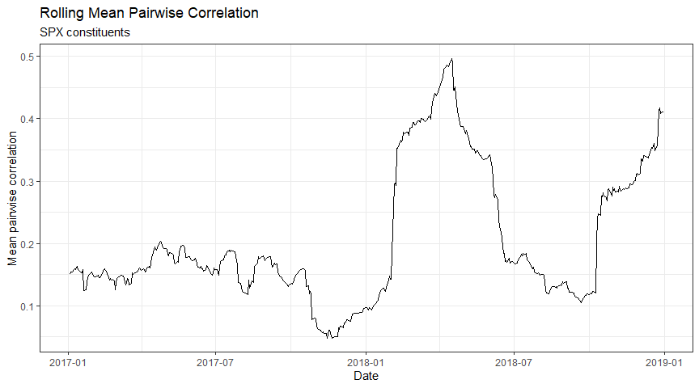

Performant R Programming: Chunking a Problem into Smaller Pieces
================

We’ve been using the problem of calculating [mean rolling correlations
of ETF
constituents](https://robotwealth.com/rolling-mean-correlations-in-the-tidyverse/)
as a test case for solving in-memory computation limitations in R.

We’re interested in this calculation as a research input to a
statistical arbitrage strategy that leverages ETF-driven trading in the
constituents. We wrote about [an early foray into this
trade](https://robotwealth.com/revenge-of-the-stock-pickers/).

Previously, we introduced this problem along with the concept of
profiling code for performance bottlenecks
[here](https://robotwealth.com/handling-a-large-universe-of-stock-price-data-in-r-profiling-with-profvis/).
We can do the calculation in-memory without any trouble for a regular
ETF, say XLF (the SPDR financial sector ETF), but we quickly run into
problems if we want to look at SPY.

In this post, we’re going to explore one workaround for R’s in-memory
limitations by splitting the problem into smaller pieces and recombining
them to get our desired result.

## The problem

When we performed this operation on the constituents of the XLF ETF, our
largest intermediate dataframe consisted of around 3-million rows,
easily within the capabilities of modern laptops.

XLF currently holds 68 constituent stocks. So for any day, we have
\(\frac{68*67}{2} = 2,278\) correlations to estimate (67 because we
don’t want the diagonal of the correlation matrix, take half as we
only need its upper or lower triangle).

We calculated five years of rolling correlations, so we had
\(5*250*2,278 = 2,847,500\) correlations in total.

*Piece of cake.*

The problem gets a lot more interesting if we consider the SPY ETF and
its 500 constituents.

For any day, we’d have \(\frac{500*499}{2} = 124,750\) correlations to
estimate. On five years of data, that’s \(5*250*124,750 = 155,937,500\)
correlations in total.

I tried to do all of that at once in memory on my laptop…and failed.

So our original problem of designing the data wrangling pipeline to
achieve our goal has now morphed into a problem of overcoming
performance barriers.

## Load data and functions

First, we load some libraries and data (you can get the data used in
this post from our [github
repo](https://github.com/Robot-Wealth/r-quant-recipes):

``` r
library(tidyverse)
```

    ## -- Attaching packages --------------------------------------------------------------------------------------------------- tidyverse 1.3.0 --

    ## v ggplot2 3.3.0     v purrr   0.3.4
    ## v tibble  3.0.1     v dplyr   0.8.5
    ## v tidyr   1.1.0     v stringr 1.4.0
    ## v readr   1.3.1     v forcats 0.5.0

    ## -- Conflicts ------------------------------------------------------------------------------------------------------ tidyverse_conflicts() --
    ## x dplyr::filter() masks stats::filter()
    ## x dplyr::lag()    masks stats::lag()

``` r
library(lubridate)
```

    ## 
    ## Attaching package: 'lubridate'

    ## The following objects are masked from 'package:dplyr':
    ## 
    ##     intersect, setdiff, union

    ## The following objects are masked from 'package:base':
    ## 
    ##     date, intersect, setdiff, union

``` r
library(glue)
```

    ## 
    ## Attaching package: 'glue'

    ## The following object is masked from 'package:dplyr':
    ## 
    ##     collapse

``` r
library(here)
```

    ## here() starts at C:/Users/Kris/Documents/r-quant-recipes

``` r
library(microbenchmark)
library(profvis)
theme_set(theme_bw())

load(here::here("data", "spxprices_2015.RData"))
spx_prices <- spx_prices %>%
  filter(inSPX == TRUE)
```

Next, load the functions in our pipeline:

``` r
# pad any missing values
pad_missing <- function(df) {
  df %>%
    complete(ticker, date)
}

# calculate returns to each stock
get_returns <- function(df) {
  df %>%
    group_by(ticker) %>%
    arrange(date, .by_group = TRUE) %>%
    mutate(return_simple = close / dplyr::lag(close) - 1) %>%
    select(date, ticker, return_simple)
}

# full join on date
fjoin_on_date <- function(df) {
  df %>%
    full_join(df, by = "date")
}

# ditch corr matrix diagonal, one half
wrangle_combos <- function(combinations_df) {
  combinations_df %>%
    ungroup() %>% 
  # drop diagonal 
    filter(ticker.x != ticker.y) %>% 
  # remove duplicate pairs (eg A-AAL, AAL-A)
    mutate(tickers = ifelse(ticker.x < ticker.y, glue("{ticker.x}, {ticker.y}"), glue("{ticker.y}, {ticker.x}"))) %>%
    distinct(date, tickers, .keep_all = TRUE) 
} 

pairwise_corrs <- function(combination_df, period) {
  combination_df %>%
    group_by(tickers) %>%
    arrange(date, .by_group = TRUE) %>%
    mutate(rollingcor = slider::slide2_dbl(
      .x = return_simple.x, 
      .y = return_simple.y, 
      .f = ~cor(.x, .y), 
      .before = (wdw-1),   # resulting window size is before + current element 
      .complete = TRUE)
      ) %>%
    select(date, tickers, rollingcor)
  
} 

mean_pw_cors <- function(correlations_df) {
  correlations_df %>%
    group_by(date) %>%
    summarise(mean_pw_corr = mean(rollingcor, na.rm = TRUE))
} 
```

For completeness, here’s our full pipeline with and without the
intermediate objects:

``` r
spx_prices <- spx_prices %>% pad_missing()
returns_df <- spx_prices %>% get_returns()
combos_df <- returns_df %>% fjoin_on_date()
wrangled_combos_df <- combos_df %>% wrangle_combos()
corr_df <- wrangled_combos_df %>% pairwise_corrs(period = 60)
meancorr_df <- corr_df %>% mean_pw_cors()

meancorr_df <- spx_prices %>% 
  pad_missing() %>%
  get_returns() %>% 
  fjoin_on_date() %>%
  wrangle_combos() %>% 
  pairwise_corrs(period = 60) %>% 
  mean_pw_cors()
```

We know that the bottleneck in our pipeline is the step that calculates
the rolling pairwise correlations. But the prior steps can also blow our
default memory limits, particularly if we’ve got other objects in our
environment. So we’ll split the entire pipeline into chunks.

But first, let’s talk about *why* and under *what constraints* it’s
valid to split our pipeline of operations into chunks.

We can chunk our data in this case because the output - the mean of the
rolling pairwise correlations - is only dependent on the window of
returns data over which those correlations are calculated.

For example, if our window used 20 periods, we could calculate today’s
value from the matrix of returns for our stock universe over the last 20
periods. The calculation has no other dependencies.

The implication is that we could do all of those 20-period mean
correlation calculations independently, then jam all the individual
outputs together and get the correct answer.

Sweet\!

But there are a couple of things to consider.

Every time we calculate a window of returns, the first value of the
window will be `NA`: we need yesterday’s price to calculate the (close
to close) return today.

Those prices exist in our raw data, but by extracting each window, we’re
artificially dropping them for our calculation. We can see this if we
take a few [slices of our prices](https://gph.is/2dyR96s):

``` r
wdw <- 5

spx_prices <- spx_prices %>%
  pad_missing() %>%
  group_by(ticker) %>%
  arrange(date) 

spx_prices %>%
  slice(1:wdw) %>%
  get_returns() %>%
  pivot_wider(id_cols = date, names_from = ticker, values_from = return_simple) %>%
  select(starts_with("A"))
```

    ## # A tibble: 5 x 66
    ##         A   AAL   AAP     AAPL     ABBV      ABC  ABMD      ABT      ACN
    ##     <dbl> <dbl> <dbl>    <dbl>    <dbl>    <dbl> <dbl>    <dbl>    <dbl>
    ## 1 NA         NA    NA NA       NA       NA          NA NA       NA      
    ## 2 -0.0187    NA    NA -2.82e-2 -0.0188  -0.00851    NA  2.23e-4 -0.0169 
    ## 3 -0.0156    NA    NA  9.41e-5 -0.00495  0.00546    NA -1.14e-2 -0.00721
    ## 4  0.0133    NA    NA  1.40e-2  0.0404   0.0200     NA  8.11e-3  0.0210 
    ## 5  0.0300    NA    NA  3.84e-2  0.0105   0.00228    NA  2.06e-2  0.0152 
    ## # ... with 57 more variables: ADBE <dbl>, ADI <dbl>, ADM <dbl>, ADP <dbl>,
    ## #   ADS <dbl>, ADSK <dbl>, AEE <dbl>, AEP <dbl>, AES <dbl>, AET <dbl>,
    ## #   AFL <dbl>, AGN <dbl>, AIG <dbl>, AIV <dbl>, AIZ <dbl>, AJG <dbl>,
    ## #   AKAM <dbl>, ALB <dbl>, ALGN <dbl>, ALK <dbl>, ALL <dbl>, ALLE <dbl>,
    ## #   ALXN <dbl>, AMAT <dbl>, AMCR <dbl>, AMD <dbl>, AME <dbl>, AMG <dbl>,
    ## #   AMGN <dbl>, AMP <dbl>, AMT <dbl>, AMZN <dbl>, AN <dbl>, ANDV <dbl>,
    ## #   ANET <dbl>, ANSS <dbl>, ANTM <dbl>, AON <dbl>, AOS <dbl>, APA <dbl>,
    ## #   APC <dbl>, APD <dbl>, APH <dbl>, APTV <dbl>, ARE <dbl>, ARG <dbl>,
    ## #   ATI <dbl>, ATO <dbl>, ATVI <dbl>, AVB <dbl>, AVGO <dbl>, AVP <dbl>,
    ## #   AVY <dbl>, AWK <dbl>, AXP <dbl>, AYI <dbl>, AZO <dbl>

``` r
spx_prices %>%
  slice((1+wdw):(wdw+wdw)) %>%
  get_returns() %>%
  pivot_wider(id_cols = date, names_from = ticker, values_from = return_simple) %>%
  select(starts_with("A"))
```

    ## # A tibble: 5 x 66
    ##         A   AAL   AAP     AAPL     ABBV      ABC  ABMD      ABT      ACN
    ##     <dbl> <dbl> <dbl>    <dbl>    <dbl>    <dbl> <dbl>    <dbl>    <dbl>
    ## 1 NA         NA    NA NA       NA       NA          NA NA       NA      
    ## 2 -0.0118    NA    NA -0.0246  -3.04e-4 -0.0223     NA  0.00841 -0.00301
    ## 3 -0.0140    NA    NA  0.00888 -3.60e-2  0.00781    NA -0.0213   0.00358
    ## 4 -0.0124    NA    NA -0.00381  4.89e-3  0.00502    NA -0.00740 -0.0117 
    ## 5 -0.0269    NA    NA -0.0271  -1.27e-2 -0.00760    NA -0.00745 -0.00687
    ## # ... with 57 more variables: ADBE <dbl>, ADI <dbl>, ADM <dbl>, ADP <dbl>,
    ## #   ADS <dbl>, ADSK <dbl>, AEE <dbl>, AEP <dbl>, AES <dbl>, AET <dbl>,
    ## #   AFL <dbl>, AGN <dbl>, AIG <dbl>, AIV <dbl>, AIZ <dbl>, AJG <dbl>,
    ## #   AKAM <dbl>, ALB <dbl>, ALGN <dbl>, ALK <dbl>, ALL <dbl>, ALLE <dbl>,
    ## #   ALXN <dbl>, AMAT <dbl>, AMCR <dbl>, AMD <dbl>, AME <dbl>, AMG <dbl>,
    ## #   AMGN <dbl>, AMP <dbl>, AMT <dbl>, AMZN <dbl>, AN <dbl>, ANDV <dbl>,
    ## #   ANET <dbl>, ANSS <dbl>, ANTM <dbl>, AON <dbl>, AOS <dbl>, APA <dbl>,
    ## #   APC <dbl>, APD <dbl>, APH <dbl>, APTV <dbl>, ARE <dbl>, ARG <dbl>,
    ## #   ATI <dbl>, ATO <dbl>, ATVI <dbl>, AVB <dbl>, AVGO <dbl>, AVP <dbl>,
    ## #   AVY <dbl>, AWK <dbl>, AXP <dbl>, AYI <dbl>, AZO <dbl>

You can see that the first row of each slice is NA.

One solution would be to just do that return calculation on all the data
up front, which we can certainly do in memory, but isn’t really in the
spirit of what we’re trying to demonstrate here.

Instead, we’ll extract more price data than we need for our return
windows such that each return window is complete.

That implies that we could process our data one chunk at a time where
each chunk was a minimum size of `wdw + 1`. Let’s test that out.

``` r
wdw <- 60

test <- spx_prices %>%
  slice(1:(wdw+1)) 

system.time({
  test_corr <- test %>%
    get_returns() %>% 
    fjoin_on_date() %>%
    wrangle_combos() %>% 
    na.omit() %>%  # comfortable omitting NA here as we've been careful about alignment via padding missing values
    pairwise_corrs(period = wdw) %>% 
    na.omit() %>%  # this na.omit removes NA in prior window due to complete = TRUE requirement
    mean_pw_cors()
})

#  user     system  elapsed 
#  50.64    1.14    51.84 
```

Hmmm. That took the best part of a minute. And that’s a single
calculation\! Clearly that’s not going to be feasible when we have
hundreds or thousands of calculations to perform.

Let’s use a larger chunk size this time, so that from one chunk we can
do five rolling window calculations instead of one. Is processing time
additive, or are there speedups to be had by going for scale?

``` r
wdw <- 60

test <- spx_prices %>%
  slice(1:(wdw+1+5)) 

system.time({
  test_corrs <- test %>%
    get_returns() %>% 
    fjoin_on_date() %>%
    wrangle_combos() %>% 
    na.omit() %>%  # comfortable omitting NA here as we've been careful about alignment via padding missing values
    pairwise_corrs(period = wdw) %>% 
    na.omit() %>%  # this na.omit removes NA in prior window due to complete = TRUE requirement
    mean_pw_cors()
})

#  user     system   elapsed 
#  76.01    1.90     78.37
```

That’s interesting. Doing five windows didn’t result in five times the
computation time.

This would be partly explained by the execution path being “hot”
following the first calculation, but there does seem to be some
significant increase in efficiency when we do several calculations in a
single chunk.

Let’s use
[profvis](https://robotwealth.com/handling-a-large-universe-of-stock-price-data-in-r-profiling-with-profvis/)
to see if we can figure out what’s going on.

First, we profile the single window case:

``` r
library(profvis)

profvis({
  test <- spx_prices %>%  slice(1:(wdw+1))
  returns_df <- test %>% get_returns()
  combos_df <- returns_df %>% fjoin_on_date()
  wrangled_combos_df <- combos_df %>% wrangle_combos() %>% na.omit()
  corr_df <- wrangled_combos_df %>% pairwise_corrs(period = 60) %>% na.omit()
  meancorr_df <- corr_df %>% mean_pw_cors()
})
```

Next let’s profile the multi window case:

``` r
profvis({
  test <- spx_prices %>%  slice(1:(wdw+1+5))
  returns_df <- test %>% get_returns()
  combos_df <- returns_df %>% fjoin_on_date()
  wrangled_combos_df <- combos_df %>% wrangle_combos() %>% na.omit()
  corr_df <- wrangled_combos_df %>% pairwise_corrs(period = 60) %>% na.omit()
  meancorr_df <- corr_df %>% mean_pw_cors()
})
```

In both cases, we spend a comparable amount of time in each step, except
for the pairwise correlation calculation step, in which the five-window
case saw a 50% increase in time spent - which seems like a very good
deal\!

The time spent calculating the mean of the correlations doubled, but
this accounts for only a negligible amount of the total time spent so
it’s not worth worrying about.

This suggests that doing as many windows as possible in each chunk will
likely give us the biggest bang for our buck.

Notice also in the previous `profiz` output that the largest amount of
memory is allocated at the `wrangle_combos` step (this is not the
*slowest* step, but it produces the largest dataframe). This step will
give us a good proxy for estimating a sensible chunk size.

But first, we need to know how much memory we can actually allocate.

## How much memory can we use?

It depends on your operating system and your machine specs. I’m on
Windows 10 and my machine has 32 GB of RAM.

I can use `memory.limit()` and `pryr::mem_used` to see the memory status
of my machine:

``` r
library(pryr)

memory.limit()
mem_used()

# 32537
# 4.76 GB
```

Cool - apparently R can max out my RAM (not that you’d let it…) and R
has used 4.76 GB. That’s mostly because I’ve got a bunch of large
objects in memory from things I did previously, and which I’ll remove
before I do anything serious.

We can get too precise when it comes to estimating how much memory an R
object might hold.

The memory allocation of R objects doesn’t grow linearly with size, as R
requests oversized blocks of memory and then manages those blocks,
rather than incrementally asking the operating system for more each time
something is created.

There are also memory overheads with the data structures themselves,
such as metadata and pointers to other objects in memory.

Let’s make a dataframe of combinations for 250 days of stock data (about
one year), calculate the size of the object, and use that to estimate
whether we might be able to cope with that chunk size:

``` r
test <- spx_prices %>%  
  slice(1:250) %>% 
  get_returns() %>% 
  fjoin_on_date() %>% 
  wrangle_combos() 
  
test %>%
    object_size()

# 2.28 GB
```

OK - we should be able to process our data a year at a time with a bit
of wiggle room to overlap our chunks (we must overlap our chunks because
the first value calculated in a new chunk needs the previous `wdw+1`
values for the first calculation). Let’s give it a shot.

``` r
# helper functions
get_slice <- function(df, idx, chunk_size) {
  df %>%
    slice(idx:(idx+chunk_size))
}

process_chunk <- function(chunk) {
  chunk %>%
    get_returns() %>% 
    fjoin_on_date() %>%
    wrangle_combos() %>% 
    na.omit() %>%  # comfortable omitting NA here as we've been careful about alignment via padding missing values
    pairwise_corrs(period = wdw) %>% 
    na.omit() %>%  # this na.omit removes NA in prior window due to complete = TRUE requirement
    mean_pw_cors()
}

# set up sequential chunk processing
wdw <- 50
chunk_days <- 250

num_days <- spx_prices %>%
  ungroup() %>%
  pull(date) %>%
  n_distinct(na.rm = TRUE) - wdw

num_chunks <- ceiling(num_days / (chunk_days + wdw + 1)) + 1

corr_list <- list()
system.time({
  for(i in c(1, c(1:num_chunks)*chunk_days)) {
    corr_list[[i]] <- spx_prices %>%
      get_slice(i, (chunk_days+wdw+1)) %>%
      process_chunk()
  }  
})

#  user     system   elapsed
#  3670     109.8    3819
```

Result\! That takes quite a long time, but at least we’ve managed to get
the job done.

Let’s check out the final product:

``` r
bind_rows(corr_list) %>%
  filter(date >= "2017-01-01", date <= "2019-01-01") %>%
  ggplot(aes(x = date, y = mean_pw_corr)) +
    geom_line() +
    labs(
      x = 'Date',
      y = 'Mean pairwise correlation',
      title = 'Rolling Mean Pairwise Correlation', 
      subtitle = 'SPX constituents'
      ) +
    theme_bw()
```



Looks good\!

As well as testing the output for correctness, the next step would be to
consider getting the job done faster by farming the chunks out to
individual workers so that they could be processed in parallel. We can
do this because each chunk is independent of the other chunks - it’s
simply a matter of splitting our data appropriately, performing the
calculation on each chunk, and combining the results back together.

There are a bunch of other potentially cheap optimisations that we
mentioned in the [introductory
post](\(https://robotwealth.com/handling-a-large-universe-of-stock-price-data-in-r-profiling-with-profvis/\))
- we’ll explore these as well.

## Conclusion

In this post we split our big data problem of calculating mean rolling
pairwise correlations of a large universe of stocks into manageable
chunks and processed the entire job in memory using an everyday laptop.

The main obstacles that we needed to think about were the introduction
of NA values upon calculation of returns from prices, correct alighment
of our data by date, and the need for overlapping chunks due to the
rolling nature of the operation being performed.
