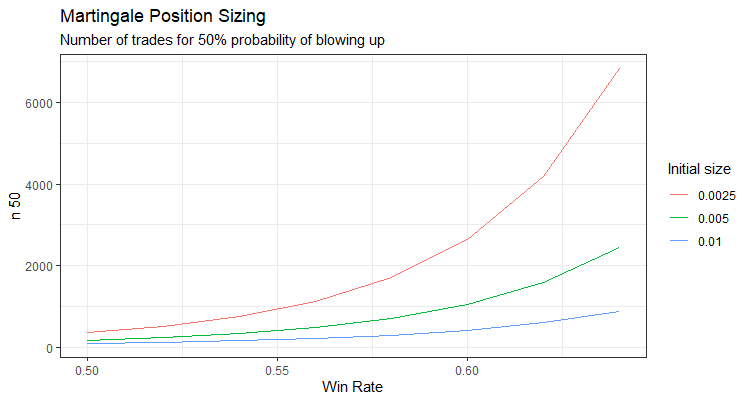

# Get Rich Quick Trading Strategies

## ... and why they don't work

We explore three *Get Rich Quick* trading strategies with a view to understanding why they don't work. 

### Martingale

Martingale is not a trading strategy; it's a betting scheme whereby the bettor doubles the stake following every losing wager until a winner is achieved. 

Following this betting scheme ensures with mathematical certainty the destruction of the entire bankroll... it is simplay a matter of time:

Read the complete article at [our blog](https://robotwealth.com/get-rich-quick-trading-strategies-and-why-they-dont-work/)